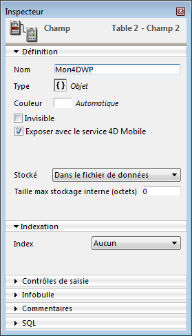
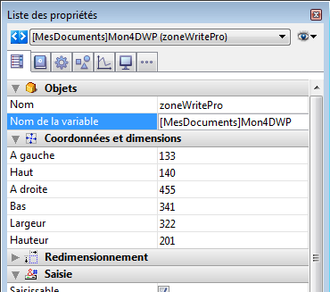

## Format de document .4wp 

Vous pouvez sauvegarder des documents 4D Write Pro sur disque et les rouvrir sans aucune perte de données grâce au format natif **.4wp**.

Le format **.4wp** est constitué d'un dossier zip dont le nom est le titre du document, et contenant du texte HTML et des images :

* le texte HTML combine du HTML standard et des expressions 4D (non interprétées) ainsi que des balises 4D spécifiques,
* les images sont stockées dans un dossier du même nom que le document, situé à côté du fichier HTML.

Comme les documents .4wp sont basés sur du HTML, ils peuvent être importés et ouverts dans toute application tierce qui prend en charge le format HTML.

Le format interne des documents 4D Write Pro est du HTML étendu propriétaire, compatible HTML5/XHTML5, mais utilisant son propre sous-ensemble d'attributs et de balises HTML/CSS. Par conséquent, seuls les documents HTML exportés par 4D Write Pro peuvent être ouverts par 4D Write Pro sans risque de perte d'informations. Importer des documents HTML qui ont été créés par une source externe peut provoquer des erreurs.

Pour plus d'informations, vous pouvez [**télécharger la liste des attributs de 4D Write pro avec la définition associée en tant que style CSS ou balise XHTML**](https://download.4d.com/Documents/Products%5FDocumentation/LastVersions/Line%5F19/4DWP-attributes-and-xhtml.pdf) dans le 4D Write Pro XHTML.

### Rétrocompatibilité 

Vous pouvez toujours rouvrir un document .4wp avec une version antérieure de 4D Write Pro. S'il contient des attributs qui ont été ajoutés dans des versions plus récentes, ces attributs sont simplement ignorés. Cependant, si vous enregistrez le document, les attributs sont supprimés du document et seront perdus. 

## Stocker les documents 4D Write Pro dans des champs objet 4D 

Vous pouvez stocker automatiquement vos documents 4D Write Pro dans le fichier de données de 4D. Si vous avez créé une zone 4D Write Pro dans un formulaire ainsi qu'un champ de type Objet pour stocker le contenu de la zone, le texte saisi dans la zone est automatiquement sauvegardé dans les données au moment de la validation de l'enregistrement. Vous pouvez alors utiliser la commande [CHERCHER PAR ATTRIBUT](../../commands/chercher-par-attribut) afin de sélectionner des enregistrements en fonction de la valeur de leurs attributs internes. Vous pouvez également ajouter des attributs personnalisés aux zones 4D Write Pro et les utiliser pour des recherches. 

Cette section décrit les fonctionnalités suivantes :

* Associer un champ objet 4D à une zone 4D Write Pro dans un formulaire.
* Fixer, lire et rechercher des attributs personnalisés dans les documents 4D Write Pro, à l'aide des commandes standard [OB FIXER](../../commands/ob-fixer), [OB Lire](../../commands/ob-lire) et [CHERCHER PAR ATTRIBUT](../../commands/chercher-par-attribut).

### Associer un champ objet 4D à une zone 4D Write Pro 

Pour associer une zone 4D Write Pro à un champ 4D de type Objet, il vous suffit de référencer le champ dans la propriété "Nom de variable" de la zone. 

### Créer le champ objet en structure 

Dans la structure de votre base de données, tout champ objet 4D peut être utilisé pour stocker des documents 4D Write Pro. Vous devez simplement définir, en fonction de vos besoins, ses propriétés standard :

* le nom du champ,
* ses attributs, tels que "Exposer avec REST resource" et son index,
* son option de stockage.



### Affecter le champ objet à la zone 4D Write Pro 

Une fois que le champ objet destiné à stocker vos documents 4D Write Pro est défini, il vous suffit de le référencer dans le formulaire contenant la zone. Vous pouvez utiliser un formulaire table ou un formulaire projet.   
Dans l'éditeur de formulaires, saisissez le nom du champ, en utilisant la notation standard "\[Table\]Champ", dans la zone **Nom de la variable** de la Liste des propriétés pour la zone 4D Write Pro : 



Votre zone 4D Write Pro est alors associée au champ, ce qui vous donne l'assurance que son contenu sera automatiquement sauvegardé avec chaque enregistrement. A noter que si vous n'utilisez pas les boutons à action automatique de 4D, vous devrez programmer vous-même la sauvegarde de la zone, à l'aide des commandes 4D. 

### Utiliser des attributs personnalisés 

Lorsque les zones 4D Write Pro sont stockées dans des champs de type Objet, vous pouvez écrire et lire des attributs personnalisés dans les documents 4D Write Pro, comme par exemple le nom de l'auteur, la catégorie du document, ou toute information supplémentaire qui vous serait utile. Vous pouvez effectuer des recherches parmi les attributs personnalisés afin de sélectionner des enregistrements en fonction de critères spécifiques.

Les attributs personnalisés sont exportés avec les commandes [WP EXPORTER DOCUMENT](../commands/wp-exporter-document) et [WP EXPORTER VARIABLE](../commands/wp-exporter-variable). Ils sont également exportés lorsque vous convertissez un champ objet 4D Write Pro en JSON à l'aide de la commande [JSON Stringify](../../commands/json-stringify) (en plus des attributs principaux de document de 4D Write Pro).

Pour écrire ou lire des attributs personnalisés, vous pouvez utiliser la notation objet ou les commandes [OB Lire](../../commands/ob-lire) et [OB FIXER](../../commands/ob-fixer).

Par exemple, dans la méthode du formulaire, vous pouvez écrire :

```4d
 Si(Evenement formulaire code=Sur validation)
    [MesDocuments]Mon4DWP["monatt_Dernière modif par"]:=Utilisateur courant
    [MesDocuments]Mon4DWP.monatt_Catégorie:=Memo
    [MesDocuments]Mon4DWP:=[MesDocuments]Mon4DWP //enregistrer la modification
 Fin de si
```

ou :

```4d
 Si(Evenement formulaire code=Sur validation)
    OB FIXER([MesDocuments]Mon4DWP;"monatt_Dernière modif par";Utilisateur courant)
    OB FIXER([MesDocuments]Mon4DWP;"monatt_Catégorie";"Memo")
 Fin de si
```

Vous pouvez bien entendu lire les attributs personnalisés des documents :

```4d
 vAttrib:=[MesDocuments]Mon4DWP.monatt_Catégorie
```

ou :

```4d
 vAttrib:=OB Lire([MesDocuments]Mon4DWP;"monatt_Catégorie")
```

Si vous avez stocké des attributs personnalisés avec les documents 4D Write Pro dans votre fichier de données, vous pouvez effectuer des recherches sur ces attributs afin de créer des sélections d'enregistrements contenant les valeurs recherchées. Exemple :

```4d
 CHERCHER PAR ATTRIBUT([MesDocuments];[MesDocuments]Mon4DWP;"monatt_Catégorie";=;"Memo")
  //sélectionne tous les enregistrements de la table MesDocuments dont l'attribut personnalisé "monatt_Catégorie" contient la valeur "Memo"
  //dans le champ objet Mon4DWP (associé à une zone 4D Write Pro)
```

:::warning Sur les noms des attributs personnalisés

Comme les attributs personnalisés partagent le même espace de nommage que les attributs internes des documents 4D Write Pro, nous recommandons fortement l'utilisation de préfixes lorsque vous définissez les noms de vos attributs, afin d'éviter tout conflit entre les attributs internes et personnalisés. Les noms sans préfixe sont réservés aux attributs internes de 4D Write Pro. En revanche, la définition des préfixes est libre (nous utilisons par exemple le préfixe "monatt\_" dans les exemples ci-dessus).  

:::

**Note** : Les attributs personnalisés ne peuvent pas être gérés par les commandes [WP FIXER ATTRIBUTS](../commands/wp-fixer-attributs), [WP LIRE ATTRIBUTS](../commands/wp-lire-attributs), et [WP REINITIALISER ATTRIBUTS](../commands/wp-reinitialiser-attributs) (ils ne supportent que les attributs internes de 4D Write Pro). 


## Ouvrir et exporter des documents

Dans les applications 4D, les documents 4D Write Pro sont créés, importés et/ou exportés via des commandes dédiées placées dans le thème **4D Write Pro** ([WP EXPORT DOCUMENT](../commands/wp-export-document), [WP EXPORT VARIABLE](../commands/wp-export-variable), [WP Import document](../commands/wp-import-document), [WP New](../commands/wp-new)). 

Vous pouvez également [associer une zone 4D Write Pro à un champ objet](../user-legacy/defining-a-4d-write-pro-area.md#storing-4d-write-pro-documents-in-4d-object-fields) de la base. De cette manière, chaque document 4D Write Pro est automatiquement sauvegardé avec l'enregistrement et est conservé dans les données de la base.

## Imprimer des documents 4D Write Pro

Les documents 4D Write Pro peuvent être imprimés de deux manières :

* en tant que parties de formulaires 4D
* en tant que documents indépendants

### Impression de documents dans des formulaires 4D 

Vous pouvez imprimer des objets 4D Write Pro inclus dans des [formulaires 4D](../../FormEditor/forms.md) de tout type (projet, table, entrée ou sortie), à l'aide des commandes d'impression standard de 4D telles que [IMPRIMER SELECTION](../../commands/imprimer-selection) ou [IMPRIMER ENREGISTREMENT](../../commands/imprimer-enregistrement). 

L'option standard *Impression taille variable* est également prise en charge(\*) pour les zones 4D Write Pro, vous permettant de gérer les variations de taille durant l'impression. Lorsque cette option est cochée, la marge (extérieure et intérieure) et la bordure hautes ne sont appliquées qu'à la première page. La marge (extérieure et intérieure) et la bordure basses ne sont appliquées qu'à la dernière page. Les propriétés de pagination du document sont ignorées : le contrôle des veuves et des orphelins est désactivé, et les sauts de page ne sont pas appliqués (ces propriétés sont utilisées uniquement pour le rendu des pages à l'écran ou l'impression autonome du document). Lorsque l'option **Impression taille variable** est sélectionnée, seuls les objets situés au-dessus de la zone dans le formulaire sont imprimés. Pour plus d'informations sur cette option, reportez-vous à la section "*Impression taille variable*" dans le manuel Mode Développement.

(\*) Les commandes [Imprimer objet](../../commands/imprimer-objet) et [Imprimer ligne](../../commands/imprimer-ligne) ne sont pas compatibles avec cette option. 

#### Mode d'affichage et impression 

Quel que soit le **Mode d'affichage** défini pour la zone 4D Write Pro (cf. *Configurer les propriétés d'affichage*), elle est toujours imprimée en mode **Inclus** lorsque vous utilisez une commande d'impression 4D telle que [Imprimer ligne](../../commands/imprimer-ligne). Dans ce contexte, les propriétés d'Apparence ne sont pas prises en charge pour les objets de formulaire 4D Write Pro : Mode d'affichage (toujours "Inclus"), Montrer les entêtes, Montrer les pieds de page, Montrer le cadre de page (toujours "non") et Montrer les caractères cachés (toujours "non").

#### Exemple 

L'exemple suivant illustre l'effet de l'option **Impression taille variable** sur une zone 4D Write Pro incluse dans le formulaire de sortie par défaut. Le code suivant est exécuté : 

```4d
 TOUT SELECTIONNER([Movies])
 TRIER([Movies]Title)
 IMPRIMER SELECTION([Movies])
```

* Avec l'option "Impression taille variable" **non cochée**, vous obtenez le résultat suivant :  

* Avec l'option "Impression taille variable" **cochée**, vous obtenez le résultat suivant :  
  
*(Source des texte d'exemple : wikipedia)*

### Impression de documents indépendants 

A partir de 4D v15 R5, 4D Write Pro inclut des fonctionnalités d'impression vous permettant d'imprimer des documents 4D Write Pro indépendants et de contrôler les options standard d'impression comme le format, l'orientation ou les numéros de page.

#### Commandes 4D Write Pro 

Essentiellement, deux commandes gèrent les fonctions d'impression avec 4D Write Pro : **WP IMPRIMER** et **WP UTILISER PARAMETRES IMPRESSION**.

* [WP IMPRIMER](../commands/wp-imprimer) lance une tâche d'impression pour le document 4D Write Pro ou ajoute le document dans la tâche d'impression courante.
* [WP UTILISER PARAMETRES IMPRESSION](../commands/wp-utiliser-parametres-impression) modifie les options d'impression de la page courante, sur la base des attributs du document 4D Write Pro pour la taille de page et l'orientation.

**Note :** Sur des machines avec Windows 7 ou Windows Server 2008 R2, vérifiez que le *Platform Update for Windows 7* a bien été installé pour que les fonctionnalités d'impression soient prises en charge.

#### Commandes 4D standard 

Les commandes 4D suivantes prennent en charge les fonctionnalités d'impression de 4D Write Pro :

* [SET PRINT OPTION](../../commands/set-print-option) et [GET PRINT OPTION](../../commands/get-print-option) : Toutes les options sont prises en charge pour les documents 4D Write Pro imprimés avec [WP PRINT](../commands/wp-print).  
Pour Option papier et Option orientation, il sera généralement préférable d'appeler [WP USE PAGE SETUP](../commands/wp-use-page-setup) de façon à facilement synchroniser ces attributs avec les options du document 4D Write Pro. L'option Option intervalle de page (15) vous permet d'imprimer de la page *x* à la page *y* uniquement.
* [PRINT SETTINGS](../../commands/print-settings : permet de fixer les paramètres d'impression pour l'imprimante courante ; si la commande [WP PRINT](../commands/wp-print) est appelée par la suite, elle utilisera les paramètres d'impression modifiés si certains ont été modifiés au moyen des dialogues de paramétrage d'impression (excepté pour les options de marges qui prennent toujours en compte les options du document 4D Write Pro).
* [OPEN PRINTING JOB](../../commands/open-printing-job) et [CLOSE PRINTING JOB](../../commands/close-printing-job): [WP PRINT](../commands/wp-print) peut être appelée entre ces commandes de façon à insérer un ou plusieurs document(s) 4D Write Pro dans une tâche d'impression.