## Notions de base 

Lorsqu'un document est en [mode d'affichage **Page**](./defining-a-4d-write-pro-area.md#selecting-the-view-mode), les propriétés de document suivantes sont apparentes pour l'utilisateur :

* les contours des pages, qui représentent les limites d'impression
* la largeur et la hauteur des pages (21x29,7 cm par défaut)
* l'orientation des pages (portrait par défaut)
* les marges (2,5 cm par défaut)

Vous pouvez également utiliser des commandes supplémentaires telles que Document.../Taille de la page ou Document.../Orientation de la page.

**Note :** Lorsque le mode d'affichage d'un document est **Inclus** ou **Brouillon**, les propriétés de page peuvent être définies, même si leur effet n'est pas visible. En mode Brouillon, les effets des propriétés de paragraphe suivantes sont toutefois visibles :

* Limites des hauteurs de pages (des lignes sont dessinées)
* Colonnes
* Propriété "Eviter les sauts de pages intérieurs"
* Propriété "Contrôle des veuves et des orphelins".

## Sauts de paragraphe 

Lorsqu'ils sont affichés en mode Page ou Brouillon (ou dans le contexte de l'impression d'un document), les paragraphes de 4D Write Pro peuvent être rompus :

* automatiquement, si la hauteur du paragraphe est supérieure à la hauteur de page disponible,
* en fonction des sauts de paragraphe définis par programmation ou par l'utilisateur.

Les ruptures peuvent être ajoutées par programmation ou par l'utilisateur. Les actions disponibles sont les suivantes :

* commande [WP INSERER RUPTURE](../commands/wp-inserer-rupture)
* action standard *insertPageBreak*
* l'option **Insérer un saut de page** du menu contextuel par défaut.

### Contrôle des sauts de page automatiques

Vous pouvez contrôler les sauts de paragraphe automatiques à l'aide des fonctions suivantes : 

* **Contrôle des veuves et des orphelins** : Lorsque cette option est définie pour un paragraphe, 4D Write Pro n'autorise pas les veuves (dernière ligne d'un paragraphe isolée en haut d'une page) ou les orphelins (première ligne d'un paragraphe isolée en bas d'une page) dans le document. Dans le premier cas, la ligne précédente du paragraphe est ajoutée en haut de la page de sorte que deux lignes y sont affichées. Dans le second cas, la première ligne isolée est déplacée sur la page suivante.
* **Éviter le saut de page à l'intérieur** : Lorsque cette option est définie pour un paragraphe, 4D Write Pro empêche ce paragraphe d'être divisé en parties sur deux pages ou plus.
* **Paragraphe solidaire :** Lorsque cette option est définie pour un paragraphe, ce paragraphe ne peut pas être séparé de celui qui le suit par un saut automatique. Voir wk keep with next et l'[action standard](./defining-a-4d-write-pro-area.md#standard-actions) correspondante *keepWithNext*.

Ces options peuvent être définies à l'aide du menu contextuel, ou des [attributs](../commands-legacy/4d-write-pro-attributes.md) (`wk avoid widows and orphans`, `wk page break inside paragraph`, ou des [actions standard](./defining-a-4d-write-pro-area.md#standard-actions) *widowAndOrphanControlEnabled* et *avoidPageBreakInsidev*).

## Fond 

L'arrière-plan (le fond) des documents et des éléments de documents de 4D Write Pro (tableaux, paragraphes, sections, en-têtes/pieds de pages, etc.) peut être défini à l'aide des attributs suivants :

* couleurs
* bordures
* images
* positionnement horizontal, vertical et origine
* rectangle d'application
* répétition

Ces [attributs](../commands-legacy/4d-write-pro-attributes.md) peuvent être définis par programmation pour le fond des éléments individuels dans la page et/ou de l'ensemble du document via la commande [WP FIXER ATTRIBUTS](../commands/wp-fixer-attributs) ou les [actions standard](./defining-a-4d-write-pro-area.md#standard-actions). 

Les utilisateurs peuvent modifier les attributs d'arrière-plan à l'aide du menu contextuel de la zone : 

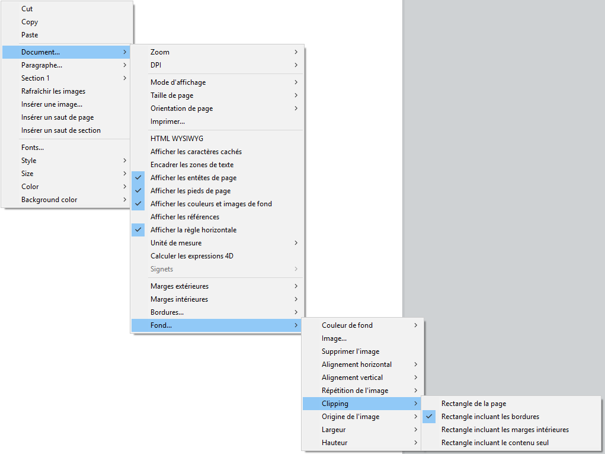 

Pour un exemple d'ajout d'image d'arrière-plan en taille réelle, [téléchargez la base *How Do I* (HDI) dédiée](http://download.4d.com/Demos/4D%5Fv16%5FR5/HDI%5F4DWP%5FBackImagePaperBox.zip).

## En-têtes, pieds de pages et sections 

Les documents 4D Write Pro peuvent contenir des en-têtes et des pieds de page. Les en-têtes et les pieds de page sont liés aux sections.

Une section est une partie d'un document qui est définie par un intervalle de pages, et qui peut comporter des attributs de pagination et communs qui lui sont propres. Un document peut contenir de une à *N* sections, *N* étant le nombre total de pages. Chaque page ne peut appartenir qu'à une seule section, à l'exception des pages contenant des sauts de section continus (voir ci-dessous). 

Les documents 4D Write Pro peuvent contenir :

- une ou plusieurs sections (une section par défaut)
- pour chaque section, jusqu'à trois sous-sections :
   - sous-section première page
   - sous-section page(s) gauche(s)
   - sous-section page(s) droite(s)

Vous pouvez définir un ensemble d'en-têtes et de pieds de page pour chaque section.

### Définir une section 

Une section est un sous-ensemble de pages contiguës d'un document 4D Write Pro. Un document peut contenir une ou plusieurs sections, chaque section pouvant elle-même contenir un nombre variable de pages, depuis une page unique jusqu'au nombre total de pages du document. Une section peut contenir une seule colonne ou jusqu'à 20 colonnes par page. 

Par défaut, un document contient une seule section, nommée **Section 1**. Le menu contextuel de 4D Write Pro affiche ce numéro de section dans toutes les pages du document :

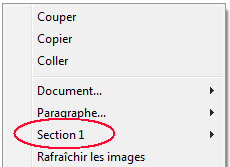

Vous créez une nouvelle section en ajoutant un saut de section dans le texte :


Lorsqu'un ou plusieurs sauts de section ont été ajoutés, le menu contextuel affiche un numéro incrémenté pour chaque section. Vous pouvez cependant renommer les sections :

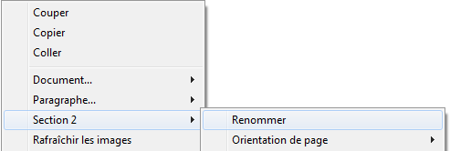

Le nom que vous saisissez est alors utilisé comme nom de section pour le document : 

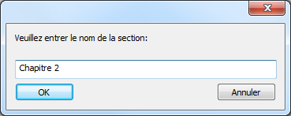 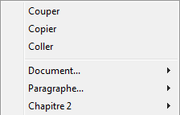

Notez que si vous avez défini une première page différente ou des pages droite/gauche différentes pour une section, le type de page est également affiché dans le menu (voir ci-dessous). 

### Insérer un saut de section continu 

Un saut de section continu crée une nouvelle section sur la même page. Cela vous permet de créer des pages avec des sections qui ont différents nombres de colonnes (voir *Créer une page avec des sections multi-colonnes et des section à une seule colonne*).

Les sections créées avec des sauts de section continus sont comptées dans le document (elles possèdent des numéros de section), mais contrairement aux sections créées avec des sauts de section standard, leurs en-têtes, pieds, images ancrées, etc. sont pris en compte uniquement lorsqu'un saut de page physique s'est produit.

**Note** : Si vous modifiez l'orientation de la page pour la nouvelle section après avoir inséré un saut de section continu, celui-ci se transforme en un saut de section standard.

### Attributs de section 

Les sections héritent des attributs du document. Cependant, les attributs de documents communs, y compris les en-têtes et pieds de page, peuvent être modifiés séparément pour chaque section. Le menu contextuel affiche les propriétés et attributs disponibles au niveau des sections :

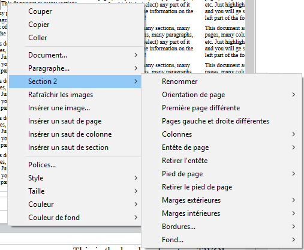

* **Orientation de page** : permet de définir une orientation de page spécifique (portrait ou paysage) par section
* **Première page différente** : permet de définir des attributs spécifiques pour la première page de la section ; cette fonction peut être utilisée pour créer des pages de garde, par exemple. Lorsque cette option est cochée, la première page de la section est considérée elle-même comme une sous-section et peut disposer de ses propres attributs.  

* **Pages gauche et droite différentes** : permet de définir des attributs différents pour les pages gauches et droites de la section. Lorsque cette option est cochée, les pages gauches et droites de la section sont considérées comme des sous-sections et peuvent disposer de leurs propres attributs.  

* **Colonnes**: permet de définir le nombre et les propriétés des colonnes pour la section. Ces options sont détaillées ci-dessous.
* **Entête** et **Pied de page** : ces options vous permettent de définir des en-têtes et pieds de page spécifiques. Elles sont détaillées ci-dessous.
* **Marges extérieures** et **intérieures** / **Bordures** / **Fond** : ces attributs peuvent être définis séparément pour chaque section. Pour plus d'informations sur ces attributs, veuillez vous reporter à la page *Attributs 4D Write Pro*.

### Insérer des en-têtes et des pieds de page 

Chaque section peut comporter un en-tête et un pied de page spécifiques. Les en-têtes et les pieds de page sont visibles uniquement lorsque le mode d'affichage du document est **Page**. 

 A l'intérieur d'une section, vous pouvez définir jusqu'à trois en-têtes et pieds de page différents, en fonction des options activées :

* première page,
* page(s) gauche(s),
* page(s) droite(s),

Pour créer un en-tête ou un pied de page : 

1. Assurez-vous que le document est en mode d'affichage **Page**.
2. Double-cliquez dans la zone d'en-tête ou de pied de la section et de la page souhaitées afin de passer en édition.  
   * La zone d'en-tête est en haut de la page :  
   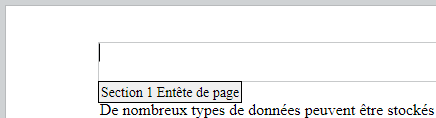  
   * La zone d'en-tête est en bas de la page :  
   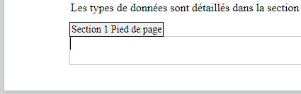

Vous pouvez ajouter tout contenu statique, qui sera automatiquement répété sur chaque page de la section (à l'exception de la première page, si l'option est activée). 

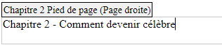

Vous pouvez ajouter du contenu dynamique tel que le numéro de page ou le nombre de pages, à l'aide de la commande [ST INSERER EXPRESSION](../../commands/st-inserer-expression) (pour plus d'informations, veuillez vous reporter au paragraphe *Insérer des expressions de page et de document*).

**Note :** Vous pouvez également gérer les en-têtes et pieds de page par programmation à l'aide de commandes spécifiques telles que [WP Lire entete](../commands/wp-lire-entete) et [WP Lire pied](../commands/wp-lire-pied).

Une fois qu'un en-tête ou un pied de page a été défini pour une section, vous pouvez configurer ses attributs communs à l'aide du menu contextuel :

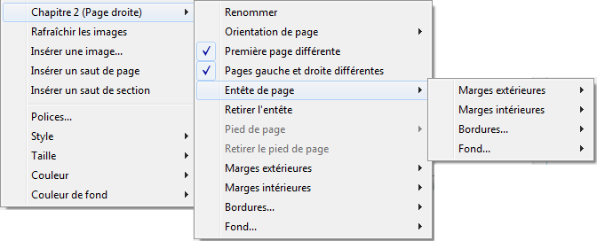

Pour plus d'informations sur les attributs **Marges extérieures**, **Marges intérieures**, **Bordures** et **Fond**, veuillez vous reporter à la section *Attributs 4D Write Pro*. 

Vous pouvez supprimer l'ensemble de la définition d'un en-tête ou d'un pied de page (contenu et attributs) en sélectionnant la commande **Retirer l'entête** ou **Retirer le pied de page**  dans le menu contextuel. 

### Compatibilité 

4D Write Pro prend en charge les en-têtes et les pieds de page des documents convertis depuis le plug-in 4D Write dont la hauteur est fixe.

Les expressions et propriétés suivantes sont également prises en charge et converties lorsqu'elles étaient présentes dans les en-têtes et pieds de page des documents du plug-in 4D Write :

* variables numéros et nombre de pages
* première page différente
* pages gauche/droite différentes

## Règles 

Les règles horizontales sont disponibles dans tous les modes d'affichage de 4D Write Pro et ont les caractéristiques suivantes : 

* Graduations en cm, mm, pouces ou pt en fonction de l'unité courante définie dans le document 4D Write Pro. Vous pouvez changer l'unité de mesure du document à l'aide du menu contextuel ou via l'attribut wk layout unit.
* Symbole de retrait première ligne
* Symbole de marge de paragraphe gauche
* Symbole de marge de paragraphe droite
* Tabulations affichées sur le bord inférieur de la règle
* Zones de couleur représentant les marges gauche et droite de la page

Les règles verticales ne sont disponibles qu'en mode Page et ont les caractéristiques suivantes : 

* Graduations en cm, mm, pouces ou pt en fonction de l'unité courante définie dans le document 4D Write Pro. Vous pouvez changer l'unité de mesure du document à l'aide du menu contextuel ou via l'attribut wk layout unit.
* Zones de couleur représentant les marges haute et basse de la page

Vous pouvez afficher ou masquer les règles via des actions standard (voir *Utiliser les actions standard 4D Write Pro*) ou en utilisant la ligne **Afficher la règle horizontale** ou **Afficher la règle verticale** dans le menu contextuel de la zone 4D Write Pro :

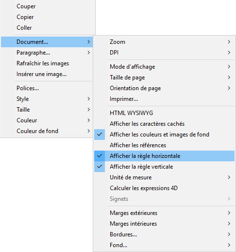

**Note :** Une option des propriétés de la zone permet également de définir l'affichage par défaut des règles (cf. section *Configurer les propriétés d'affichage*).

### Ajuster les marges et le retrait 

Vous pouvez modifier les marges, l'indentation (le retrait) des premières lignes et les positions des tabulations en déplaçant les symboles correspondants à l'aide de la souris :

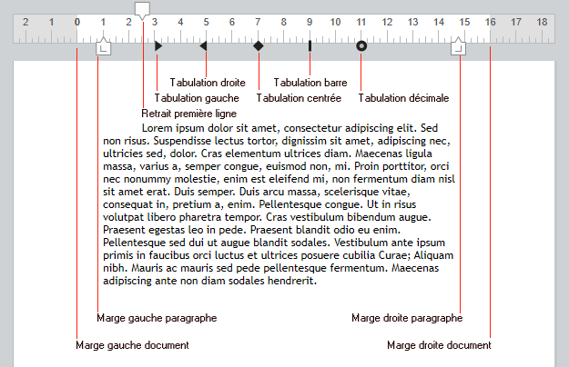

Lorsque vous survolez l'un de ces symboles avec la souris, le curseur est modifié pour indiquer qu'il peut être déplacé, et une ligne de repère verticale apparaît lorsque vous le déplacez :


Lorsque plusieurs paragraphes sont sélectionnés, le déplacement d'un symbole de marge ou d'indentation est appliqué à tous les paragraphes sélectionnés. Si vous maintenez la touche **Majuscule** enfoncée pendant le déplacement, les intervalles existants entre les marges sont conservés dans les paragraphes sélectionnés. 

#### Règle horizontale 

Vous pouvez modifier les marges droites et gauches, les retraits et la position des tabulations en cliquant et en glissant les symboles correspondants sur la règle horizontale :  
  
  

Lorsque vous faites passer la souris sur l'un de ces symboles, le curseur change pour indiquer qu'il peut être déplacé, et une ligne verticale apparait au cours du déplacement :  
  
  

Lorsque plusieurs paragraphes sont sélectionnés, le fait de glisser les symboles de marge ou de retrait permet d'appliquer ces marges ou retraits à tous les paragraphes sélectionnés. En maintenant la touche Maj enfoncée tout en glissant ces symboles, vous conservez les intervalles existants entre les retraits ou les marges dans les paragraphes sélectionnés. 

#### Règle verticale 

Vous pouvez modifier les marges hautes et basses à l'aide de la règle verticale. Lorsque vous passez la souris sur la limite de la marge, le curseur change pour indiquer qu'il peut être déplacé, et une ligne horizontale apparait au cours du déplacement :   
  
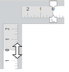   

Cette action peut être utilisée pour modifier l'espacement entre le haut et le bas de la page et le corps, l'en-tête et le pied d'un document. 

### Gestion des tabulations 

Vous pouvez utiliser le menu contextuel de la règle horizontale pour créer, modifier ou supprimer des tabulations :

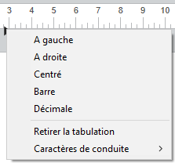

Pour créer une tabulation, cliquez sur la règle horizontale avec le bouton droit de la souris et choisissez son type depuis le menu contextuel ; un clic simple avec le bouton gauche de la souris crée automatiquement une tabulation gauche par défaut. Vous pouvez également effectuer un clic droit sur une tabulation existante pour modifier son type dans le menu contextuel.

Le libellé **Retirer la tabulation** est disponible en cas de clic droit sur une tabulation existante. Vous pouvez également supprimer des tabulations en les faisant glisser hors de la zone de la règle horizontale. 

:::note Notes 

* Les tabulations peuvent également être définies par programmation à l'aide des commandes [WP FIXER ATTRIBUTS](../commands/wp-fixer-attributs), [WP LIRE ATTRIBUTS](../commands/wp-lire-attributs), et [WP REINITIALISER ATTRIBUTS](../commands/wp-reinitialiser-attributs) avec les sélecteurs wk tab default et wk tabs.
* Pour les tabulations décimales, 4D Write Pro considère le premier point ou la première virgule de droite comme un séparateur décimal ; ce paramètre par défaut peut être modifié avec le sélecteur wk tab decimal separator.

:::

#### Définir les caractères de conduite 

Vous pouvez définir les caractères qui précèdent les tabulations (caractères de conduite) en sélectionnant un caractère prédéfini ou en saisissant le caractère à utiliser. Les caractères prédéfinis sont :

* Aucun (aucun caractère n'est affiché - *défaut*)
* .... (points)
* \--- (tirets)
* \_\_ (traits de soulignement)
* \*\*\* (astérisques)

Les caractères de conduite apparaissent toujours avant la tabulation et suivent la direction du texte (gauche à droite ou droite à gauche). Ils peuvent être définis soit par programmation avec les commandes [WP FIXER ATTRIBUTS](../commands/wp-fixer-attributs), [WP LIRE ATTRIBUTS](../commands/wp-lire-attributs) ou [WP REINITIALISER ATTRIBUTS](../commands/wp-reinitialiser-attributs) à l'aide de `wk leading` et des sélecteurs `wk tab defaul`t ou `wk tabs`, soit via le menu contextuel de la règle horizontale (comme illustré ci-dessous) :

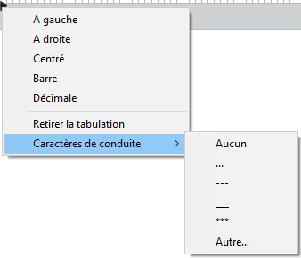

L'option **Autre..** affiche une boîte de dialogue permettant de saisir un caractère de conduite personnalisé.

### Règles multi-colonnes 

Lorsque deux ou plusieurs colonnes sont définies pour le document ou la section, la règle horizontale affiche une zone spécifique pour chaque colonne :

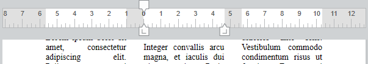

**Note :** La fonctionnalité multi-colonnes n'est pas disponible en mode d'affichage **Inclus**. 

### Evénement Sur après modification 

Un [`On After Edit`](../../Events/onAfterEdit.md) (événement Sur après modification) est généré dans l'objet de formulaire 4D Write Pro à chaque déplacement d'une tabulation ou d'une marge, ainsi qu'à chaque ajout ou suppression d'une tabulation, que l'action ait été effectuée via le menu contextuel ou par glisser-déposer. 

## Colonnes 

4D Write Pro vous permet de créer des documents comportant plusieurs colonnes. Les colonnes sont chaînées depuis la colonne la plus à gauche jusqu'à la colonne la plus à droite. Autrement dit, lorsque vous saisissez du texte, le flux de texte commencera par remplir la colonne de gauche puis continuera dans la colonne à sa droite, puis ainsi de suite jusqu'à ce qu'il atteigne la fin de la page. Une fois que le bas de la page est atteint, le flux de texte est dirigé sur la page suivante. Pour que vous puissiez contrôler ce fonctionnement, 4D Write Pro permet d’insérer des sauts de colonnes.


Les colonnes peuvent être définies au niveau du document (elles sont alors affichées dans l'ensemble du document) et/ou au niveau de la section (chaque section peut avoir sa propre configuration de colonne).

**Note :** Les colonnes sont prises en charge uniquement dans les modes d'affichage **Page** et **Brouillon** (elles ne sont pas affichées en mode **Inclus),** et sont exportées en .docx à l'aide de [WP EXPORTER DOCUMENT](../commands/wp-exporter-document) mais pas aux formats HTML et MIME HTML (format wk page web complète).

Les colonnes peuvent être définies via :

* le sous-menu **Colonnes** du menu contextuel de la zone 4D Write Pro,
* les [attributes](../commands-legacy/4d-write-pro-attributes.md) 4D Write Pro,
* les [actions standard](./using-4d-write-pro-standard-actions.md) 4D Write Pro.

Vous pouvez définir ou lire les propriétés et actions suivantes pour les colonnes :

| **Propriétés**                                       | **Description**                                                                                                                                                                                                                                                                                        | **Attributs de** *Document*                                                      | **Actions standard**                                    |
| ---------------------------------------------------- | ------------------------------------------------------------------------------------------------------------------------------------------------------------------------------------------------------------------------------------------------------------------------------------------------------ | -------------------------------------------------------------------------------- | ------------------------------------------------------- |
| Nombre de colonnes                                   | Vous pouvez définir jusqu'à 20 colonnes par document/section                                                                                                                                                                                                                                           | wk column count                                                                  | *columnCount*                                           |
| Espacement de colonne                                | Espacement entre les colonnes en pts, pouces ou cm. A noter que toutes les colonnes ont la même largeur. La largeur de chaque colonne est calculée automatiquement par 4D Write Pro en fonction du nombre de colonnes, de la largeur de la page et de l'espacement                                     | wk column spacing                                                                | *columnSpacing*                                         |
| Largeur de colonne                                   | (attribut en lecture seule) Largeur actuelle de chaque colonne, i.e. largeur calculée                                                                                                                                                                                                                  | wk column width                                                                  | \-                                                      |
| Style, couleur et épaisseur du séparateur de colonne | Vous pouvez ajouter un séparateur vertical (une ligne décorative) entre les colonnes. Ces options vous permettent de définir le style, la couleur et l'épaisseur de la ligne. Pour supprimer le séparateur vertical, choisissez **Aucun** comme style. | wk column rule style, wk column rule color, wk column rule width                 | *columnRuleStyle*, *columnRuleColor*, *columnRuleWidth* |
| Insérer saut                                         | Insérer un saut de colonne                                                                                                                                                                                                                                                                             | wk column break, voir aussi [WP INSERER RUPTURE](../commands/wp-inserer-rupture) | *insertColumnBreak*                                     |
| Menu Colonnes                                        | Créer un sous-menu Colonnes                                                                                                                                                                                                                                                                            | \-                                                                               | *columns*                                               |

### Créer une page avec des sections multi-colonnes et des section à une seule colonne 

*Insérer un saut de section continu* dans votre document vous permet d'avoir des sections à plusieurs colonnes et des sections à une seule colonne sur la même page.

Par exemple :


Vous pouvez insérer un saut de section continu et modifier le nombre de colonnes et le définir sur deux colonnes pour la première section :


## Signets

4D Write Pro vous permet de créer et de manipuler des références dynamiques sur des parties de vos documents, appelées **signets**. Un signet est une référence nommée associée à une [plage](./ranges.md) spécifique dans un document 4D Write Pro.

Les signets sont dynamiques, ce qui signifie que si l’utilisateur déplace, ajoute ou supprime du texte appartenant au signet, la plage associée sera automatiquement mise à jour et le signet continuera de référencer le même contenu dans le document. Par exemple :

- Vous créez un signet nommé "MyBM" qui référence la plage de texte "Hello world" à la page 20 de votre document.
- Puis vous insérez 50 pages au début du document.
- Vous pouvez toujours accéder automatiquement au même contenu "Hello world", maintenant à la page 70 du document, par l’intermédiaire du signet "MyBM".

Un document peut contenir un nombre illimité de signets. Plusieurs signets peuvent référencer la même plage, et les plages des signets peuvent être entrelacées. Cependant, chaque nom de signet doit être unique dans le document. Les signets ne sont pas importés lorsque la commande [WP INSERER DOCUMENT](../commands/wp-insert-document-body) est utilisée (les signets dans le document de destination ne peuvent pas être écrasés).

Une fois créé, un signet est stocké dans le document. Il est enregistré avec le document, et peut être manipulé par différentes commandes.

Les signets peuvent être utilisés pour référencer des parties d’un document modèle (*template*). Ces parties peuvent alors être automatiquement assemblées avec des données de la base afin de générer des documents finaux tels que des catalogues ou des factures.

Plusieurs commandes vous permettent de créer, supprimer et utiliser les signets :

* [WP NEW BOOKMARK](../commands-legacy/wp-new-bookmark.md) pour créer un signet à partir d’une plage
* [WP GET BOOKMARKS](../commands-legacy/wp-get-bookmarks.md) pour récupérer tous les signets définis dans le document,
* [WP Bookmark range](../commands-legacy/wp-bookmark-range.md) pour récupérer une plage depuis un signet existant,
* [WP DELETE BOOKMARK](../commands-legacy/wp-delete-bookmark.md) pour supprimer un signet


## Liens

4D Write Pro vous permet d'associer des liens hypertexte à n'importe quel objet cible de votre document, y compris à des plages (texte, image, etc.), à des éléments (tableau, corps, pied, etc.), ou au document intégral. Par exemple, vous pouvez définir un hyperlien URL pour une plage de type image ; si le document 4D Write Pro est exporté en HTML, les utilisateurs pourront cliquer sur l'image et ouvrir la page Web qui correspond à l'adresse du lien.

Les liens hypertexte peuvent également être activés directement depuis les documents 4D Write Pro à l'aide des raccourcis **Ctrl+clic** (Windows) ou **Commande+clic** (macOS). Dans un document 4D Write Pro non saisissable, un lien peut être activé par un simple clic.

4D Write Pro prend en charge les types de liens suivants :

| Type de lien | Description |                                                                                                                                                                                                                                                                                                                                 
|--------------|-------------|
|`url`         | Crée des liens vers des pages web ou à tout type de document, ou bien ouvre l'application associée lorsqu'il est activé (\*). L'activation d'un lien URL vers un document 4D Write Pro (`.4wp`, `.4w7`) remplace le document courant dans la zone 4D Write Pro.<br>(\*) tout comme la commande [OPEN URL](../../commands-legacy/open-url.md). |
| `signet`     | Crée des liens vers les signets du document |                                                                                                                                                                                                                                                                                                 
| `méthode`    | L'association d'un lien à une méthode 4D exécute la méthode (sous réserve d'être enregistrée par la méthode [SET ALLOWED METHODS](../../commands/set-allowed-methods.md)).|                                                                                                                                                            

Les liens hypertexte sont gérés via les commandes suivantes :

* [WP FIXER LIEN](../commands-legacy/wp-set-link.md) pour insérer un lien à l'aide de l'objet cible
* [WP Lire liens](../commands-legacy/wp-get-links.md) pour lire la collection de tous les liens dans un objet cible.

:::note

Les liens sont gérés en tant qu'attributs, ils peuvent donc être définis ou lus à l'aide des commandes [WP SET ATTRIBUTES](../commands/wp-set-attributes) et [WP GET ATTRIBUTES](../commands/wp-get-attributes) associées à la constante `wk link url`. Toutefois, il est recommandé d'utiliser les commandes [WP SET LINK](../commands-legacy/wp-set-link.md) et [WP Get links](../commands-legacy/wp-get-links.md, puisqu'elles encodent/décodent automatiquement les liens hypertexte sous forme d'URL. Lorsque les liens sont lus à l'aide de la commande [WP GET ATTRIBUTES](../commands/wp-get-attributes), si l'objet cible contient plusieurs liens, la commande retourne la chaîne du premier lien.

:::

Par exemple, si vous souhaitez transformer le texte sélectionné par l'utilisateur en URL :


Vous pouvez écrire :

```4d
 $range:=WP Lire selection(*;"WParea")
 WP FIXER LIEN($range;Creer objet("url";"http://www.4d.com"))
```


Pour supprimer un lien dans un objet cible, vous pouvez écrire :

```4d
 WP REINITIALISER ATTRIBUTS($range;wk link url)
```

ou

```4d
 WP FIXER ATTRIBUTS($range;wk link url;"")
```

**Note :** Si *\$range* ne contient pas le lien complet, ce dernier est tronqué mais n'est pas entièrement supprimé.

## Utiliser les commandes du thème Objets (Formulaires) 

Les commandes 4D suivantes du thème [Objets (Formulaires)](../../commands/theme/Objects_Forms.md) prennent en charge les objets de formulaire 4D Write Pro :

| Commande                                                                        | Commentaire                                                                                              |
| ------------------------------------------------------------------------------- | -------------------------------------------------------------------------------------------------------- |
| `OBJECT DUPLICATE`                                                              |                                                                                                          |
| `OBJECT Get auto spellcheck` / `OBJECT SET AUTO SPELLCHECK`                     |                                                                                                          |
| `OBJECT Get border style` / `OBJECT SET BORDER STYLE`                           |                                                                                                          |
| `OBJECT Get context menu` / `OBJECT SET CONTEXT MENU`                           |                                                                                                          |
| `OBJECT GET COORDINATES` / `OBJECT SET COORDINATES`                             |                                                                                                          |
| `OBJECT Get data source` / `OBJECT SET DATA SOURCE`                             |                                                                                                          |
| `OBJECT GET DRAG AND DROP OPTIONS` / `OBJECT SET DRAG AND DROP OPTIONS`         |                                                                                                          |
| `OBJECT Get enabled` / `OBJECT SET ENABLED`                                     |                                                                                                          |
| `OBJECT Get enterable` / `OBJECT SET ENTERABLE`                                 |                                                                                                          |
| `OBJECT GET EVENTS` / `OBJECT SET EVENTS`                                       |                                                                                                          |
| `OBJECT Get focus rectangle invisible` / `OBJECT SET FOCUS RECTANGLE INVISIBLE` |                                                                                                          |
| `OBJECT Get font` / `OBJECT SET FONT`                                           | Appliqué à la sélection (si présente)                                                                    |
| `OBJECT Get font size` / `OBJECT SET FONT SIZE`                                 | Appliqué à la sélection (si présente)                                                                    |
| `OBJECT Get font style` / `OBJECT SET FONT STYLE`                               | Appliqué à la sélection (si présente)                                                                    |
| `OBJECT Get horizontal alignment` / `OBJECT SET HORIZONTAL ALIGNMENT`           | Appliqué à la sélection (si présente). Support de la constante `wk justify` pour les zones Write Pro     |
| `OBJECT GET RESIZING OPTIONS` / `OBJECT SET RESIZING OPTIONS`                   |                                                                                                          |
| `OBJECT GET RGB COLORS` / `OBJECT SET RGB COLORS`                               | Appliqué à la sélection (si présente)                                                                    |
| `OBJECT Get type`                                                               |                                                                                                          |
| `OBJECT Get vertical alignment` / `OBJECT SET VERTICAL ALIGNMENT`               | Alignement vertical des paragraphes : n’a d’effet que si la hauteur du paragraphe dépasse celle du texte |
| `OBJECT Get visible` / `OBJECT SET VISIBLE`                                     |                                                                                                          |
| `OBJECT Is styled text`                                                         | Retourne vrai                                                                                            |
| `OBJECT MOVE`                                                                   |                                                                                                          |
| `OBJECT GET SUBFORM CONTAINER SIZE`                                             |                                                                                                          |
| `OBJECT Get name`                                                               |                                                                                                          |
| `OBJECT Get pointer`                                                            |                                                                                                          |

Les commandes OBJET non listées ci-dessus ne sont pas applicables aux zones 4D Write Pro.


