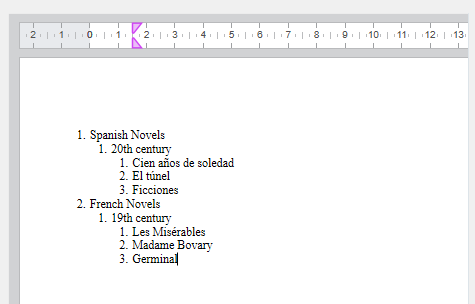

to import

<!-- REF lists-WP.Desc -->

## Listes

4D Write Pro prend en charge les listes plates (à un seul niveau) et les listes à plusieurs niveaux.

### Listes à un seul niveau

4D Write Pro prend en charge deux types principaux de listes à un seul niveau :

- listes non ordonnées : les éléments de la liste sont indiqués par des puces, des puces personnalisées ou des images utilisées comme marqueurs.
- listes ordonnées : les éléments de la liste sont indiqués par des chiffres ou des lettres

Ils peuvent être créés avec :

- la barre d'outils ou la barre latérale de [l'interface de 4D Write Pro](https://doc.4d.com/4Dv20/4D/20.2/Entry-areas.300-6750367.en.html#5865253)
- les [actions standard](./standard-actions) `listStyleType` ou `listStyleImage`,
- ou [par programmation](../commands-legacy/4d-write-pro-attributes.md#lists) en utilisant [WP SET ATTRIBUTE](../commands/wp-set-attributes).

Lorsqu'une liste est créée à l'aide d'une action standard (`listStyleType` ou `listStyleImage`) ou de la barre d'outils/sidebar, 4D Write Pro insère automatiquement une marge avant le texte afin que le marqueur soit positionné à l'intérieur de celle-ci. La valeur de la marge insérée correspond au décalage de l'onglet par défaut (`wk tab default`).


Lorsque la liste est créée à l'aide de la commande WP SET ATTRIBUTE(../commands-legacy/4d-write-pro-attributes.md#lists), aucune marge spécifique n'est gérée ; par défaut, le marqueur est ajouté à la limite gauche du paragraphe. Le développeur peut ajouter une marge personnalisée si nécessaire.

:::tip Article(s) de blog sur le sujet

[4D Write Pro - Ajout automatique d'une marge lorsque des puces sont définies à l'aide d'actions standard](https://blog.4d.com/4d-write-pro-adding-a-margin-automatically-when-bullets-are-set-using-standard-actions)

:::

### Listes multi-niveaux

Multi-level lists are based on [multi-level list style sheets](../user-legacy/stylesheets.md#multi-level-list-style-sheets). Multi-level lists contain a root-level style sheet and one or more sub-level style sheet(s). Each level is attached to a multi-level list style sheet and represents a depth in the list (level 1, level 2, level 3, etc.).

When a new sub-level is created, the level numbering restarts at 1. When you add or remove an element in your multi-level list, the numbers are automatically adjusted.



Multi-level lists are created with command [WP New style sheet](../commands/wp-new-style-sheet.md) and can be applied to a paragraph using [WP SET ATTRIBUTE](../commands/wp-set-attributes.md).

Multi-level lists can be managed using:

- paragraph [style sheet attributes](../commands-legacy/4d-write-pro-attributes.md#style-sheets) (such as `wk list level index`, `wk list level count`, and `wk list concat string format`)
- [actions standard](../user-legacy/standard-actions.md) dédiées à la gestion des niveaux (`listLevelAppend`, `listLevelInc`, `listLevelDec`)
- dedicated standard actions for numbering marker management (`listConcatStringFormat`, `listNumberFormat`).

:::tip Article(s) de blog sur le sujet

[4D Write Pro – Creating Multi-level Bullet or Numbered Lists Using Multi-level list Style Sheets](https://blog.4d.com/4d-write-pro-creating-multi-level-bullet-or-numbered-lists-using-multi-level-paragraph-style-sheets)

:::

<!-- END REF -->

<!-- REF multi-level-list-style-sheets.Desc -->

## Feuilles de style de liste multi-niveaux

Les feuilles de style de liste multi-niveaux permettent de créer des listes [multi-niveaux](../user-legacy/using-a-4d-write-pro-area.md#multi-level-lists).

Pour créer une feuille de style de liste multi-niveaux, utilisez la commande [WP New style sheet](../commands/wp-new-style-sheet.md) et passez dans *listLevelCount* le nombre de niveaux souhaité. Vous définissez ensuite une hiérarchie de feuilles de style de paragraphe liées : une feuille de style **racine** et une ou plusieurs feuilles de style **sous-niveau** qui lui sont liées. Chaque niveau représente une profondeur dans la liste (niveau 1, niveau 2, niveau 3, etc.) et reçoit automatiquement un nom au format "nom du niveau racine + lvl + index", par exemple "MyList lvl 2".

Pour personnaliser le style des listes multi-niveaux, l'objet de la feuille de style de paragraphe peut être personnalisé en utilisant [attributs de feuille de style](../commands-legacy/4d-write-pro-attributes.md#style-sheets).

Les feuilles de style de liste multi-niveaux sont entièrement supportées par les commandes suivantes : [`WP Get style sheet`](../commands/wp-get-style-sheet.md), [`WP SET ATTRIBUTES`](../commands/wp-set-attributes.md), [`WP DELETE STYLE SHEET`](../commands/wp-delete-style-sheet.md).

### Exemple

L'exemple suivant crée une feuille de style de liste multi-niveaux à trois niveaux et l'applique à des paragraphes.

```4d
// Créer une feuille de style de liste multi-niveaux à 3 niveaux
WP New style sheet(wpArea; wk type paragraph; "MyList"; 3)

// Récupérer chaque niveau
var $level1; $level2; $level3 : Object
$level1:=WP Get style sheet(wpArea; "MyList"; 1) // Niveau racine
$level2:=WP Get style sheet(wpArea; "MyList"; 2) // 1er sous-niveau
$level3:=WP Get style sheet(wpArea; "MyList"; 3) // 2e sous-niveau

// Personnaliser les styles
WP SET ATTRIBUTES($level1; {listStyleType: wk upper latin; fontBold: wk true})
WP SET ATTRIBUTES($level2; {listConcatStringFormat: True})
WP SET ATTRIBUTES($level3; {listStringFormatLtr: "(#)"})

// Appliquer des feuilles de style multi-niveaux aux paragraphes
var $paragraphs : Collection
$paragraphs:=WP Get elements(wpArea; wk type paragraph)

WP SET ATTRIBUTES($paragraphs[0]; wk style sheet; $level1)
WP SET ATTRIBUTES($paragraphs[1]; wk style sheet; $level2)
WP SET ATTRIBUTES($paragraphs[2]; wk style sheet; $level3)
```

résultat :


Pour supprimer le premier sous-niveau :

```4d
WP DELETE STYLE SHEET(wpArea; "MyList"; 2)
```

résultat :


### Valeurs d'attribut prédéfinies

Lors de la création, les feuilles de style de listes multi-niveaux utilisent des valeurs prédéfinies :

- `wk margin left` = 0.75 cm \* (number of previous levels) or 0.25 inches \* (number of previous levels), depending on current layout unit
- `wk list type` = `wk decimal`
- `wk name` is derived from the root style sheet name (Read-only for sub-levels)
- `wk list level count` est fixé à la valeur spécifiée pour tous les niveaux

  - Exemple :

    - Niveau racine : `"MyList"`
    - Premier sous-niveau: `"MyList lvl 2"`
    - Deuxième sous-niveau: `"MyList lvl 3"`

<!-- END REF -->

