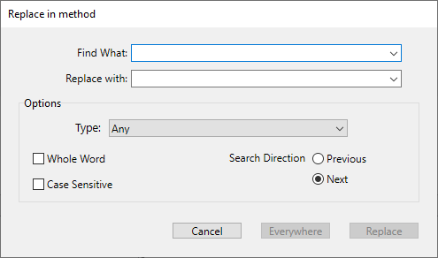

The Code Editor has specific find and replace functions that apply to the current window.

The find area located in the toolbar of each method window can be used to carry out simple searches.

The Find/Replace commands for methods, classes or functions are located in **Edit** menu of 4D:

> The find commands located above the **Find** submenu are not specific to the Code Editor but may be used to search for a value among all the methods, classes or functions, using the **Find in design** feature in the toolbar or in the **Edit** menu.

## Chercher

Selecting the **Find...** command displays the following dialog box:

La recherche définie dans cette boîte de dialogue sera effectuée dans la fenêtre de la méthode située au premier plan.

- The **Find What:** area enables you to enter the string of characters to be searched for. This area is a combo box that stores the last 15 character strings that have been searched for or replaced during the session. If you highlight text before choosing the **Find...** command, it will appear in this area. You can then either use this text or replace it with another.
- The **Whole Word** option is used to limit the search to exact occurrences of the word being searched for. When this option is checked, for instance, a search for "client" will not find either "clients" or "myclient." By default, this option is not checked; therefore, a search for "var" will find "Myvar," "variation," etc. Be careful, unlike the **Whole Object Name** option of the Find in Design dialog box, the **Whole Word** option does not take object names into account. For example, with this option, searching for the string "My" in a method will find the "My Variable" variable. This is not the case for an overall search using the **Whole Object Name** option, where the same result will not be found in the context of the above example since the whole object name (of the variable found previously) is "My Variable" and therefore does not correspond exactly to the string entered ("My").
- The **Case Sensitive** option is used to take the case of characters as they were entered in the "Find What:" area into account. For instance, a search for "MyVar" will not find "myVar."
- The **Previous/Next** radio buttons are used to set the direction of the search: towards the beginning or end of the current method, starting from the initial location of the cursor.

4D begins searching from the current text insertion point and continues to the end of the method. The first item corresponding to the set criteria is thus selected in the Code Editor window. It is then possible to continue the search using the **Find Next** and **Find Previous** commands of the **Edit** menu.

### Find Same

The **Find Same** command is used to find character strings identical to the one selected. This command is only active if you have selected at least one character in the Code Editor.

The search carried out is of the "Find Next" type in the current code editor window.

### Find Same Next/Previous

The **Find Same Next** and **Find Same Previous** commands are used to find character strings *strictly* identical to the ones selected. For example, the case must match.

### Bookmark All

The **Bookmark All** command is enabled when a search has already been specified in the find or replace dialog box. When you select this command, 4D puts a bookmark at each line that contains an item corresponding to the "current" search criteria. This makes it easy to spot all the search results.

For more information about bookmarks, refer to [Using bookmarks](./write-class-method.md#using-bookmarks).

## Replace

The **Replace** command displays the following dialog box:

- The **Find What:** area is used to define the character string or the expression to be searched for. As in the Find dialog box, this area is a combo-box that stores the last 15 character strings searched for. If you highlight text before choosing the **Replace** command, it will appear in this area.
- The **Replace with:** area is used to define the character string that will replace the one defined above. This area is also a combo-box storing the last 15 character strings that have been searched for or replaced.
- The **Whole Word** option is used to find/replace only character strings that correspond exactly to the string entered. In this case, for instance, a search for "client" will not find the strings "clients" or "myclient," etc.
- The **Case Sensitive** option is used to find/replace only character strings having the same case as that of the entered string. For instance, a search for "MyVar" will not find "myVar."
- As in the Find dialog box, the **Previous** and **Next** buttons are used to set the direction of the search: towards the beginning or end of the current method, starting from the initial location of the cursor.

The **Replace** button is used to launch the search and replace the first occurrence found. 4D begins searching from the current text insertion point and continues to the end of the method. It is then possible to continue the search using the **Find Next** and **Find Previous** commands of the **Edit** menu.

The **Everywhere** button is used to replace all the occurrences corresponding to the search criteria directly in the open method.

## Goto Definition

The **Goto Definition** command opens the definition of an element referenced in the Code Editor. To do this, place the cursor inside the object name or select it, and choose **Method** > **Goto Definition...** or use the context menu of the editor.

**Note:** This feature is also available through the keyboard shortcut **Ctrl+K** (Windows) or **Command+K** (macOS).

The effect varies depending on the target element.

- Selecting a project method and choosing **Goto Definition...** displays the contents of the method in a new window of the Code Editor
- Selecting a class name or class attribute and choosing **Goto Definition...** opens the class in the the Code Editor

## Reveal in Explorer

The **Reveal in Explorer...** command opens an Explorer window with the target element selected. To do this, place the cursor inside the element's name or select it, then choose **Method** > **Reveal in Explorer...** .

## Show documentation

The **Show documentation...** command opens the documentation for the target element. To do this, place the cursor inside the element's name or select it, then choose **Method** > **Show documentation...** or use the contextual menu. The effect varies depending on the target element.

- Selecting a project method or a user class and choosing **Show documentation...** selects the method in the Explorer and switches to the documentation tab
- Selecting a 4D command or a 4D class name and choosing **Show documentation...** displays the online documentation

If no element is selected, the command opens the documentation of the method currently opened in the Code Editor.

## Search references

The **Search references...** command found in the **Method** menu or the context menu of the Code Editor finds all the objects (methods and forms) in the database where the current item of the method is referenced (used).

The current item is either the one selected or the one where the cursor is located. It can be a field name, variable name, command, string, and so on. For example, the following action looks for all the occurrences of the *vlNbCmd* variable in the database:

This command displays its results in a new window.

## Search Callers

The **Search Callers** command in the **Method** menu is only enabled for project methods. It searches for all the objects (other methods or menus) that reference the project method.

**Note:** The **Search Callers...** command is also available in **Explorer** > **Methods**

This command displays its results in a new window.

## Goto Line

This specific search command is located in the **Method** menu. It opens a dialog box where you can indicate the line number you want to find. When you click **OK**, the editor finds and highlights that line in the method. This type of search is useful when used in conjunction with the compiler, which flags runtime errors by the line number in which they occur.

You can choose whether or not to display lines numbers in the Code Editor window. This option is described in the [Overview](./write-class-method.md#using-bookmarks) section.

