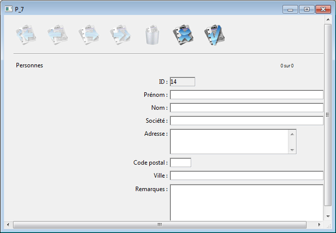
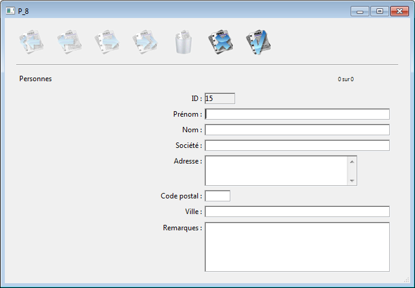

<!--REF #_command_.ADD RECORD.Syntax-->**ADD RECORD** ( {*laTable*}{;}{*} )<!-- END REF-->
<!--REF #_command_.ADD RECORD.Params-->
| Paramètre | Type |  | Description |
| --- | --- | --- | --- |
| laTable | Table | &#8594;  | Table dans laquelle ajouter des données ou Table par défaut si ce paramètre est omis |
| * | Operator |  &#8594;  | Cacher les barres de défilement |

<!-- END REF-->

*Cette commande n'est pas thread-safe, elle ne peut pas être utilisée dans du code préemptif.*


#### Compatibilité 

<!--REF #_command_.ADD RECORD.Summary-->*Cette commande est apparue dans les premières versions de 4D et reste toujours utile pour créer des prototypes ou effectuer des développements simples.<!-- END REF--> Toutefois, pour construire des interfaces modernes et personnalisées, il est désormais recommandé d'utiliser des formulaires génériques basés sur la commande [DIALOG](dialog.md) qui fournit des fonctionnalités avancées et un meilleur contrôle du flux de données.* 

#### Description 

La commande **ADD RECORD** permet à l'utilisateur de créer un nouvel enregistrement dans *laTable* ou dans la table par défaut si ce paramètre est omis.

**ADD RECORD** crée un nouvel enregistrement pour *laTable*, en fait l'enregistrement courant pour le process courant et l'affiche dans le formulaire entrée courant. En mode Application, une fois que l'utilisateur a validé le nouvel enregistrement, la sélection courante est réduite à ce seul enregistrement. 

L'écran suivant présente un formulaire typiquement utilisé pour la saisie de données :



Le formulaire est affiché dans la fenêtre se trouvant au premier plan du process. Elle comporte des barres de défilement et une case de contrôle de taille. Si vous passez le paramètre optionnel astérisque (\*), les barres de défilement n'apparaissent pas et la fenêtre du formulaire ne peut être réduite :



**ADD RECORD** affiche le formulaire jusqu'à ce que l'utilisateur valide ou annule l'enregistrement. Si l'utilisateur ajoute plusieurs enregistrements, la commande doit être appelée pour chaque nouvel enregistrement. 

L'enregistrement est sauvegardé si l'utilisateur clique sur un bouton du type Valider ou appuie sur la touche Entrée, ou encore si la commande [ACCEPT](accept.md) est exécutée. 

L'enregistrement n'est pas sauvegardé si l'utilisateur clique sur un bouton du type **Annuler** ou appuie sur la touche d'annulation (**Echap** sous Windows, **Esc** sous Mac OS), ou encore si la commande [CANCEL](cancel.md) est exécutée. 

**Note :** Cette commande ne nécessite pas que *laTable* soit en mode lecture/écriture. Elle peut être utilisée même lorsque la table est en mode lecture seulement (cf. section *Verrouillage d'enregistrements*). 

Après un appel à **ADD RECORD**, la variable système OK prend la valeur 1 si l'enregistrement est validé et 0 s'il est annulé.

**Note :** Même lorsqu'il est annulé, l'enregistrement reste en mémoire et peut être sauvegardé avec la commande [SAVE RECORD](save-record.md) si celle-ci est exécutée avant que le pointeur d'enregistrement courant ne soit modifié.

#### Exemple 1 

L'exemple suivant est une boucle souvent utilisée pour créer des enregistrements dans une base : 

```4d
 FORM SET INPUT([Clients];"SaisieClients") // Désigner le formulaire entrée de la table [Clients]
 Repeat // Boucle jusqu'à ce que l'utilisateur annule
    ADD RECORD([Clients];*) // Ajouter un enregistrement dans la table [Clients]
 Until(OK=0) // Jusqu'à ce que l'utilisateur annule
```

#### Exemple 2 

L'exemple suivant permet de rechercher un client dans la base. Le déroulement de la méthode dépend du résultat de la recherche. Si aucun client n'a été trouvé, l'utilisateur est autorisé à créer un nouveau client à l'aide de la commande **ADD RECORD**. Si au moins un client a été trouvé, le premier enregistrement est affiché pour modification, à l'aide de la commande [MODIFY RECORD](modify-record.md) :

```4d
 READ WRITE([Clients])
 FORM SET INPUT([Clients];"Entrée1") // Désigner le formulaire entrée
 vlClientNo:=Num(Request("Saisissez un numéro de client :") // On récupère le numéro du client
 If(OK=1)
    QUERY([Clients];[Clients]ClientNo=vlClientNo) // Recherche du client
    If(Records in selection([Clients])=0) // Si aucun client n'a été trouvé…
       ADD RECORD([Clients]) //Ajout d'un nouveau client
    Else
       If(Not(Locked([Clients])))
          MODIFY RECORD([Clients]) //Modifier l'enregistrement
          UNLOAD RECORD([Clients])
       Else
          ALERT("Cet enregistrement est en train d'être modifié.")
       End if
    End if
 End if
```

#### Variables et ensembles système 

La variable système OK prend la valeur 1 si l'enregistrement est validé et 0 s'il est annulé.

#### Voir aussi 

[ACCEPT](accept.md)  
[CANCEL](cancel.md)  
[CREATE RECORD](create-record.md)  
[MODIFY RECORD](modify-record.md)  
[SAVE RECORD](save-record.md)  