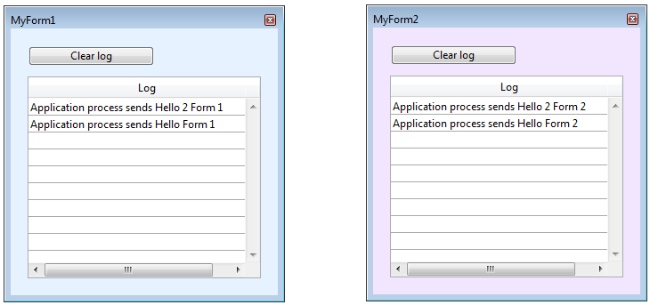

<!--REF #_command_.CALL FORM.Syntax-->**CALL FORM** ( *fenêtre* ; *formule* {; *param*}{; *param2* ; ... ; *paramN*} )<!-- END REF-->
<!--REF #_command_.CALL FORM.Params-->
| Paramètre | Type |  | Description |
| --- | --- | --- | --- |
| fenêtre | Integer | &#8594;  | Numéro de référence de la fenêtre |
| formule | Object, Text | &#8594;  | Objet Formula ou Nom de la méthode projet |
| param | Expression | &#8594;  | Paramètre(s) passé(s) à la méthode |

<!-- END REF-->

#### Gestion des erreurs 

<!--REF #_command_.CALL FORM.Summary-->La commande **CALL FORM** exécute le code 4D désigné dans formule avec un ou plusieurs *param*(s) optionnel(s) dans le contexte d'un formulaire affiché dans la *fenêtre*, indépendamment du process auquel appartient la fenêtre.<!-- END REF-->

Tout comme dans la communication interprocess basée sur les workers (voir *A propos des workers*), une boîte aux lettres est associée à chaque fenêtre et peut être utilisée lorsque la fenêtre affiche un formulaire (après l'événement On Load). **CALL FORM** encapsule la formule et ses arguments dans un message envoyé dans la boîte aux lettres de la fenêtre. Le formulaire exécute alors le message dans son propre process. Le process appelant peut être coopératif ou préemptif, par conséquent cette fonctionnalité permet à un process préemptif d'échanger des informations avec des formulaires.

Dans *fenêtre*, passez le numéro de référence de la fenêtre affichant le formulaire appelé.

Dans *formule*, vous désignez le code 4D qui doit être exécuté dans le contexte du process parent de la *fenêtre*. Vous pousser passer soit :

* un objet **formula** (voir *Objets Formula*). Les objets formula peuvent encapsuler toute expression exécutable, y compris les fonctions et les méthodes projet ;
* une **chaîne** contenant le nom d'une méthode projet.

Vous pouvez aussi passer des paramètres à la formule en utilisant un ou plusieurs paramètres *param*. Vous pouvez utiliser des *paramètres séquentiels* ou, si l'expression de la formule est une fonction ou une méthode projet, des *paramètres nommés*. Lors de l'exécution dans le contexte du formulaire, la formule du process reçoit les paramètres nommés ou bien les valeurs des paramètres dans *$1*, *$2*, et ainsi de suite. N'oubliez pas que des tableaux ne peuvent pas être passés en paramètre. En outre, dans le contexte de la commande **CALL FORM**, les points suivants doivent être pris en compte :

* Les pointeurs sur les tables et les champs sont autorisés.
* Les pointeurs sur les variables, en particulier les variables locales ou process, ne sont pas recommandés car ces variables peuvent être indéfinies au moment où la méthode du process tente d'y accéder.
* Si vous passez un paramètre de type Objet ou Collection, 4D crée une copie de l'objet ou de la collection dans le process de destination si le formulaire est dans un process différent de celui appelant la commande **CALL FORM**.

#### Exemple 1 

Vous pouvez utiliser la commande **CALL FORM** pour passer des paramètres personnalisés à un formulaire, tels que des valeurs de configuration par exemple, sans avoir à utiliser de variables process :

```4d
 $win:=Créer fenêtre formulaire("form")
 CALL FORM($win;Formula(configure);param1;param2)
 DIALOG("form")
```

#### Exemple 2 

Vous voulez ouvrir deux fenêtres de dialogue à partir d'un même formulaire, mais avec des couleurs de fonds différentes et des messages différents. Vous souhaitez également envoyer des messages par la suite et les afficher dans chaque fenêtre de dialogue.

Dans le formulaire principal, un bouton ouvre les deux dialogues :

```4d
  //Méthode objet pour créer les formulaires
  //Première fenêtre
 formRef1:=Open form window("FormMessage";Palette form window;On the left)
 SET WINDOW TITLE("MyForm1";formRef1)
 DIALOG("FormMessage";*)
 SHOW WINDOW(formRef1)
 
  //Seconde fenêtre
 formRef2:=Open form window("FormMessage";Palette form window;On the left+500)
 SET WINDOW TITLE("MyForm2";formRef2)
 DIALOG("FormMessage";*)
 SHOW WINDOW(formRef2)
 
  //Envoi des couleurs
 CALL FORM(formRef1;"doSetColor";0x00E6F2FF)
 CALL FORM(formRef2;"doSetColor";0x00F2E6FF)
  //Création des messages
 CALL FORM(formRef1;"doAddMessage";Current process name;"Hello Form 1")
 CALL FORM(formRef2;"doAddMessage";Current process name;"Hello Form 2")
```

La méthode *doAddMessage* ajoute simplement une ligne dans la list box du formulaire "FormMessage" :

```4d
 var $1 : Text //Origine du message
 var $2 : Text //Message à afficher
  //Récupère le message contenu dans $2 et l'envoie dans la list box
 $p:=OBJECT Get pointer(Object named;"Column1")
 INSERT IN ARRAY($p->;1)
 $p->{1}:=$1+" sends "+$2
```

A l'utilisation, vous obtenez le résultat suivant :


Vous pouvez alors ajouter d'autres messages en exécutant à nouveau la commande **CALL FORM** :

```4d
 CALL FORM(formRef1;"doAddMessage";Current process name;"Hello 2 Form 1")
 CALL FORM(formRef2;"doAddMessage";Current process name;"Hello 2 Form 2")
```



#### Voir aussi 

  
[CALL WORKER](call-worker.md)  
[DIALOG](dialog.md)  