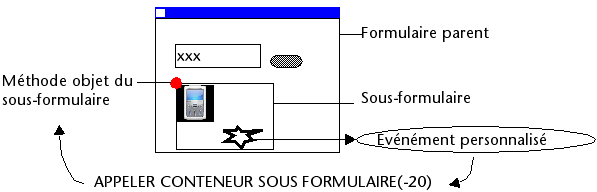

<!--REF #_command_.CALL SUBFORM CONTAINER.Syntax-->**CALL SUBFORM CONTAINER** ( événement )<!-- END REF-->
<!--REF #_command_.CALL SUBFORM CONTAINER.Params-->
| Paramètre | Type |  | Description |
| --- | --- | --- | --- |
| événement | Integer | &#8594; | Evénement à transmettre |

<!-- END REF-->

## Description 

<!--REF #_command_.CALL SUBFORM CONTAINER.Summary-->La commande **CALL SUBFORM CONTAINER** permet à une instance de sous-formulaire d’envoyer l’*événement* à l’objet sous-formulaire qui la contient.<!-- END REF--> L’objet sous-formulaire peut alors traiter l’*événement* dans le contexte du formulaire parent. 

Cette commande doit être placée dans la méthode formulaire du sous-formulaire ou dans la méthode objet d’un des objets du sous-formulaire. L’événement sera reçu uniquement dans la méthode objet du conteneur du sous-formulaire. 

Vous pouvez passer dans *événement* un des [événements formulaire 4D pris en charge par les sous-formulaires](../FormObjects/subform_overview.md#call-subform-container-command) ou toute valeur correspondant à un événement personnalisé. Dans le premier cas, l’événement doit être coché pour le sous-formulaire. Dans le cas d’un événement personnalisé, il est conseillé de passer une valeur négative dans *événement* afin de ne pas risquer d’interférer avec des numéros d’événements existants ou à venir de 4D.

*Principe d’exécution de la commande* **CALL SUBFORM CONTAINER** *:*

## Voir aussi 

[Form event code](../commands/form-event-code.md)  
[GOTO OBJECT](goto-object.md)  

## Propriétés

|  |  |
| --- | --- |
| Numéro de commande | 1086 |
| Thread safe | no |

