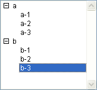
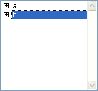
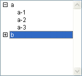

<!--REF #_command_.Count list items.Syntax-->**Count list items** ( {* ;} *liste* {; *} ) : Integer<!-- END REF-->
<!--REF #_command_.Count list items.Params-->
| Paramètre | Type |  | Description |
| --- | --- | --- | --- |
| * | Opérateur | &#8594;  | Si spécifié, liste est un nom d'objet (chaîne) Si omis, liste est une référence de liste |
| liste | Integer, Text | &#8594;  | Numéro de référence de liste (si * omis) ou Nom d'objet de type liste (si * passé) |
| * | Opérateur | &#8594;  | Si omis (défaut) : Retourner les éléments visibles (déployés) dans la ou les liste(s) Si spécifié : Retourner tous les éléments |
| Résultat | Integer | &#8592; | Nombre d'éléments visibles (déployés) si 2e * omis ou Nombre total d’éléments si 2e * passé |

<!-- END REF-->

*Cette commande n'est pas thread-safe, elle ne peut pas être utilisée dans du code préemptif.*


#### Description 

<!--REF #_command_.Count list items.Summary-->La fonction **Count list items** retourne soit le nombre d'éléments visibles soit le nombre total d'éléments dans la liste dont vous avez passé le numéro de référence ou le nom d'objet dans *liste*.<!-- END REF--> 

Si vous passez le premier paramètre optionnel *\**, vous indiquez que le paramètre *liste* est un nom d’objet (chaîne) correspondant à une représentation de liste dans le formulaire. Si vous ne passez pas ce paramètre, vous indiquez que le paramètre *liste* est une référence de liste hiérarchique ([RéfListe](# "Expression de type Entier long identifiant de façon unique une liste hiérarchique")). Si vous utilisez une seule représentation de liste ou travaillez avec tous les éléments (le second *\** est passé), vous pouvez utiliser indifféremment l’une ou l’autre syntaxe. En revanche, si vous utilisez plusieurs représentations d’une même liste et travaillez avec les éléments visibles (le second *\** est omis), la syntaxe basée sur le nom d’objet est requise car chaque représentation peut disposer de sa propre configuration déployée/contractée.

**Note :** Si vous utilisez le caractère @ dans le nom d'objet de la liste et que le formulaire contient plusieurs listes répondant à ce nom, la commande **Count list items** s'appliquera au premier objet dont le nom correspond. 

Le choix du type d'information à retourner est effectué à l'aide du second paramètre *\**. Lorsque ce paramètre est passé, la commande retourne le nombre total d’éléments présents dans la liste, quel que soit son état courant déployé/contracté.   
Lorsque ce paramètre est omis, la commande retourne le nombre d'éléments qui sont visibles, en fonction de l'état déployé/contracté actuel de la liste et de ses sous-listes.

Cette fonction doit être appliquée à une liste affichée dans un formulaire.

#### Exemples 

Voici la liste *hList* affichée en mode Application :



```4d
 $vlNbItems:=Count list items(hList) // à ce stade, $vlNbItems vaut 8
 $vlNbTItems:=Count list items(hList;*) //$vlNbTItems vaut également 8
```



```4d
 $vlNbItems:=Count list items(hList) // à ce stade, $vlNbItems vaut 2
 $vlNbTItems:=Count list items(hList;*) //$vlNbTItems vaut toujours 8
```



```4d
 $vlNbItems:=Count list items(hList) //$vlNbItems vaut 5
 $vlNbTItems:=Count list items(hList;*) //$vlNbTItems vaut toujours 8
```

#### Voir aussi 

[List item position](list-item-position.md)  
[Selected list items](selected-list-items.md)  