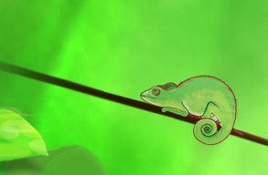
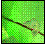
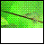
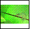

<!--REF #_command_.CREATE THUMBNAIL.Syntax-->**CREATE THUMBNAIL** ( *source* ; *dest* {; *largeur* {; *hauteur* {; *mode* {; *profondeur*}}}} )<!-- END REF-->
<!--REF #_command_.CREATE THUMBNAIL.Params-->
| Paramètre | Type |  | Description |
| --- | --- | --- | --- |
| source | Picture | &#8594;  | Champ ou variable image 4D à passer en imagette |
| dest | Picture | &#8592; | Imagette résultante |
| largeur | Integer | &#8594;  | Largeur de l’imagette en pixels, Par défaut = 48 |
| hauteur | Integer | &#8594;  | Hauteur de l’imagette en pixels, Par défaut = 48 |
| mode | Integer | &#8594;  | Mode de création de l’imagette Par défaut = proportionnelle centrée (6) |
| profondeur | Integer | &#8594;  | Obsolète, ne pas utiliser |

<!-- END REF-->

#### Description 

<!--REF #_command_.CREATE THUMBNAIL.Summary-->La commande **CREATE THUMBNAIL** retourne une imagette à partir d’une image source.<!-- END REF--> Les imagettes sont généralement utilisées pour la prévisualisation d’images dans le cadre d’applications multimédia ou de sites Web. 

Passez dans *source* la variable ou le champ image 4D contenant l’image source à réduire sous forme d’imagette, et dans *dest* la variable ou le champ image 4D devant recevoir l’imagette résultante. 

Les paramètres optionnels *largeur* et *hauteur* vous permettent de définir la taille en pixels de l’imagette que vous souhaitez obtenir. Si vous omettez ces paramètres, la taille par défaut de l’imagette sera de 48x48 pixels. 

Le paramètre optionnel *mode* vous permet de définir le mode de création de l’imagette, c’est-à-dire la manière dont elle sera redimensionnée. Vous pouvez utiliser l’un des trois modes suivants, accessibles par l’intermédiaire de constantes prédéfinies disponibles dans le thème “*Formats d'affichage des images*” :

| Constante                   | Type        | Valeur |
| --------------------------- | ----------- | ------ |
| Scaled to fit               | Entier long | 2      |
| Scaled to fit prop centered | Entier long | 6      |
| Scaled to fit proportional  | Entier long | 5      |

**Note :** Seules ces trois constantes peuvent être utilisées avec **CREATE THUMBNAIL**. Les autres constantes du thème “Formats d’affichage des images” ne s’appliquent pas à cette commande. 

Si vous omettez le paramètre *mode*, le mode 6 (Proportionnelle centrée) est appliqué par défaut. Le résultat des différents modes est illustré ci-dessous : 

Image source   

Imagettes résultantes (48x48)

* Non tronquée = 2  

* Proportionnelle = 5  

* Proportionnelle centrée = 6 (mode par défaut)  

**Note :** Avec les modes “Proportionnelle” et “Proportionnelle centrée”, les espaces vides apparaîtront blancs dans les imagettes — lorsque ces modes sont appliqués aux champs ou variables images dans les formulaires 4D, les espaces vides sont transparents. 

Le paramètre *profondeur* est ignoré et doit être omis. La commande utilise toujours la profondeur écran (nombre de couleurs) courante. 
