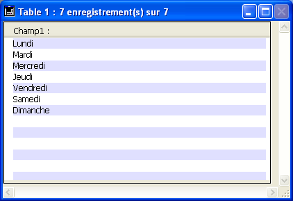

<!--REF #_command_.Displayed line number.Syntax-->**Displayed line number**  : Integer<!-- END REF-->
<!--REF #_command_.Displayed line number.Params-->
| Paramètre | Type |  | Description |
| --- | --- | --- | --- |
| Résultat | Integer | &#8592; | Numéro de ligne en cours d’affichage |

<!-- END REF-->

*Cette commande n'est pas thread-safe, elle ne peut pas être utilisée dans du code préemptif.*


#### Description 

<!--REF #_command_.Displayed line number.Summary-->La commande **Displayed line number** fonctionne uniquement dans le contexte de l’événement formulaire On Display Detail.<!-- END REF--> Elle retourne le numéro de la ligne en cours de traitement durant l’affichage à l’écran d’une liste d’enregistrements ou des lignes d'une list box. Si **Displayed line number** est appelée en-dehors de l’affichage d’une liste ou d'une listbox, elle retourne 0.

Dans le cas d'une liste d'enregistrements, lorsque la ligne affichée n’est pas vide (c’est-à-dire lorsqu’elle est associée à un enregistrement), la valeur retournée par **Displayed line number** est identique à celle retournée par [Selected record number](selected-record-number.md).

Comme [Selected record number](selected-record-number.md), **Displayed line number** débute à 1\. Cette commande est utile lorsque vous souhaitez appliquer un traitement à chaque ligne d’un formulaire liste ou d'une list box affiché(e) à l’écran, y compris aux lignes vides. 

#### Exemple 

Cet exemple permet d’appliquer une couleur alternée à un formulaire liste affiché à l’écran, même pour les lignes sans enregistrement :

```4d
  //Méthode du formulaire liste
 If(Form event code=On Display Detail)
    If(Displayed line number% 2=0)
  //Noir sur blanc pour le texte des lignes paires
       OBJECT SET RGB COLORS([Table 1]Champ1;-1;0x00FFFFFF)
    Else
  //Noir sur bleu pâle pour le texte des lignes impaires
       OBJECT SET RGB COLORS([Table 1]Champ1;-1;0x00E0E0FF)
    End if
 End if
```



#### Voir aussi 

[Form event code](../commands/form-event-code.md)  
[Selected record number](selected-record-number.md)  