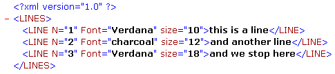

<!--REF #_command_.DOM Count XML attributes.Syntax-->**DOM Count XML attributes** ( *refElément* ) : Integer<!-- END REF-->
<!--REF #_command_.DOM Count XML attributes.Params-->
| Paramètre | Type |  | Description |
| --- | --- | --- | --- |
| refElément | Text | &#8594;  | Référence d’élément XML |
| Résultat | Integer | &#8592; | Nombre d’attributs |

<!-- END REF-->

#### Description 

<!--REF #_command_.DOM Count XML attributes.Summary-->La commande **DOM Count XML attributes** retourne le nombre d’attributs XML présents dans l’élément XML désigné par *refElément*.<!-- END REF--> Pour plus d'informations sur les attributs XML, reportez-vous à la section *Présentation des commandes XML DOM*. 

#### Exemple 

Avant de récupérer les valeurs des éléments dans un tableau, vous souhaitez connaître le nombre d’attributs dans l’élément XML suivant :



```4d
 var maVarBlob : Blob
 var $ref_XML_Parent;$ref_XML_Enfant : Text
 var monRésultat : Text
 var $nbAttributs : Integer
 
 $ref_XML_Parent:=DOM Parse XML variable(maVarBlob)
 $ref_XML_Enfant:=DOM Get first child XML element($ref_XML_Parent)
 
 $nbAttributs:=DOM Count XML attributes($ref_XML_Enfant)
 ARRAY TEXT(tAttrib;$nbAttributs)
 ARRAY TEXT(tValAttrib;$nbAttributs)
 For($i;1;$nbAttributs)
    DOM GET XML ATTRIBUTE BY INDEX($ref_XML_Enfant;$i;tAttrib{$i};tValAttrib{$i})
 End for
```

Dans l’exemple ci-dessus, $nbAttributs vaut 3, tAttrib{1} contient “Font”, tAttrib{2} contient “N” et tAttrib{3} contient “size”. tValAttrib contient “Verdana”, “1” et “10”.

**Note :** Le numéro d’indice ne correspond pas à l’emplacement de l’attribut dans le fichier XML affiché sous forme de texte. En XML, l’indice d’un attribut indique sa position parmi les attributs classés par ordre alphabétique (en fonction de leur nom).

#### Variables et ensembles système 

Si la commande a été correctement exécutée, la variable système OK prend la valeur 1\. Si une erreur se produit, elle prend la valeur 0.

#### Voir aussi 

[DOM Count XML elements](dom-count-xml-elements.md)  

#### Propriétés
|  |  |
| --- | --- |
| Numéro de commande | 727 |
| Thread safe | &check; |
| Modifie les variables | OK |
| Interdite sur le serveur ||


