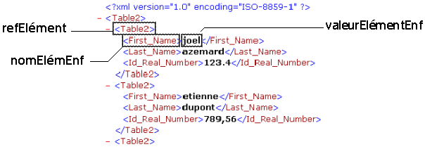

<!--REF #_command_.DOM Get first child XML element.Syntax-->**DOM Get first child XML element** ( *refElément* {; *nomElémentEnf* {; *valeurElémentEnf*}} ) : Text<!-- END REF-->
<!--REF #_command_.DOM Get first child XML element.Params-->
| Paramètre | Type |  | Description |
| --- | --- | --- | --- |
| refElément | Text | &#8594;  | Référence d’élément XML |
| nomElémentEnf | Text | &#8592; | Nom de l'élément XML enfant |
| valeurElémentEnf | Text | &#8592; | Valeur de l'élément XML enfant |
| Résultat | Text | &#8592; | Référence de l’élément XML enfant |

<!-- END REF-->

#### Description 

<!--REF #_command_.DOM Get first child XML element.Summary-->La commande **DOM Get first child XML element** retourne une référence XML vers le premier “enfant” de l’élément XML passé en référence dans *refElément*.<!-- END REF--> Cette référence pourra être utilisée avec les autres commandes d’analyse XML.

Les paramètres *nomElémentEnf* et *valeurElémentEnf*, s’ils sont passés, reçoivent respectivement le nom et la valeur de l’élément enfant. 



#### Exemple 1 

Récupération de la référence du premier élément XML du parent racine. La structure XML (C:\\\\import.xml) est préalablement chargée dans un BLOB : 

```4d
 var maVarBlob : Blob
 var $ref_XML_Parent;$ref_XML_Enfant : Text
 
 DOCUMENT TO BLOB("c:\\import.xml";maVarBlob)
 $ref_XML_Parent:=DOM Parse XML variable(maVarBlob)
 $ref_XML_Enfant:=DOM Get first child XML element($ref_XML_Parent)
```

#### Exemple 2 

Récupération de la référence, du nom et de la valeur du premier élément XML du parent racine. La structure XML (C:\\\\import.xml) est préalablement chargée dans un BLOB : 

```4d
 var maVarBlob : Blob
 var $ref_XML_Parent;$ref_XML_Enfant : Text
 var $enfantNom;$enfantValeur : Text
 
 DOCUMENT TO BLOB("c:\\import.xml";maVarBlob)
 $ref_XML_Parent:=DOM Parse XML variable(maVarBlob)
 $ref_XML_Enfant:=DOM Get first child XML element($ref_XML_Parent;$enfantNom;$enfantValeur)
```

#### Variables et ensembles système 

Si la commande a été correctement exécutée, la variable système OK prend la valeur 1\. Sinon, elle prend la valeur 0\. 

#### Voir aussi 

[DOM Get next sibling XML element](dom-get-next-sibling-xml-element.md)  

#### Propriétés
|  |  |
| --- | --- |
| Numéro de commande | 723 |
| Thread safe | &check; |
| Modifie les variables | OK |
| Interdite sur le serveur ||


