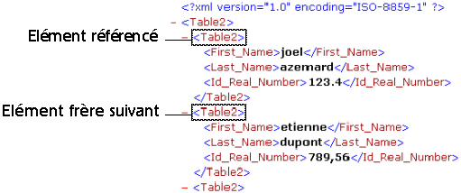

<!--REF #_command_.DOM Get next sibling XML element.Syntax-->**DOM Get next sibling XML element** ( *refElément* {; *nomElémentFrère* {; *valeurElémentFrère*}} ) -> Résultat<!-- END REF-->
<!--REF #_command_.DOM Get next sibling XML element.Params-->
| Paramètre | Type |  | Description |
| --- | --- | --- | --- |
| refElément | Text | &#8594;  | Référence d’élément XML |
| nomElémentFrère | Text | &#8592; | Nom de l'élément XML frère |
| valeurElémentFrère | Text | &#8592; | Valeur de l'élément XML frère |
| Résultat | Text | &#8592; | Référence de l’élément XML frère |

<!-- END REF-->

#### Description 

<!--REF #_command_.DOM Get next sibling XML element.Summary-->La commande **DOM Get next sibling XML element** retourne une référence vers le prochain “frère” de l’élément XML passé en référence.<!-- END REF--> Cette référence pourra être utilisée avec les autres commandes d’analyse XML.

  
Les paramètres *nomElémentFrère* et *valeurElémentFrère*, s’ils sont passés, reçoivent respectivement le nom et la valeur de l’élément “frère”. 

Cette commande permet de naviguer parmi les “enfants” d'un élément XML. 

Après le dernier “frère”, la variable système OK prend la valeur 0\. 

#### Exemple 1 

Récupération de la référence de l’élément XML frère suivant l’élément passé en paramètre :

```4d
 var $ref_XML_Parent;$ref_XML_Suivant : Text
 $ref_XML_Suivant:=DOM Get next sibling XML element($ref_XML_Parent)
```



#### Exemple 2 

Récupération dans une boucle des références de tous les éléments XML enfants de l’élément parent passé en paramètre, à compter du premier enfant : 

```4d
 var $ref_XML_Parent;$ref_XML_Premier;$ref_XML_Suivant : Text
 
 $ref_XML_Premier:=DOM Get first child XML element($ref_XML_Parent)
 $ref_XML_Suivant:=$ref_XML_Premier
 While(OK=1)
    $ref_XML_Suivant:=DOM Get next sibling XML element($ref_XML_Suivant)
 End while
```


#### Variables et ensembles système 

Si la commande a été correctement exécutée et si l’élément analysé n’est pas le dernier “frère” de l’élément référencé, la variable système OK prend la valeur 1\. Si une erreur se produit ou si l’élément analysé est le dernier “frère” de l’élément référencé, elle prend la valeur 0.

#### Voir aussi 

[DOM Get first child XML element](dom-get-first-child-xml-element.md)  