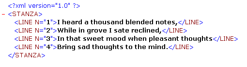

<!--REF #_command_.DOM REMOVE XML ATTRIBUTE.Syntax-->**DOM REMOVE XML ATTRIBUTE** ( *refElément* ; *nomAttribut* )<!-- END REF-->
<!--REF #_command_.DOM REMOVE XML ATTRIBUTE.Params-->
| Paramètre | Type |  | Description |
| --- | --- | --- | --- |
| refElément | Text | &#8594;  | Référence d’élément XML |
| nomAttribut | Text | &#8594;  | Attribut à supprimer |

<!-- END REF-->

#### Description 

<!--REF #_command_.DOM REMOVE XML ATTRIBUTE.Summary-->La commande **DOM REMOVE XML ATTRIBUTE** supprime, s’il existe, l’attribut désigné par *nomAttribut* de l’élément XML dont la référence est passée dans le paramètre *refElément*.<!-- END REF--> 

Si l’attribut a été correctement supprimé, la variable système OK prend la valeur 1\. Si aucun attribut nommé *nomAttribut* n’existe dans *refElément*, une erreur est retournée et la variable système OK prend la valeur 0\. 

#### Exemple 

Soit la structure suivante :



Le code suivant permet de supprimer le premier attribut "N=1" : 

```4d
 var maVarBlob : Blob
 var $ref_XML_Parent;$ref_XML_Enfant : Text
 var $NumLigne : Integer
 
 $ref_XML_Parent:=DOM Parse XML variable(maVarBlob)
 $ref_XML_Enfant:=DOM Get first child XML element($ref_XML_Parent)
 DOM REMOVE XML ATTRIBUTE($ref_XML_Enfant;"N")
```

#### Voir aussi 

[DOM GET XML ATTRIBUTE BY INDEX](dom-get-xml-attribute-by-index.md)  
[DOM GET XML ATTRIBUTE BY NAME](dom-get-xml-attribute-by-name.md)  
[DOM REMOVE XML ELEMENT](dom-remove-xml-element.md)  
[DOM SET XML ATTRIBUTE](dom-set-xml-attribute.md)  

#### Propriétés
|  |  |
| --- | --- |
| Numéro de commande | 1084 |
| Thread safe | &check; |
| Modifie les variables | OK |
| Interdite sur le serveur ||


