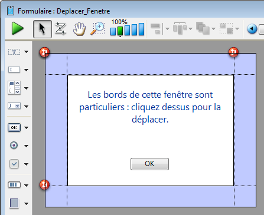
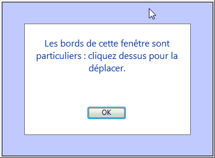

<!--REF #_command_.DRAG WINDOW.Syntax-->**DRAG WINDOW**<!-- END REF-->
<!--REF #_command_.DRAG WINDOW.Params-->
| Ne requiert pas de paramètre |  |
| --- | --- |

<!-- END REF-->

#### Description 

<!--REF #_command_.DRAG WINDOW.Summary-->La commande **DRAG WINDOW** permet de faire glisser la fenêtre dans laquelle l'utilisateur a cliqué puis de la déplacer en fonction des mouvements de la souris.<!-- END REF--> Généralement, cette commande est appelée depuis la méthode d'un objet capable de répondre instantanément aux clics souris (par exemple un bouton invisible).

#### Exemple 

Le formulaire suivant, présenté ici dans l'éditeur de formulaires, contient un fond coloré au-dessus duquel quatre boutons invisibles ont été placés (un par côté) :



Chaque bouton est associé à la méthode suivante :

```4d
 DRAG WINDOW //Commencer à faire glisser la fenêtre au premier clic
```

Après l'exécution de la méthode projet suivante :

```4d
 $refFen:=Open form window("Deplacer_Fenetre";Modal form dialog box)
 DIALOG("Deplacer_Fenetre")
 CLOSE WINDOW
```

... vous obtenez une fenêtre semblable à celle-ci :



Vous pouvez la déplacer en cliquant sur les bordures.

#### Voir aussi 

[GET WINDOW RECT](get-window-rect.md)  
[SET WINDOW RECT](set-window-rect.md)  

#### Propriétés
|  |  |
| --- | --- |
| Numéro de commande | 452 |
| Thread safe | &check; |
| Interdite sur le serveur ||


