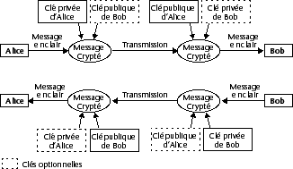

<!--REF #_command_.ENCRYPT BLOB.Syntax-->**ENCRYPT BLOB** ( *aCrypter* ; *cléPrivEmetteur* {; *cléPubRécepteur*} )<!-- END REF-->
<!--REF #_command_.ENCRYPT BLOB.Params-->
| Paramètre | Type |  | Description |
| --- | --- | --- | --- |
| aCrypter | Blob | &#8596; | Données à crypter |
| || | Données cryptées |
| cléPrivEmetteur | Blob | &#8594;  | Clé privée de l’émetteur |
| cléPubRécepteur | Blob | &#8594;  | Clé publique du récepteur |

<!-- END REF-->

#### Description 

<!--REF #_command_.ENCRYPT BLOB.Summary-->La commande **ENCRYPT BLOB** permet de crypter le contenu du BLOB *aCrypter* à l’aide de la clé privée de l’émetteur *cléPrivEmetteur* ainsi que, optionnellement, de la clé publique du récepteur *cléPubRécepteur*.<!-- END REF--> Pour obtenir une paire de clés de cryptage (clé publique et clé privée), utilisez la routine [GENERATE ENCRYPTION KEYPAIR](generate-encryption-keypair.md), placée dans le thème “Protocole sécurisé”.

**Note :** La commande **ENCRYPT BLOB** exploite l’algorithme et les fonctions de cryptage du protocole TLS. Par conséquent, pour pouvoir utiliser cette commande, vous devez veiller à ce que les composants nécessaires au fonctionnement du protocole TLS soient installés sur la machine — même si vous ne souhaitez pas utiliser TLS dans le cadre de connexions à un serveur 4D. Pour plus d'informations, reportez-vous à *developer.4d.com*

* L’utilisation d’une seule clé pour le cryptage (clé privée de l’émetteur) garantit l’impossibilité pour toute personne ne disposant pas de la clé publique de lire les données. Elle garantit également que c’est bien l’émetteur qui a crypté les données.
* L’utilisation d’une paire de clés pour le cryptage (clé privée de l’émetteur + clé publique du récepteur) garantit en outre qu’un seul récepteur pourra lire les données.

Le format interne des BLOBs contenant des clés est le PKCS. Ce format standard, multi-plate-forme, permet l’échange ou la manipulation des clés par simple copier-coller dans un Email ou un fichier texte.

Après l’exécution de la commande, le BLOB *aCrypter* contient les données cryptées. Ces données ne pourront être décryptées qu’avec la commande [DECRYPT BLOB](decrypt-blob.md), à laquelle la clé publique de l’émetteur sera passée en paramètre. En outre, si la clé publique (optionnelle) du récepteur avait été utilisée pour le cryptage, la clé privée du récepteur sera également nécessaire pour le décryptage.

**Principe du cryptage à clés publiques/privées pour l’échange de messages entre deux individus, “Alice” et “Bob”** 



**Note :** L’algorithme de cryptage comporte une fonction de vérification d’intégrité (checksum), afin d’empêcher toute modification malveillante ou accidentelle du contenu du BLOB. Par conséquent, un BLOB crypté ne doit pas être modifié, sous peine de ne pas pouvoir être décrypté.

##### Optimisation des commandes de cryptage 

Le cryptage des données ralentit l’exécution de l’application, en particulier si une paire de clés est utilisée. Deux types d’optimisations sont toutefois possibles : 

* Suivant la quantité de mémoire disponible, la commande s’exécute en mode “synchrone” ou “asynchrone”.  
Le mode asynchrone est plus rapide, car il ne bloque pas les autres process. Ce mode est automatiquement utilisé si la mémoire disponible est au moins égale à 2 fois la taille de la source à crypter.  
Dans le cas contraire, pour des raisons de sécurité, le mode synchrone est utilisé. Ce mode est plus lent car les autres process sont bloqués.
* Dans le cas de BLOBs volumineux, l’astuce consiste à crypter uniquement une partie déterminée et sensible du BLOB, afin de réduire la taille des données à traiter et donc le temps d’exécution.

#### Exemple 

**• Utilisation d’une seule clé**

 Une société veut garantir la confidentialité d’informations stockées dans une base 4D. Elle doit régulièrement envoyer ces données à ses filiales, par exemple sous la forme de fichiers via Internet. 

1\. La société commence par générer une paire de clés à l’aide de la commande [GENERATE ENCRYPTION KEYPAIR](generate-encryption-keypair.md). 

```4d
  //Méthode GENERE_CLES_TXT
 var $BcléPublique;$BcléPrivée : Blob
 GENERATE ENCRYPTION KEYPAIR($BcléPrivée;$BcléPublique)
 BLOB TO DOCUMENT("cléPublique.txt";$BcléPublique)
 BLOB TO DOCUMENT("cléPrivée.txt";$BcléPrivée)
```

2\. La société conserve la clé privée, et remet à chaque filiale une copie du document contenant la clé publique. Il faut, bien entendu, que cette transmission s’effectue d’une façon sûre, par exemple par la copie sur un support numérique remis physiquement aux filiales. 

3\. Par la suite, la société copie les informations confidentielles (stockées par exemple dans un champ texte) dans des BLOBs et les crypte avec sa clé privée : 

```4d
  //Méthode CRYPTER_INFOS
 var $vbCrypté;$vbcléPrivée : Blob
 var $vtCrypter : Text
 
 $vtCrypter:=[Confidentiel]Info
 VARIABLE TO BLOB($vtCrypter;$vbCrypté)
 DOCUMENT TO BLOB("cléPrivée.txt";$vbcléPrivée)
 If(OK=1)
    ENCRYPT BLOB($vbCrypté;$vbcléPrivée)
    BLOB TO DOCUMENT("MiseAJour.txt";$vbCrypté)
 End if
```

4\. Le fichier de mise à jour peut alors être envoyé aux filiales (même en passant par un canal non sécurisé comme Internet). Si un tiers intercepte le fichier crypté, il sera dans l’incapacité de le décrypter sans la clé publique.

5\. Chaque filiale peut, quant à elle, décrypter le document à l’aide de la clé publique :

```4d
  //Méthode DECRYPTER_INFOS
 var $vbCrypté;$vbcléPublique : Blob
 var $vtDécrypté : Text
 var $vhRefDoc : Time
 
 ALERT("Veuillez sélectionner le document crypté.")
 $vhRefDoc:=Open document("") //Sélection du fichier MiseAJour.txt
 If(OK=1)
    CLOSE DOCUMENT($vhRefDoc)
    DOCUMENT TO BLOB(Document;$vbCrypté)
    DOCUMENT TO BLOB("cléPublique.txt";$vbcléPublique)
    If(OK=1)
       DECRYPT BLOB($vbCrypté;$vbcléPublique)
       BLOB TO VARIABLE($vbCrypté;$vtDécrypté)
       CREATE RECORD([Confidentiel])
       [Confidentiel]Info:=$vtDécrypté
       SAVE RECORD([Confidentiel])
    End if
 End if
```

**• Utilisation de deux clés**

 Une société souhaite utiliser un système d’échange de données via Internet dans lequel chaque filiale reçoit des informations confidentielles mais envoie également ses propres informations à la maison-mère. Ce système a donc les impératifs suivants :  
\- Seul le destinataire doit pouvoir lire un message,  
\- On doit avoir la garantie que le message provient bien de l’expéditeur. 

1\. La maison-mère ainsi que chaque filiale génèrent leurs propres paires de clés (à l’aide de la méthode GENERE\_CLES\_TXT).

```4d
  //Méthode GENERE_CLES_TXT
 var $BcléPublique;$BcléPrivée : Blob
 GENERATE ENCRYPTION KEYPAIR($BcléPrivée;$BcléPublique)
 BLOB TO DOCUMENT("cléPublique.txt";$BcléPublique)
 BLOB TO DOCUMENT("cléPrivée.txt";$BcléPrivée)
```

2\. Chacune garde sa clé privée. Chaque filiale envoie sa clé publique à la maison-mère, qui elle-même envoie sa clé publique à chaque filiale. Cette transmission ne doit pas nécessairement être effectuée par un canal protégé, car la seule détention de la clé publique dans ce cas sera insuffisante pour décrypter une information.

3\. Pour crypter une information à envoyer, une filiale ou la maison-mère exécute la méthode CRYPTER\_INFOS\_2 qui utilise la clé privée de l’émetteur et la clé publique du destinataire pour crypter les données :

```4d
  //Méthode CRYPTER_INFOS_2
 var $vbCrypté;$vbcléPrivée;$vbcléPublique : Blob
 var $vtCrypter : Text
 var $vhRefDoc : Time
 
 $vtCrypter:=[Confidentiel]Info
 VARIABLE TO BLOB($vtCrypter;$vbCrypté)
  // On charge sa propre clé privée...
 DOCUMENT TO BLOB("cléPrivée.txt";$vbcléPrivée)
 If(OK=1)
  // ...et la clé publique du récepteur
    ALERT("Veuillez sélectionner la clé publique du destinataire.")
    $vhRefDoc:=Open document("") //Sélection de la clé publique à charger
    If(OK=1)
       CLOSE DOCUMENT($vhRefDoc)
       DOCUMENT TO BLOB(Document;$vbcléPublique)
  //Cryptage du BLOB avec les deux clés en paramètres
       ENCRYPT BLOB($vbCrypté;$vbcléPrivée;$vbcléPublique)
       BLOB TO DOCUMENT("MiseAJour.txt";$vbCrypté)
    End if
 End if
```

4\. Le fichier crypté peut alors être envoyé au destinataire via Internet. Si un tiers l’intercepte, il sera dans l’incapacité de le décrypter, même en connaissant les clés publiques, car il lui manquera la clé privée du destinataire.

5\. Chaque destinataire peut, quant à lui, décrypter le document reçu, en utilisant sa clé privée et la clé publique de l’émetteur :

```4d
  //Méthode DECRYPTER_INFOS_2
 var $vbCrypté;$vbcléPublique;$vbcléPrivée : Blob
 var $vtDécrypté : Text
 var $vhRefDoc : Time
 
 ALERT("Veuillez sélectionner le document crypté.")
 $vhRefDoc:=Open document("") //Sélection du fichier MiseAJour.txt
 If(OK=1)
    CLOSE DOCUMENT($vhRefDoc)
    DOCUMENT TO BLOB(Document;$vbCrypté)
  //On charge sa propre clé privée
    DOCUMENT TO BLOB("cléPrivée.txt";$vbcléPrivée)
    If(OK=1)
  // ...et la clé publique de l’émetteur
       ALERT("Veuillez sélectionner la clé publique de l’envoyeur.")
       $vhRefDoc:=Open document("") //Sélection de la clé publique
       If(OK=1)
          CLOSE DOCUMENT($vhRefDoc)
          DOCUMENT TO BLOB(Document;$vbcléPublique)
  //Décryptage du BLOB avec les deux clés en paramètres
          DECRYPT BLOB($vbCrypté;$vbcléPublique;$vbcléPrivée)
          BLOB TO VARIABLE($vbCrypté;$vtDécrypté)
          CREATE RECORD([Confidentiel])
          [Confidentiel]Info:=$vtDécrypté
          SAVE RECORD([Confidentiel])
       End if
    End if
 End if
```

#### Voir aussi 

  
[DECRYPT BLOB](decrypt-blob.md)  
[Encrypt data BLOB](encrypt-data-blob.md)  
[GENERATE ENCRYPTION KEYPAIR](generate-encryption-keypair.md)  