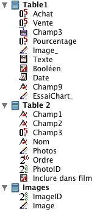

<!--REF #_command_.Find in list.Syntax-->**Find in list** ( {* ;} *liste* ; *valeur* ; *portée* {; *tabEléments* {; *}} ) : Integer<!-- END REF-->
<!--REF #_command_.Find in list.Params-->
| Paramètre | Type |  | Description |
| --- | --- | --- | --- |
| * | Opérateur | &#8594;  | Si spécifié, liste est un nom d’objet (chaîne) Si omis, liste est un numéro de référence de liste |
| liste | Integer, Text | &#8594;  | Numéro de référence de liste (si * omis) ou Nom d'objet de type liste (si * passé) |
| valeur | Text | &#8594;  | Valeur à rechercher |
| portée | Integer | &#8594;  | 0=Liste principale, 1=Sous-listes |
| tabEléments | Integer array | &#8592; | - Si 2e * omis : tableau des positions des éléments trouvés - Si 2e * passé : tableau des numéros de référence des éléments trouvés |
| * | Opérateur | &#8594;  | - Si omis : utiliser la position des éléments - Si passé : utiliser le numéro de référence des éléments |
| Résultat | Integer | &#8592; | - Si 2e * omis : position de l’élément trouvé - Si 2e * passé : numéro de référence de l’élément trouvé |

<!-- END REF-->

#### Description 

<!--REF #_command_.Find in list.Summary-->La commande **Find in list** retourne la position ou la référence du premier élément de *liste* qui équivaut à la chaîne passée dans *valeur*.<!-- END REF--> Si plusieurs éléments sont trouvés, la fonction peut également remplir le tableau *tabEléments* avec la position ou la référence de chaque élément.

Si vous passez le premier paramètre optionnel *\**, vous indiquez que le paramètre *liste* est un nom d’objet (chaîne) correspondant à une représentation de liste dans le formulaire. Si vous ne passez pas ce paramètre, vous indiquez que le paramètre *liste* est une référence de liste hiérarchique ([RéfListe](# "Expression de type Entier long identifiant de façon unique une liste hiérarchique")). Si vous utilisez une seule représentation de liste ou travaillez avec les numéros de référence des éléments (le second *\** est omis), vous pouvez utiliser indifféremment l’une ou l’autre syntaxe. En revanche, si vous utilisez plusieurs représentations d’une même liste et travaillez avec les positions des éléments (le second *\** est passé), la syntaxe basée sur le nom d’objet est requise car la position des éléments peut varier d'une représentation à l'autre.

**Note :** Si vous utilisez le caractère @ dans le nom d'objet de la liste et que le formulaire contient plusieurs listes répondant à ce nom, la commande **Find in list** s'appliquera au premier objet dont le nom correspond. 

Le second paramètre *\** vous permet d’indiquer si vous souhaitez travailler avec des positions courantes d’éléments (dans ce cas, ce paramètre doit être omis) ou des références absolues d’éléments (dans ce cas, il doit être passé).

Passez dans *valeur* la chaîne de caractères à rechercher. La recherche sera du type “est exactement”, c’est-à-dire que la recherche de “bois”ne trouvera pas “boissons”. Toutefois, vous pouvez utiliser le caractère @ pour définir des recherches du type “commence par”, “se termine par” ou “contient”.

Le paramètre *portée* vous permet de définir si la recherche doit porter uniquement sur le premier niveau de la *liste* ou si elle doit inclure toutes ses sous-listes. Passez 0 pour concentrer la recherche sur le premier niveau de la liste et 1 pour l’étendre à toutes les sous-listes.

Si vous souhaitez connaître la position ou le numéro de tous les éléments correspondant à *valeur*, passez un tableau d’entiers longs dans le paramètre facultatif *tabEléments*. Si nécessaire, le tableau sera créé et redimensionné par la commande. La commande remplira le tableau avec les positions (si le second *\** est omis) ou les numéros de référence (si le second *\** est passé) des éléments trouvés.

Les positions sont exprimées relativement à l’élément supérieur de la liste principale, en tenant compte de l’état courant déployé/contracté de la liste et de ses sous-listes. 

Si aucun élément ne correspond à la *valeur* recherchée, la fonction retourne 0 et le tableau *tabEléments* est retourné vide.

#### Exemple 

Soit la liste hiérarchique suivante :



```4d
 $vlItemPos:=Find in list(hList;"P@";1;$arrPos)
  //$vlItemPos vaut 5
  //$arrPos{1} vaut 5, $arrPos{2} vaut 17 et $arrPos{3} vaut 19
 $vlItemRef:=Find in list(hList;"P@";1;$arrRefs;*)
  //$vlItemRef vaut 7
  //$arrRefs{1} vaut 7, $arrRefs{2} vaut 18 et $arrRefs{3} vaut 23
 $vlItemPos:=Find in list(hList;"Date";1;$arrPos)
  //$vlItemPos vaut 9
  //$arrPos{1} vaut 9
 $vlItemRef:=Find in list(hList;"Date";1;$arrRefs;*)
  //$vlItemRef vaut 11
  //$arrRefs{1} vaut 11
 $vlItemPos:=Find in list(hList;"Date";0;*)
  //$vlItemPos vaut 0`
```


#### Propriétés
|  |  |
| --- | --- |
| Numéro de commande | 952 |
| Thread safe | &check; |
| Interdite sur le serveur ||


