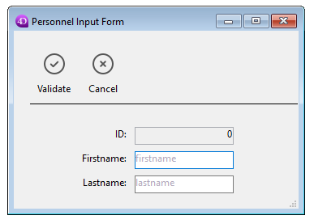

<!--REF #_command_.FORM SET INPUT.Syntax-->**FORM SET INPUT** ( {*laTable* ;} *formulaire* {; *formUtilisateur* {; *}} )<!-- END REF-->
<!--REF #_command_.FORM SET INPUT.Params-->
| Paramètre | Type |  | Description |
| --- | --- | --- | --- |
| laTable | Table | &#8594;  | Table pour laquelle définir le formulaire entrée ou Table par défaut si ce paramètre est omis |
| formulaire | Text, Object | &#8594;  | Nom du formulaire table (chaîne), ouChemin POSIX (chaîne) d'un fichier .json décrivant le formulaire, ouObjet décrivant le formulaire |
| formUtilisateur | Text | &#8594;  | Nom du formulaire utilisateur à utiliser |
| * | Operator |  &#8594;  | Taille de fenêtre automatique |

<!-- END REF-->

#### Description 

<!--REF #_command_.FORM SET INPUT.Summary-->**FORM SET INPUT** désigne *formulaire* ou *formUtilisateur* comme formulaire entrée courant de *laTable* pour le process courant.<!-- END REF--> *formulaire* doit appartenir à *laTable*.

La portée de cette commande est le process courant. Chaque table dispose d'un formulaire entrée courant pour chaque process. 

Dans le paramètre *formulaire*, vous pouvez passer :

* le nom d'un formulaire (table) à utiliser,
* le chemin (en syntaxe POSIX) d'un fichier .json valide contenant la description du formulaire à utiliser (voir *Chemin d'accès du formulaire*),
* un objet contenant la description du formulaire à utiliser.

**Note :** Pour des raisons structurelles, cette commande n'est pas compatible avec les formulaires projets. 

La commande **FORM SET INPUT** n'affiche pas de formulaire ; elle désigne juste celui qui sera affiché ou utilisé par d'autres commandes. Pour plus d'informations sur la création de formulaires, reportez-vous au manuel *Mode Développement* de 4D.

Pour chaque table de la base, un formulaire entrée par défaut est défini dans la fenêtre de l'Explorateur. Ce formulaire est utilisé si la commande **FORM SET INPUT** n'est pas appelée, ou si le paramètre *formulaire* est invalide.

Le paramètre facultatif *formUtilisateur* permet de désigner un formulaire utilisateur (issu du *formulaire*) comme formulaire entrée par défaut. Si vous passez un nom de formulaire utilisateur valide, ce formulaire sera utilisé par défaut en lieu et place du formulaire entrée dans le process courant. Ce principe permet de disposer simultanément de différents formulaires utilisateurs personnalisés (générés à l’aide de la commande *\_o\_CREATE USER FORM*) et d’utiliser celui qui convient en fonction du contexte.   
Pour plus d’informations sur les formulaires utilisateurs, reportez-vous à la section *Présentation des formulaires utilisateurs*. 

Le formulaire entrée est affiché par de nombreuses commandes. Ces commandes sont généralement utilisées pour la saisie ou la modification de valeurs. Les commandes suivantes affichent un formulaire entrée : 

* [ADD RECORD](add-record.md)
* [DISPLAY RECORD](display-record.md)
* [MODIFY RECORD](modify-record.md)
* [QUERY BY EXAMPLE](query-by-example.md)
Les commandes [DISPLAY SELECTION](display-selection.md) et [MODIFY SELECTION](modify-selection.md) affichent une liste d'enregistrements dans le formulaire sortie. Chacune d'entre elles permet ensuite à l'utilisateur de double-cliquer sur un enregistrement, qui s'affiche alors dans le formulaire entrée.

Le formulaire entrée est aussi utilisé par les commandes d'import [IMPORT TEXT](import-text.md), [IMPORT SYLK](import-sylk.md) et [IMPORT DIF](import-dif.md).

Le paramètre optionnel *\** est destiné à être utilisé conjointement avec les propriétés du formulaire, que vous définissez en mode Développement dans la fenêtre des Propriétés du formulaire, et avec la commande [Open window](open-window.md). En passant le paramètre \*, vous indiquez à 4D d'utiliser les propriétés du formulaire pour redimensionner automatiquement la fenêtre lors de l'utilisation ultérieure de la fenêtre comme formulaire entrée ou comme dialogue. Reportez-vous à la description de la commande [Open window](open-window.md) pour plus d'informations sur ce point.

**Note :** Que vous passiez ou non le paramètre \*, **FORM SET INPUT** change le formulaire entrée pour la table. 

#### Exemple 1 

L'exemple suivant illustre une utilisation typique de **FORM SET INPUT**. A noter que, si dans cet exemple **FORM SET INPUT** est appelé juste avant que le formulaire soit utilisé, cela n'est absolument pas nécessaire. **FORM SET INPUT** peut en fait être exécuté dans une tout autre méthode, du moment qu'elle est exécutée avant celle-ci : 

```4d
 FORM SET INPUT([Sociétés];"Nouvelle Sté") // Formulaire pour les nouvelles sociétés
 ADD RECORD([Sociétés]) // Ajout d'une nouvelle société
```

#### Exemple 2 

Dans une base de facturation gérant plusieurs sociétés, la création d’une facture doit s’effectuer dans le formulaire utilisateur correspondant : 

```4d
 Case of
    :(société="4D SAS")
       FORM SET INPUT([Factures];"Saisie";"4D_SAS")
    :(société="4D Inc")
       FORM SET INPUT([Factures];"Saisie";"4D_Inc")
    :(société="Acme")
       FORM SET INPUT([Factures];"Saisie";"ACME")
 End case
 ADD RECORD([Factures])
```

#### Exemple 3 

L'exemple suivant utilise un fichier .json de description de formulaire pour la saisie des enregistrements des employés :

```4d
 FORM SET INPUT([Personnel];"/RESOURCES/PersonnelForm.json")
 ADD RECORD([Personnel])
```

Résultat :  



#### Voir aussi 

[ADD RECORD](add-record.md)  
[DISPLAY RECORD](display-record.md)  
[DISPLAY SELECTION](display-selection.md)  
[FORM SET OUTPUT](form-set-output.md)  
[IMPORT DIF](import-dif.md)  
[IMPORT SYLK](import-sylk.md)  
[IMPORT TEXT](import-text.md)  
[MODIFY RECORD](modify-record.md)  
[MODIFY SELECTION](modify-selection.md)  
[Open window](open-window.md)  
[QUERY BY EXAMPLE](query-by-example.md)  

#### Propriétés
|  |  |
| --- | --- |
| Numéro de commande | 55 |
| Thread safe | &check; |
| Interdite sur le serveur ||


