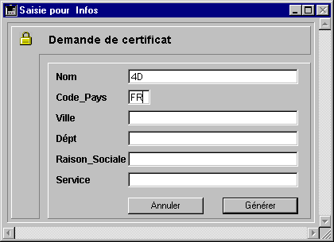

<!--REF #_command_.GENERATE CERTIFICATE REQUEST.Syntax-->**GENERATE CERTIFICATE REQUEST** ( *cléPrivée* ; *demCertif* ; *tabCodes* ; *tabLibellés* )<!-- END REF-->
<!--REF #_command_.GENERATE CERTIFICATE REQUEST.Params-->
| Paramètre | Type |  | Description |
| --- | --- | --- | --- |
| cléPrivée | Blob | &#8594;  | BLOB contenant la clé privée |
| demCertif | Blob | &#8592; | BLOB devant recevoir la demande de certificat |
| tabCodes | Integer array | &#8594;  | Liste des codes d’informations |
| tabLibellés | Text array | &#8594;  | Liste des libellés d’informations |

<!-- END REF-->

#### Description 

<!--REF #_command_.GENERATE CERTIFICATE REQUEST.Summary-->La commande **GENERATE CERTIFICATE REQUEST** permet de générer une demande de certificat au format PKCS, directement exploitable par des autorités de certification telles que Verisign® ou Thawthe®.<!-- END REF--> Le certificat est une pièce essentielle du fonctionnement du protocole SSL dans le cadre d’un serveur Web. Il est envoyé à chaque browser se connectant en mode SSL. Il contient la “carte d’identité” du site Web (reprenant les informations que vous saisissez dans la commande), ainsi que sa clé publique — permettant aux browsers de décrypter les informations reçues. En outre, le certificat contient diverses informations ajoutées par l’autorité de certification.

**Note :** Pour plus d’informations sur le fonctionnement du protocole SSL avec le serveur Web 4D, reportez-vous à la section [WEB SERVICE SET PARAMETER](web-service-set-parameter.md). 

La demande de certificat nécessite une paire de clés générée à l’aide de la commande [GENERATE ENCRYPTION KEYPAIR](generate-encryption-keypair.md) et contient diverses informations. C’est en combinant cette demande avec d’autres paramètres qui lui sont propres, que l’autorité de certification sera en mesure de générer un certificat.

Passez dans *cléPrivée* un BLOB contenant la clé privée générée avec la commande [GENERATE ENCRYPTION KEYPAIR](generate-encryption-keypair.md). 

Passez dans *demCertif* un BLOB vide. Après l’exécution de la commande, il contiendra la demande de certificat au format PKCS encodé en base64\. Vous pouvez stocker directement ce contenu dans un fichier texte suffixé .pem, par exemple à l’aide de la commande [BLOB TO DOCUMENT](blob-to-document.md), pour la faire parvenir à l’autorité de certification.

**Important :** La clé privée est utilisée pour générer la demande de certificat mais ne doit pas être envoyée à l’autorité de certification.

Vous devez remplir les tableaux *tabCodes* (de type entier long) et *tabLibellés* (de type alpha) avec, respectivement, les numéros de code et les libellés des informations destinées à l’autorité de certification.   
Les codes et les libellés attendus peuvent varier en fonction de l’autorité de certification et du mode d’utilisation du certificat. Toutefois, dans le cadre d’une utilisation standard du certificat (connexions d’un serveur Web via SSL), les tableaux doivent contenir les éléments suivants :

| **Informations à fournir**                               | **tabCodes** | **tabLibellés (Exemples)** |
| -------------------------------------------------------- | ------------ | -------------------------- |
| CommonName : Nom du domaine                              | 13           | www.4D.fr                  |
| CountryName : Code du pays (deux lettres)                | 14           | FR                         |
| LocalityName : Ville                                     | 15           | Clichy                     |
| StateOrProvinceName : Département, Etat...               | 16           | Hauts de Seine             |
| OrganizationName : Raison sociale                        | 17           | 4D                         |
| OrganizationUnit : Service/Personne en charge du serveur | 18           | Web Administrator          |

L’ordre dans lequel les codes et les informations sont insérés dans les tableaux n’a pas d’importance, en revanche les deux tableaux doivent être “synchronisés” : si l’élément {3} du tableau *tabCodes* contient la valeur 15 (nom de la ville), l’élément {3} du tableau *tabLibellés* doit contenir cette information, dans notre exemple Clichy.

#### Exemple 

Un formulaire “Demande de certificat” comporte les six champs nécessaires à l’établissement d’une demande de certificat standard. Le bouton **Générer** crée un document sur disque contenant la demande de certificat. Le document “Cléprivée.txt” contient la clé privée (générée à l’aide la commande [GENERATE ENCRYPTION KEYPAIR](generate-encryption-keypair.md)) doit déjà être présent sur le disque.



```4d
  // Méthode objet du bouton bGénérer
 var $vbcléPrivée;$vbDemandeCert : Blob
 var $NumTable : Integer
 ARRAY LONGINT($tLCodes;6)
 ARRAY STRING(80;$tAInfos;6)
 
 $NumTable:=Table(Current form table)
 For($i;1;6)
    $tAInfos{$i}:=Field($NumTable;$i)->
    $tLCodes{$i}:=$i+12
 End for
 If(Find in array($tAInfos;"")#-1)
    ALERT("Vous devez remplir tous les champs.")
 Else
    ALERT("Sélectionnez votre clé privée.")
    $vhRefDoc:=Open document("")
    If(OK=1)
       CLOSE DOCUMENT($vhRefDoc)
       DOCUMENT TO BLOB(Document;$vbcléPrivée)
       GENERATE CERTIFICATE REQUEST($vbcléPrivée;$vbDemandeCert;$tLCodes;$tAInfos)
       BLOB TO DOCUMENT("Demande.txt";$vbDemandeCert)
    Else
       ALERT("Clé privée invalide.")
    End if
 End if
```

#### Voir aussi 

[GENERATE ENCRYPTION KEYPAIR](generate-encryption-keypair.md)  
[HTTP SET CERTIFICATES FOLDER](http-set-certificates-folder.md)  