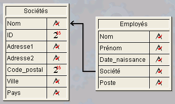
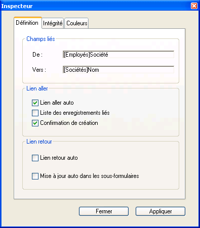

<!--REF #_command_.GET FIELD RELATION.Syntax-->**GET FIELD RELATION** ( *champN* ; *aller* ; *retour* {; *} )<!-- END REF-->
<!--REF #_command_.GET FIELD RELATION.Params-->
| Paramètre | Type |  | Description |
| --- | --- | --- | --- |
| champN | Field | &#8594;  | Champ de départ du lien |
| aller | Integer | &#8592; | Statut du lien aller |
| retour | Integer | &#8592; | Statut du lien retour |
| * | Opérateur | &#8594;  | • Si passé : aller et retour retournent le statut courant effectif du lien (valeurs 2 ou 3 uniquement)• Si omis (défaut) : aller et retour peuvent retourner la valeur 1 si le lien n’a pas été modifié par programmation |

<!-- END REF-->

#### Description 

<!--REF #_command_.GET FIELD RELATION.Summary-->La commande **GET FIELD RELATION** permet de connaître le statut automatique/manuel du lien partant du *champN* pour le process courant.<!-- END REF--> Tous les liens peuvent être consultés, y compris les liens déclarés automatiques dans la fenêtre de Structure.

* Passez dans *champN* le nom du champ de la table N d’où part le lien dont vous souhaitez connaître le statut. Si aucun lien ne part du champ *champN*, les paramètres *aller* et *retour* retournent 0, une erreur est générée et la variable système OK prend la valeur 0 (cf. ci-dessous).
* Après l’exécution de la commande, la variable *aller* contient une valeur indiquant si le lien aller spécifié est défini comme automatique :  
0 = il n’y a pas de lien partant de *champN*. L’erreur de syntaxe n°16 (“Ce champ ne possède pas de lien”) est générée et la variable système OK prend la valeur 0\.  
1 = le statut automatique/manuel du lien aller spécifié est celui défini par l’option **Lien aller auto** dans les propriétés du lien en mode Développement (il n’a pas été modifié par programmation).  
2 = le lien N vers 1 est manuel pour le process.  
3 = le lien N vers 1 est automatique pour le process.
* Après l’exécution de la commande, la variable *retour* contient une valeur indiquant si le lien retour spécifié est défini comme automatique :  
0 = il n’y a pas de lien partant de *champN*. L’erreur de syntaxe n°16 (“Ce champ ne possède pas de lien”) est générée et la variable système OK prend la valeur 0\.  
1 = le statut automatique/manuel du lien retour spécifié est celui défini par l’option **Lien retour auto** dans les propriétés du lien en mode Développement (il n’a pas été modifié par programmation).  
2 = le lien 1 vers N est manuel pour le process.  
3 = le lien 1 vers N est automatique pour le process.

Vous pouvez comparer les valeurs reçues dans les paramètres *aller* et *retour* aux constantes du thème “*Liens*” :

| Constante               | Type        | Valeur |
| ----------------------- | ----------- | ------ |
| Automatic               | Entier long | 3      |
| Manual                  | Entier long | 2      |
| No relation             | Entier long | 0      |
| Structure configuration | Entier long | 1      |

* Le paramètre facultatif *\** permet de “forcer” la lecture du statut courant du lien, même s’il n’a pas été modifié par programmation. Autrement dit, lorsque vous passez le paramètre *\**, seules les valeurs 2 ou 3 peuvent être retournées dans les paramètres *aller* et *retour*.

#### Exemple 

Soit la structure suivante :



Les propriétés du lien reliant le champ \[Employés\]Société au champ \[Sociétés\]Nom sont les suivantes :



Le code ci-dessous illustre les différentes possibilités offertes par les commandes **GET FIELD RELATION**, [GET AUTOMATIC RELATIONS](get-automatic-relations.md) et [SET FIELD RELATION](set-field-relation.md), [SET AUTOMATIC RELATIONS](set-automatic-relations.md) ainsi que leurs effets :

```4d
 GET AUTOMATIC RELATIONS(liens_Appel;liens_Retour) //retourne Faux, Faux
 GET FIELD RELATION([Employés]Société;aller;retour) //retourne 1,1
 GET FIELD RELATION([Employés]Société;aller;retour;*) //retourne 3,2
 
 SET FIELD RELATION([Employés]Société;2;0) //passe le lien N vers 1 en manuel
 
 GET FIELD RELATION([Employés]Société;aller;retour) //retourne 2,1
 GET FIELD RELATION([Employés]Société;aller;retour;*) //retourne 2, 2
 
 SET FIELD RELATION([Employés]Société;1;0) //rétablit les paramètres définis en
  //structure pour le lien N vers 1
 
 GET FIELD RELATION([Employés]Société;aller;retour) //retourne 1,1
 GET FIELD RELATION([Employés]Société;aller;retour;*) //retourne 3,2
 
 SET AUTOMATIC RELATIONS(True;True) //passe tous les liens de toutes les tables en automatique
 
 GET AUTOMATIC RELATIONS(liens_Appel;liens_Retour) //retourne Vrai, Vrai
 GET FIELD RELATION([Employés]Société;aller;retour) //retourne 1,1
 GET FIELD RELATION([Employés]Société;aller;retour;*) //retourne 3,3
```

#### Voir aussi 

[GET AUTOMATIC RELATIONS](get-automatic-relations.md)  
[GET RELATION PROPERTIES](get-relation-properties.md)  
[SET AUTOMATIC RELATIONS](set-automatic-relations.md)  
[SET FIELD RELATION](set-field-relation.md)  

#### Propriétés
|  |  |
| --- | --- |
| Numéro de commande | 920 |
| Thread safe | &check; |
| Interdite sur le serveur ||


