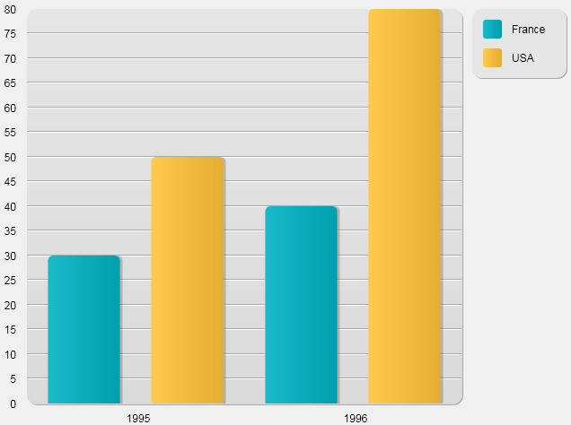

<!--REF #_command_.GRAPH.Syntax-->**GRAPH** ( *graphImage* ; graphNum | graphParams ; *xCatégories* {; *zValeurs*} {; *zValeurs2* ; ... ; *zValeursN*} )<!-- END REF-->
<!--REF #_command_.GRAPH.Params-->
| Paramètre | Type |  | Description |
| --- | --- | --- | --- |
| graphImage | Picture | &#8594;  | Variable image |
| graphNum &#124; graphParams | Entier long, Objet | &#8594;  | Entier long : Numéro de type de graphe, Objet (64 bits uniquement) : Paramètres du graphe |
| xCatégories | Array | &#8594;  | Catégories sur l'axe des x |
| zValeurs | Array | &#8594;  | Valeurs à représenter graphiquement (jusqu'à 8 valeurs) |

<!-- END REF-->

#### Description 

<!--REF #_command_.GRAPH.Summary-->La commande **GRAPH** crée un graphe dans une variable image à partir de valeurs provenant de tableaux.<!-- END REF-->

Les graphes générés par cette commande sont dessinés via le moteur de rendu SVG intégré. Ils bénéficient des fonctions d'interface associées aux variables images : menu contextuel en mode Application (permettant notamment le choix du format d'affichage), barres de défilement, etc.

**Note :** SVG (Scalable Vector Graphics) est un format de fichier graphique vectoriel (extension .svg). Basé sur le XML, ce format est largement répandu et peut être notamment affiché par les navigateurs Web. Pour plus d'informations, reportez-vous à [http://www.w3.org.Graphics/SVG](http://www.w3.org.graphics/SVG/)/. La commande [SVG EXPORT TO PICTURE](svg-export-to-picture.md) vous permet également de tirer parti du moteur SVG intégré.

Passez dans le paramètre *graphImage* le nom de la variable image devant afficher le graphe dans le formulaire.

Le second paramètre définit le type de graphe à utiliser. Vous disposez de deux possibilités :

* passer un paramètre *graphNum* de type [Entier long](# "Entre -2 Milliard et +2 Milliard") (toutes versions de 4D) : dans ce cas, vous devez passer un nombre entre 1 et 8\. Les différents types de graphes disponibles sont listés dans l'exemple présenté plus bas. Une fois le graphe créé, vous pouvez modifier son type en modifiant la valeur de *graphNum* et en exécutant de nouveau la commande **GRAPH**. Vous pouvez par la suite modifier certaines caractéristiques du graphe en appelant la commande [GRAPH SETTINGS](graph-settings.md). Voir Exemple 1.
* passer un paramètre *graphParams* de type [Objet](# "Données structurées sous forme d'objet natif 4D") (non pris en charge par 4D Server sur Windows) : dans ce cas, vous devez passer un objet qui contient les diverses propriétés du graphe que vous souhaitez définir. Pour cela, vous pouvez utiliser les constantes placées dans le thème "*Paramètre des graphes*" (cf ci-dessous). Cette syntaxe vous permet de définir le type de graphe ainsi que tous ses paramètres spécifiques (légende, xmin, etc.) en un seul appel. Avec ce principe, vous pouvez sauvegarder les graphes générés en tant qu'images SVG et les afficher dans un navigateur standard tel que FireFox, Chrome, IE ou Safari (les graphes générés sont conformes au SVG standard implémenté dans les navigateurs). En outre, cette syntaxe donne accès à de nombreux paramètres, vous permettant de personnaliser, entre autres, l'espacement entre les barres, les marges, les couleurs de barres, etc. Voir Exemples 2, 3 et 4\. Attention, si vous utilisez cette syntaxe, la commande [GRAPH SETTINGS](graph-settings.md) ne doit PAS être appelée.

Le paramètre *xCatégories* définit les valeurs qui seront utilisées pour l'axe des X. Vous pouvez passer un champ de type chaîne, Heure, Date, ou un type numérique. Il doit y avoir le même nombre d'éléments de tableau dans *xCatégories* qu'il y en a dans chaque *zValeurs*.

Le paramètre *zValeurs* définit les valeurs à représenter graphiquement. Elles doivent être de type numérique. Vous pouvez passer jusqu'à huit ensembles de données. Les graphes en secteurs ne représentent que le premier *zValeurs*.

##### IDs automatiques 

Des IDs spécifiques sont automatiquement attribués aux éléments présents dans le graphe SVG :

| **IDs**                                     | **Description**                                          |
| ------------------------------------------- | -------------------------------------------------------- |
| ID\_graph\_1 à ID\_graph\_8                 | Colonnes, lignes, aires...                               |
| ID\_graph\_shadow\_1 à ID\_graph\_shadow\_8 | Ombre des colonnes, lignes, aires...                     |
| ID\_bullet\_1 à ID\_bullet\_8               | Points (*graphes en Lignes et en Points uniquement*)     |
| ID\_pie\_label\_1 à ID\_pie\_label\_8       | Libellés des secteurs (*graphes en Secteurs uniquement*) |
| ID\_legend                                  | Légende                                                  |
| ID\_legend\_1 à ID\_legend\_8               | Titres des légendes                                      |
| ID\_legend\_border                          | Encadrement des légendes                                 |
| ID\_legend\_border\_shadow                  | Ombre des encadrements des légendes                      |
| ID\_x\_values                               | Valeurs axe des X                                        |
| ID\_y\_values                               | Valeurs axe des Y                                        |
| ID\_y0\_axis                                | Valeurs axe des Z                                        |
| ID\_background                              | Arrière plan                                             |
| ID\_background\_shadow                      | Ombre de l’arrière plan                                  |
| ID\_x\_grid                                 | Grille sur l’axe des X                                   |
| ID\_x\_grid\_shadow                         | Ombre de la grille sur l’axe des X                       |
| ID\_y\_grid                                 | Grille sur l’axe des Y                                   |
| ID\_y\_grid\_shadow                         | Ombre de la grille sur l’axe des Y                       |

##### Attributs graphParams 

Lorsque vous utilisez le paramètre *graphParams*, vous devez passer un objet qui contient les diverses propriétés du graphe que vous souhaitez définir. Pour cela, vous pouvez utiliser les constantes suivantes, placées dans le thème "*Paramètre des graphes*" : 

| Constante                         | Type   | Valeur                     | Comment                                                                                                                                                                                                                                                                                                                                                                                                                                                                                                                                                                                                                                                                                                                                                                                                                                                                                                                                        |
| --------------------------------- | ------ | -------------------------- | ---------------------------------------------------------------------------------------------------------------------------------------------------------------------------------------------------------------------------------------------------------------------------------------------------------------------------------------------------------------------------------------------------------------------------------------------------------------------------------------------------------------------------------------------------------------------------------------------------------------------------------------------------------------------------------------------------------------------------------------------------------------------------------------------------------------------------------------------------------------------------------------------------------------------------------------------- |
| Graph background color            | Chaîne | graphBackgroundColor       | **Valeurs possibles :** Expression couleur norme SVG (texte), par exemple "#7F8E00", "Pink" ou "#0a1414"                                                                                                                                                                                                                                                                                                                                                                                                                                                                                                                                                                                                                                                                                                                                                                                                                                       |
| Graph background opacity          | Chaîne | graphBackgroundOpacity     | **Valeurs possibles** : Entier long entre 0 et 100<br/>**Valeur par défaut** : 100                                                                                                                                                                                                                                                                                                                                                                                                                                                                                                                                                                                                                                                                                                                                                                                                                                                     |
| Graph background shadow color     | Chaîne | graphBackgroundShadowColor | **Valeurs possibles** : Expression couleur SVG (texte), par exemple "#7F8E00", "Pink" ou "#0a1414"                                                                                                                                                                                                                                                                                                                                                                                                                                                                                                                                                                                                                                                                                                                                                                                                                                             |
| Graph bottom margin               | Chaîne | bottomMargin               | **Valeurs possibles** : Nombre réel<br/>**Valeur par défaut** : 12                                                                                                                                                                                                                                                                                                                                                                                                                                                                                                                                                                                                                                                                                                                                                                                                                                                                     |
| Graph colors                      | Chaîne | colors                     | **Valeurs possibles** : Tableau texte. Couleurs pour chaque série de graphe.<br/>**Valeurs par défaut** : Blue-green (#19BAC9), Yellow (#FFC338), Purple (#573E82), Green (#4FA839), Orange (#D95700), Blue (#1D9DF2), Yellow-green (#B5CF32), Red (#D43A26)                                                                                                                                                                                                                                                                                                                                                                                                                                                                                                                                                                                                                                                                           |
| Graph column gap                  | Chaîne | columnGap                  | **Valeurs possibles** : Entier long<br/>**Valeur par défaut** : 12<br/>Définit l'espacement entre les colonnes du graphe<br/>Types 1, 2, 3 uniquement                                                                                                                                                                                                                                                                                                                                                                                                                                                                                                                                                                                                                                                                                                                                                                  |
| Graph column width max            | Chaîne | columnWidthMax             | **Valeurs possibles** : Réel<br/>**Valeur par défaut** : 200<br/>Types 1, 2, 3 uniquement                                                                                                                                                                                                                                                                                                                                                                                                                                                                                                                                                                                                                                                                                                                                                                                                                                      |
| Graph column width min            | Chaîne | columnWidthMin             | **Valeurs possibles** : Réel<br/>**Valeur par défaut** : 10<br/>Types 1, 2, 3 uniquement                                                                                                                                                                                                                                                                                                                                                                                                                                                                                                                                                                                                                                                                                                                                                                                                                                       |
| Graph default height              | Chaîne | defaultHeight              | **Valeurs possibles** : Réel<br/>**Valeur par défaut** : 400\. Si graphType=7 (secteurs), valeur défaut = 600                                                                                                                                                                                                                                                                                                                                                                                                                                                                                                                                                                                                                                                                                                                                                                                                                          |
| Graph default width               | Chaîne | defaultWidth               | **Valeurs possibles** : Réel<br/>**Valeur par défaut** : 600\. Si graphType=7 (Secteurs), valeur par défaut = 800                                                                                                                                                                                                                                                                                                                                                                                                                                                                                                                                                                                                                                                                                                                                                                                                                      |
| Graph display legend              | Chaîne | displayLegend              | **Valeurs possibles** : Booléen<br/>**Valeur par défaut** : Vrai                                                                                                                                                                                                                                                                                                                                                                                                                                                                                                                                                                                                                                                                                                                                                                                                                                                                       |
| Graph document background color   | Chaîne | documentBackgroundColor    | **Valeurs possibles** : Expression couleur SVG (texte), par exemple "#7F8E00", "Pink" ou "#0a1414". Lorsqu'un graphe enregistré sous forme d'image SVG est ouvert dans une autre application, la couleur de fond du document est affichée uniquement si le moteur de rendu SVG prend en charge la norme *SVG tiny 1.2* (prise en charge sur IE, Firefox mais pas sur Chrome).                                                                                                                                                                                                                                                                                                                                                                                                                                                                                                                                                                  |
| Graph document background opacity | Chaîne | documentBackgroundOpacity  | **Valeurs possibles** : Entier long (0 à 100). Lorsqu'un graphe enregistré sous forme d'image SVG est ouvert dans une autre application, l'opacité du fond du document est affichée uniquement si le moteur de rendu SVG prend en charge la norme *SVG tiny 1.2* (prise en charge sur IE, Firefox mais pas sur Chrome).<br/>**Valeur par défaut :** 100                                                                                                                                                                                                                                                                                                                                                                                                                                                                                                                                                                                |
| Graph font color                  | Chaîne | fontColor                  | **Valeurs possibles** : Expression couleur SVG (texte), par exemple "#7F8E00", "Pink" ou "#0a1414".                                                                                                                                                                                                                                                                                                                                                                                                                                                                                                                                                                                                                                                                                                                                                                                                                                            |
| Graph font family                 | Chaîne | fontFamily                 | **Valeurs possibles** : Nom de famille de police<br/>**Valeur par défaut** : "Arial"                                                                                                                                                                                                                                                                                                                                                                                                                                                                                                                                                                                                                                                                                                                                                                                                                                                   |
| Graph font size                   | Chaîne | fontSize                   | **Valeurs possibles** : Entier long<br/>**Valeur par défaut** : 12\. Si graphType=7 (Secteurs), voir Graph pie font size                                                                                                                                                                                                                                                                                                                                                                                                                                                                                                                                                                                                                                                                                                                                                                                                               |
| Graph left margin                 | Chaîne | leftMargin                 | **Valeurs possibles** : Réel<br/>**Valeur par défaut** : 12                                                                                                                                                                                                                                                                                                                                                                                                                                                                                                                                                                                                                                                                                                                                                                                                                                                                            |
| Graph legend font color           | Chaîne | legendFontColor            | **Valeurs possibles** : Expression couleur SVG (texte), par exemple "#7F8E00", "Pink" ou "#0a1414"                                                                                                                                                                                                                                                                                                                                                                                                                                                                                                                                                                                                                                                                                                                                                                                                                                             |
| Graph legend icon gap             | Chaîne | legendIconGap              | **Valeurs possibles** : Réel<br/>**Valeur par défaut** : Graph legend icon height/2                                                                                                                                                                                                                                                                                                                                                                                                                                                                                                                                                                                                                                                                                                                                                                                                                                                    |
| Graph legend icon height          | Chaîne | legendIconHeight           | **Valeurs possibles** : Réels<br/>**Valeur par défaut** : 20                                                                                                                                                                                                                                                                                                                                                                                                                                                                                                                                                                                                                                                                                                                                                                                                                                                                           |
| Graph legend icon width           | Chaîne | legendIconWidth            | **Valeurs possibles** : Réel<br/>**Valeur par défaut** : 20                                                                                                                                                                                                                                                                                                                                                                                                                                                                                                                                                                                                                                                                                                                                                                                                                                                                            |
| Graph legend labels               | Chaîne | legendLabels               | **Valeurs possibles** : Tableau texte. S'il est manquant, 4D affiche des icônes sans texte.                                                                                                                                                                                                                                                                                                                                                                                                                                                                                                                                                                                                                                                                                                                                                                                                                                                    |
| Graph line width                  | Chaîne | lineWidth                  | **Valeurs possibles** : Réels<br/>**Valeur par défaut** : 2<br/>Type 4 uniquement                                                                                                                                                                                                                                                                                                                                                                                                                                                                                                                                                                                                                                                                                                                                                                                                                                              |
| Graph number format               | Chaîne | numberFormat               | **Valeurs possibles** : Chaîne de format numérique, par exemple : "###,###,##0"<br/>**Valeur par défaut** : "" (pas de format).                                                                                                                                                                                                                                                                                                                                                                                                                                                                                                                                                                                                                                                                                                                                                                                                        |
| Graph pie direction               | Chaîne | pieDirection               | **Valeurs possibles** : 1 ou -1<br/>**Valeur par défaut** : 1<br/>1 indique le sens des aiguilles d'une montre, -1 indique le sens inverse des aiguilles d'une montre                                                                                                                                                                                                                                                                                                                                                                                                                                                                                                                                                                                                                                                                                                                                                          |
| Graph pie font size               | Chaîne | pieFontSize                | **Valeurs possibles** : Réels<br/>**Valeur par défaut** : 16<br/>Type 7 uniquement                                                                                                                                                                                                                                                                                                                                                                                                                                                                                                                                                                                                                                                                                                                                                                                                                                             |
| Graph pie shift                   | Chaîne | pieShift                   | **Valeurs possibles** : Réels<br/>**Valeur par défaut** : 8<br/>Type 7 uniquement                                                                                                                                                                                                                                                                                                                                                                                                                                                                                                                                                                                                                                                                                                                                                                                                                                              |
| Graph pie start angle             | Chaîne | pieStartAngle              | **Valeurs possibles** : Réels (positifs ou négatifs)<br/>**Valeur par défaut** : 0, ce qui représente un angle de départ de 0° (position supérieure verticale)<br/>Une valeur positive indique un angle relatif à la direction courante du graphe. Une valeur négative indique un angle relatif à la direction inverse de celle du graphe.                                                                                                                                                                                                                                                                                                                                                                                                                                                                                                                                                                                     |
| Graph plot height                 | Chaîne | plotHeight                 | **Valeurs possibles** : Réels<br/>**Valeur par défaut** : 12<br/>Type 4 uniquement                                                                                                                                                                                                                                                                                                                                                                                                                                                                                                                                                                                                                                                                                                                                                                                                                                             |
| Graph plot radius                 | Chaîne | plotRadius                 | **Valeurs possibles** : Réels<br/>**Valeur par défaut** : 12<br/>Type 6 uniquement                                                                                                                                                                                                                                                                                                                                                                                                                                                                                                                                                                                                                                                                                                                                                                                                                                             |
| Graph plot width                  | Chaîne | plotWidth                  | **Valeurs possibles** : Réel<br/>**Valeur par défaut** : 12<br/>Type 4 uniquement                                                                                                                                                                                                                                                                                                                                                                                                                                                                                                                                                                                                                                                                                                                                                                                                                                              |
| Graph right margin                | Chaîne | rightMargin                | **Valeurs possibles** : Réels<br/>**Valeur par défaut** : 2                                                                                                                                                                                                                                                                                                                                                                                                                                                                                                                                                                                                                                                                                                                                                                                                                                                                            |
| Graph top margin                  | Chaîne | topMargin                  | **Valeurs possibles** : Réels<br/>**Valeur par défaut** : 2                                                                                                                                                                                                                                                                                                                                                                                                                                                                                                                                                                                                                                                                                                                                                                                                                                                                            |
| Graph type                        | Chaîne | graphType                  | **Valeurs possibles** : Entier long \[1 à 8\] où 1 = colonnes, 2 = colonnes proportionnelles, 3 = colonnes empilées, 4 = lignes, 5 = aires, 6 = points, 7 = secteurs, 8 = images. <br/>**Valeur par défaut** : 1<br/>Si la valeur est nulle, le graphe n'est pas dessiné et aucun message d'erreur n'est affiché. Si la valeur est trop grande, le graphe n'est pas dessiné et un message d'erreur est affiché.<br/>Si vous souhaitez modifier les graphes de type image (valeur=8), vous devez recopier le dossier 4D/Resources/GraphTemplates/Graph\_8\_Pictures/ dans le dossier Resources de votre base et effectuer les modifications nécessaires. Les fichiers image locaux seront utilisés au lieu des fichiers de 4D. Les noms des fichiers image sont libres ; 4D trie les fichiers contenus dans le dossier et affecte le premier fichier au premier graphe. Ces fichiers peuvent être de type SVG ou image. |
| Graph xGrid                       | Chaîne | xGrid                      | **Valeurs possibles** : Booléen<br/>**Valeur par défaut** : Vrai<br/>Tous types sauf 7                                                                                                                                                                                                                                                                                                                                                                                                                                                                                                                                                                                                                                                                                                                                                                                                                                         |
| Graph xMax                        | Chaîne | xMax                       | **Valeurs possibles** : Nombre, Date, Heure (même type que le paramètre *xCatégories*). <br/>Seules les valeurs inférieures à xMax sont affichées dans le graphe. xMax est utilisé uniquement pour les graphes de type 4, 5, or 6 si xProp=Vrai et si *xCatégories* est de type numérique, date ou heure. Si ce paramètre est manquant ou si xMin>xMax, 4D calcule automatiquement la valeur xMax.                                                                                                                                                                                                                                                                                                                                                                                                                                                                                                                                     |
| Graph xMin                        | Chaîne | xMin                       | **Valeurs possibles** : Nombre, Date, Heure (même type que le paramètre *xCatégories*). <br/>Seules les valeurs supérieures xMin sont affichées dans le graphe. xMin est utilisé uniquement pour les graphes de type 4, 5, or 6 si xProp=Vrai et si *xCatégories* est de type numérique, date ou heure. Si ce paramètre est manquant ou si xMin>xMax, 4D calcule automatiquement la valeur xMin.                                                                                                                                                                                                                                                                                                                                                                                                                                                                                                                                       |
| Graph xProp                       | Chaîne | xProp                      | **Valeurs possibles** : Booléen<br/>**Valeur par défaut** : Faux<br/>Vrai pour un axe x proportionnel, Faux pour un axe x normal. Utilisé uniquement avec les types proportionnels 4, 5 et 6<br/>                                                                                                                                                                                                                                                                                                                                                                                                                                                                                                                                                                                                                                                                                                                      |
| Graph yGrid                       | Chaîne | yGrid                      | **Valeurs possibles** : Booléen<br/>**Valeur par défaut** : Vrai<br/>Tous types sauf 7                                                                                                                                                                                                                                                                                                                                                                                                                                                                                                                                                                                                                                                                                                                                                                                                                                         |
| Graph yMax                        | Chaîne | yMax                       | **Valeurs possibles** : Nombres<br/>Si ce paramètre est manquant, 4D calcule automatiquement la valeur yMax.<br/>Tous types sauf 7                                                                                                                                                                                                                                                                                                                                                                                                                                                                                                                                                                                                                                                                                                                                                                                             |
| Graph yMin                        | Chaîne | yMin                       | **Valeurs possibles** : Nombres<br/>Si ce paramètre est manquant, 4D calcule automatiquement la valeur yMin.<br/>Tous types sauf 7                                                                                                                                                                                                                                                                                                                                                                                                                                                                                                                                                                                                                                                                                                                                                                                             |

#### Exemple 1 

Syntaxe avec *graphNum* : l'exemple suivant illustre les différents types de graphes que vous pouvez obtenir. Ce code doit être placé dans la méthode formulaire (ou une méthode objet) du formulaire contenant la variable image. A noter que, dans notre exemple, les données représentées sont constantes, ce qui n'est généralement pas le cas :

```4d
 var vGraph : Picture //Variable du graphe
 ARRAY TEXT(X;2) //Création d'un tableau pour l'axe des X
 X{1}:="1995" //Libellé X #1
 X{2}:="1996" //Libellé X #2
 ARRAY REAL(A;2) //Création d'un tableau pour l'axe des Z
 A{1}:=30 // Insertion des données
 A{2}:=40
 ARRAY REAL(B;2) //Création d'un second tableau pour l'axe des Z
 B{1}:=50 // Insertion des données
 B{2}:=80
 vType:=1 //Initialisation du type de graphe
 GRAPH(vGraph;vType;X;A;B) //Dessiner le graphe
 GRAPH SETTINGS(vGraph;0;0;0;0;False;False;True;"France";"USA") //Définition des légendes du graphe
```

Les images suivantes représentent les graphes résultants :

* Lorsque *vType* est égal à 1, vous obtenez un graphe en **Colonnes** :
* Lorsque *vType* est égal à 2, vous obtenez un graphe en **Colonnes proportionnelles** :  

* Lorsque *vType* est égal à 3, vous obtenez un graphe en **Colonnes empilées :**  

* Lorsque *vType* est égal à 4, vous obtenez un graphe en **Lignes :**  

* Lorsque *vType* est égal à 5, vous obtenez un graphe en **Aires :**  

* Lorsque *vType* est égal à 6, vous obtenez un graphe en **Points :**  

* Lorsque *vType* est égal à 7, vous obtenez un graphe en **Secteurs :**  

* Lorsque *vType* est égal à 8, vous obtenez un graphe en **Images :**  


#### Exemple 2 

Syntaxe avec *graphParams* : Avec l'exemple suivant, vous dessinez un simple graphe en lignes basé sur des valeurs de temps :

```4d
 var vGraph : Picture //Variable graphe
 ARRAY TIME(X;3) //Tableau pour l'axe des X
 X{1}:=?05:15:10? //libellé X n°1
 X{2}:=?07:15:10? //libellé X n°2
 X{3}:=?12:15:55? //libellé X n°3
 
 ARRAY REAL(A;3) //Tableau pour l'axe des Y
 A{1}:=30 //On ajoute quelques données
 A{2}:=22
 A{3}:=50
 
 ARRAY REAL(B;3) //Un autre ableau pour l'axe des Y
 B{1}:=50 //On ajoute quelques données
 B{2}:=80
 B{3}:=10
 
 var vSettings : Object //Initialisation des paramètres du graphe
 
 OB SET(vSettings;Graph type;4) //Type lignes
 
 ARRAY TEXT(aLabels;2) //Définition des légendes pour le graphe
 aLabels{1}:="Mary"
 aLabels{2}:="John"
 OB SET ARRAY(vSettings;Graph legend labels;aLabels)
 
 GRAPH(vGraph;vSettings;X;A;B) //On dessine le graphe
```


#### Exemple 3 

Avec les mêmes valeurs, on ajoute des paramètres personnalisés pour obtenir une vue différente :

```4d
 var vGraph : Picture //Variable graphe
 ARRAY TIME(X;3) //Tableau pour l'axe des X
 X{1}:=?05:15:10? //libellé X n°1
 X{2}:=?07:15:10? //libellé X n°2
 X{3}:=?12:15:55? //libellé X n°3
 
 ARRAY REAL(A;3) //Tableau pour l'axe des Y
 A{1}:=30 //On ajoute quelques données
 A{2}:=22
 A{3}:=50
 
 ARRAY REAL(B;3) //Un autre ableau pour l'axe des Y
 B{1}:=50 //On ajoute quelques données
 B{2}:=80
 B{3}:=10
 
 var vSettings : Object //initialisation des paramètres du graphe
 
 OB SET(vSettings;Graph type;4) //Type lignes
 
 ARRAY TEXT(aLabels;2) //On définit les légendes du graphe
 aLabels{1}:="Mary"
 aLabels{2}:="John"
 OB SET ARRAY(vSettings;Graph legend labels;aLabels)
 
  //options
 OB SET(vSettings;Graph xProp;True) //proportionnel
 OB SET(vSettings;Graph xGrid;False) //on enlève la grille verticale
 OB SET(vSettings;Graph xMin;?03:00:00?) //on définit les limites
 OB SET(vSettings;Graph xMax;?20:00:00?)
 
 GRAPH(vGraph;vSettings;X;A;B) //On dessine le graphe
```


#### Exemple 4 

Dans cet exemple, on personnalise divers paramètres :

```4d
 var vGraph : Picture //variable du graphe
 ARRAY TEXT(X;5) //Création d'un tableau pour l'axe des X
 X{1}:="Monday" // 1er libellé X
 X{2}:="Tuesday" // 2e libellé X
 X{3}:="Wednesday" //etc.
 X{4}:="Thursday"
 X{5}:="Friday"
 
 ARRAY LONGINT(A;5) //Création d'un tableau pour l'axe des Y
 A{1}:=30 //On ajoute quelques données
 A{2}:=22
 A{3}:=50
 A{4}:=45
 A{5}:=55
 
 ARRAY LONGINT(B;5) //Création d'un autre tableau pour l'axe des Y
 B{1}:=50 //On ajoute quelques données
 B{2}:=80
 B{3}:=10
 B{4}:=5
 B{5}:=72
 
 var vSettings : Object //Initialisation des paramètres du graphe
 
 OB SET(vSettings;Graph type;1) //graphe en barres
 
 ARRAY TEXT(aLabels;2) //Définit les légendes pour le graphe
 aLabels{1}:="Mary"
 aLabels{2}:="John"
 OB SET ARRAY(vSettings;Graph legend labels;aLabels)
 
  //options
 OB SET(vSettings;Graph yGrid;False) //on enlève la grille verticale
 OB SET(vSettings;Graph background color;"#573E82") //on définit une couleur de fond
 OB SET(vSettings;Graph background opacity;40)
 ARRAY TEXT($aTcols;2) //on définit les couleurs du graphe
 $aTcols{1}:="#B5CF32"
 $aTcols{2}:="#D43A26"
 OB SET ARRAY(vSettings;Graph colors;$aTcols)
 GRAPH(vGraph;vSettings;X;A;B) //On dessine le graphe
```


#### Voir aussi 

  
[GRAPH SETTINGS](graph-settings.md)  
*Paramètre des graphes*  
[SVG EXPORT TO PICTURE](svg-export-to-picture.md)  