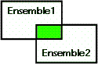

<!--REF #_command_.INTERSECTION.Syntax-->**INTERSECTION** ( *ensemble1* ; *ensemble2* ; *résultat* )<!-- END REF-->
<!--REF #_command_.INTERSECTION.Params-->
| Paramètre | Type |  | Description |
| --- | --- | --- | --- |
| ensemble1 | Text | &#8594;  | Premier ensemble |
| ensemble2 | Text | &#8594;  | Second ensemble |
| résultat | Text | &#8594;  | Ensemble résultant |

<!-- END REF-->

#### Description 

<!--REF #_command_.INTERSECTION.Summary-->**INTERSECTION** compare *ensemble1* et *ensemble2* et sélectionne uniquement les enregistrements se trouvant à la fois dans *ensemble1* et dans *ensemble2*.<!-- END REF--> Le tableau suivant liste les résultats possibles d'une opération d'intersection d'ensembles.

| **Ensemble1** | **Ensemble2** | **Ensemble résultant** |
| ------------- | ------------- | ---------------------- |
| Oui           | Non           | Non                    |
| Oui           | Oui           | Oui                    |
| Non           | Oui           | Non                    |
| Non           | Non           | Non                    |

Le schéma ci-dessous est la représentation graphique de l'intersection de deux ensembles. La zone colorée est l'ensemble résultant.



L'ensemble *résultat* est créé par **INTERSECTION**. Il remplace tout ensemble du même nom existant déjà, y compris *ensemble1* et *ensemble2*. Les ensembles de départ *ensemble1* et *ensemble2* doivent appartenir à la même table. L'ensemble *résultat* appartient à la même table que *ensemble1* et *ensemble2*. Si le même enregistrement courant était défini dans *ensemble1* et *ensemble2*, il reste mémorisé dans l'ensemble *résultat*. Sinon, l'ensemble *résultat* ne comporte pas d'enregistrement courant. 

**4D Server :** En mode client/serveur, les ensembles sont "visibles" en fonction de leur type (interprocess, process et local) et de leur lieu de création (serveur ou client). **INTERSECTION** requiert que les trois ensembles soient visibles sur la même machine. Pour plus d'informations sur ce point, reportez-vous à la section *4D Server, ensembles et sélections* dans le manuel de référence de 4D Server.

#### Exemple 

L'exemple suivant recherche les clients en contact avec deux représentants, Jean et Grégoire. Chaque représentant dispose d'un ensemble regroupant ses clients. Les clients se trouvant dans les deux ensembles sont en contact avec Jean et Grégoire :

```4d
 INTERSECTION("Jean";"Grégoire";"Doublon") // Doublon reçoit les clients appartenant aux 2 ensembles
 USE SET("Doublon") // Modification de la sélection courante
 CLEAR SET("Doublon") // Effacement de cet ensemble mais sauvegarde des autres
 DISPLAY SELECTION([Clients]) // Affichage des clients en contact avec les deux commerciaux
```

#### Voir aussi 

[DIFFERENCE](difference.md)  
[UNION](union.md)  