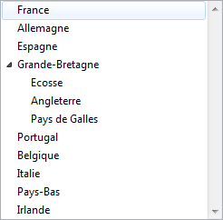

<!--REF #_command_.LIST TO ARRAY.Syntax-->**LIST TO ARRAY** ( *liste* ; *tableau* {; *réfEléments*} )<!-- END REF-->
<!--REF #_command_.LIST TO ARRAY.Params-->
| Paramètre | Type |  | Description |
| --- | --- | --- | --- |
| liste | Text, Integer | &#8594;  | Nom ou référence de la liste de laquelle copier les éléments du premier niveau |
| tableau | Array | &#8592; | Tableau dans lequel copier les éléments de la liste |
| réfEléments | Array | &#8592; | Numéros de référence des éléments de la liste |

<!-- END REF-->

*Cette commande n'est pas thread-safe, elle ne peut pas être utilisée dans du code préemptif.*


#### Description 

<!--REF #_command_.LIST TO ARRAY.Summary-->La commande **LIST TO ARRAY** crée ou remplace le tableau *tableau* avec les éléments du premier niveau de la liste ou de l'énumération *liste*.<!-- END REF-->

Vous pouvez passer dans le paramètre *liste* soit un nom d'énumération (une chaîne) soit une référence de liste hiérarchique ([RefListe](# "Expression de type Entier long identifiant de façon unique une liste hiérarchique")).

Si vous n'avez pas préalablement défini le tableau comme tableau de type Alpha ou Texte, **LIST TO ARRAY** crée un tableau de type Texte par défaut. 

**Note :** En mode compilé, le *tableau* doit avoir été préalablement défini et ne peut pas être retypé.

Le paramètre optionnel *réfEléments* (un tableau de type numérique) retourne les numéros de référence des éléments de la liste. 

Vous pouvez utiliser **LIST TO ARRAY** pour construire un tableau basé sur les éléments de premier niveau d'une liste. Cependant, cette commande ne vous donne pas les moyens de travailler avec les éléments des sous-listes. Pour exploiter pleinement les listes hiérarchiques, il est préférable d'utiliser les commandes de listes hiérarchiques, notamment [Load list](load-list.md).

#### Exemple 1 

L'exemple suivant recopie les éléments de l'énumération Régions dans le tableau *tabRégions* :

```4d
 LIST TO ARRAY("Régions";tabRégions)
```

#### Exemple 2 

Soit une liste hiérarchique créée de la manière suivante :

```4d
 MyList2:=New list
 APPEND TO LIST(myList2;"Ecosse";1)
 APPEND TO LIST(myList2;"Angleterre";2)
 APPEND TO LIST(myList2;"Pays de Galles";3)
 myList1:=New list
 APPEND TO LIST(myList1;"France";1)
 APPEND TO LIST(myList1;"Allemagne";2)
 APPEND TO LIST(myList1;"Espagne";3)
 APPEND TO LIST(myList1;"Grande-Bretagne";4;MyList2;True)
 APPEND TO LIST(myList1;"Portugal";5)
 APPEND TO LIST(myList1;"Belgique";6)
 APPEND TO LIST(myList1;"Italie";7)
 APPEND TO LIST(myList1;"Pays-Bas";8)
 APPEND TO LIST(myList1;"Irlande";9)
```

Cette liste peut être représentée ainsi :



Si vous exécutez l’instruction :

```4d
 LIST TO ARRAY(myList1;$MonTab)
```

...vous obtenez :

```4d
 $MonTab{1}="France"
 $MonTab{2}="Allemagne"
 $MonTab{3}="Espagne"
 $MonTab{4}="Grande-Bretagne"
 $MonTab{5}="Portugal"
 ...
```

#### Voir aussi 

[ARRAY TO LIST](array-to-list.md)  
[Load list](load-list.md)  
[SAVE LIST](save-list.md)  