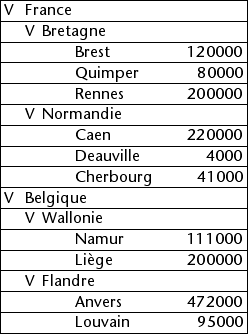
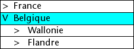
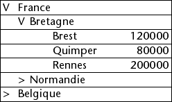
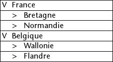

<!--REF #_command_.LISTBOX EXPAND.Syntax-->**LISTBOX EXPAND** ( {* ;} *objet* {; *récursive* {; *sélecteur* {; *ligne* {; *colonne*}}}} )<!-- END REF-->
<!--REF #_command_.LISTBOX EXPAND.Params-->
| Paramètre | Type |  | Description |
| --- | --- | --- | --- |
| * | Opérateur | &#8594;  | Si spécifié, objet est un nom d'objet (chaîne)<br/>Si omis, objet est une variable |
| objet | any | &#8594;  | Nom d'objet (si * est spécifié) ou <br/>Variable (si * est omis) |
| récursive | Boolean | &#8594;  | Vrai = déployer les sous-niveaux, Faux = ne pas déployer les sous-niveaux |
| sélecteur | Integer | &#8594;  | Partie de la list box à déployer |
| ligne | Integer | &#8594;  | Numéro de ligne de la rupture à déployer ou Numéro de niveau de la list box à déployer |
| colonne | Integer | &#8594;  | Numéro de colonne de la rupture à déployer |

<!-- END REF-->

*Cette commande n'est pas thread-safe, elle ne peut pas être utilisée dans du code préemptif.*


#### Description 

<!--REF #_command_.LISTBOX EXPAND.Summary-->La commande **LISTBOX EXPAND** vous permet de provoquer le déploiement des lignes de rupture de l’objet list box affiché en mode hiérarchique désigné par les paramètres *objet* et *\**.<!-- END REF-->

Si vous passez le paramètre optionnel *\**, vous indiquez que le paramètre *objet* est un nom d'objet (une chaîne). Si vous ne passez pas ce paramètre, vous indiquez que le paramètre *objet* est une variable. Dans ce cas, vous ne passez pas une chaîne mais une référence de variable. 

Si la list box n’est pas configurée en mode hiérarchique, la commande ne fait rien. Pour plus d’informations sur les list box hérarchiques, reportez-vous à la section *List box hiérarchiques*.

 Le paramètre optionnel *récursive* vous permet de paramétrer le déploiement des sous-niveaux hiérarchiques de la list box. Passez Vrai ou omettez ce paramètre pour que la commande provoque le déploiement de tous les niveaux et tous les sous-niveaux. Si vous passez Faux, seul le premier niveau désigné sera déployé. 

Le paramètre optionnel *sélecteur* vous permet de définir la portée de la commande. Vous pouvez passer dans ce paramètre l’une des constantes suivantes, placées dans le thème *List box* :

| Constante    | Type        | Valeur | Comment                                                                                                                                                                                                                                                                                                                                                  |
| ------------ | ----------- | ------ | -------------------------------------------------------------------------------------------------------------------------------------------------------------------------------------------------------------------------------------------------------------------------------------------------------------------------------------------------------- |
| lk all       | Entier long | 0      | La commande agit sur tous les sous-niveaux (valeur par défaut, utilisée si le paramètre est omis).                                                                                                                                                                                                                                                       |
| lk selection | Entier long | 1      | La commande agit sur les sous-niveaux sélectionnés.                                                                                                                                                                                                                                                                                                      |
| lk break row | Entier long | 2      | La commande agit sur le sous-niveau auquel appartient la "cellule" désignée par les paramètres *ligne* et *colonne*. A noter que ces paramètres représentent les numéros de ligne et de colonne dans la listbox en mode standard et non dans sa représentation hiérarchique. Si les paramètres *ligne* et *colonne* sont omis, la commande ne fait rien. |
| lk level     | Entier long | 3      | La commande agit sur toutes les lignes de rupture correspondant à la colonne *niveau*. Ce paramètre désigne un numéro de colonne dans la listbox en mode standard et non dans sa représentation hiérarchique. Si le paramètre *niveau* est omis, la commande ne fait rien.                                                                               |

La commande ne sélectionne pas les lignes de rupture. 

Si la sélection ou la list box ne contient pas de ligne de rupture, ou si toutes les lignes de rupture sont déjà déployées, la commande ne fait rien.

#### Exemple 

Cet exemple illustre différents modes d’utilisation de la commande. Soient les tableaux suivants représentés dans une list box :


```4d
  //Déployer toutes les lignes et sous-lignes de rupture de la list box
 LISTBOX EXPAND(*;"MaListbox")
```



```4d
  //Déployer le premier niveau de lignes de rupture de la sélection
 LISTBOX EXPAND(*;"MaListbox";False;lk selection)
  //Si la ligne "Belgique" était sélectionnée
```



```4d
  //Déployer la ligne de rupture Bretagne sans récursivité
 LISTBOX EXPAND(*;"MaListbox";False;lk break row;1;2)
```



```4d
  //Déployer toutes les premières colonnes (pays) sans récursivité
 LISTBOX EXPAND(*;"MaListbox";False;lk level;1)
```



#### Voir aussi 

[LISTBOX COLLAPSE](listbox-collapse.md)  