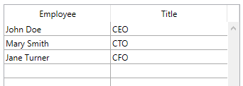

<!--REF #_command_.LISTBOX INSERT COLUMN FORMULA.Syntax-->**LISTBOX INSERT COLUMN FORMULA** ( {* ;} *objet* ; *positionCol* ; *nomCol* ; *formule* ; *typeDonnées* ; *nomEnTête* ; *variableEntête* {; *nomPied* ; *variablePied*} )<!-- END REF-->
<!--REF #_command_.LISTBOX INSERT COLUMN FORMULA.Params-->
| Paramètre | Type |  | Description |
| --- | --- | --- | --- |
| * | Opérateur | &#8594;  | Si spécifié, objet est un nom d’objet (chaîne) Si omis, objet est une variable |
| objet | any | &#8594;  | Nom d’objet (si * est spécifié) ou Variable (si * est omis) |
| positionCol | Integer | &#8594;  | Emplacement de la colonne à insérer |
| nomCol | Text | &#8594;  | Nom d’objet de la colonne |
| formule | Text | &#8594;  | Formule 4D associée à la colonne |
| typeDonnées | Integer | &#8594;  | Type de résultat de la formule |
| nomEnTête | Text | &#8594;  | Nom d'objet de l'en-tête de la colonne |
| variableEntête | Integer, Pointer | &#8594;  | Variable d'en-tête de la colonne |
| nomPied | Text | &#8594;  | Nom d’objet du pied de la colonne |
| variablePied | Variable, Pointer | &#8594;  | Variable du pied de la colonne |

<!-- END REF-->

#### Description 

<!--REF #_command_.LISTBOX INSERT COLUMN FORMULA.Summary-->La commande **LISTBOX INSERT COLUMN FORMULA** insère une colonne dans la list box désignée par les paramètres *objet* et *\** .<!-- END REF-->   
La commande **LISTBOX INSERT COLUMN FORMULA** est semblable à la commande [LISTBOX INSERT COLUMN](listbox-insert-column.md), à la différence près qu’elle permet la saisie d’une formule comme contenu de la colonne.  
Ce type de contenu ne peut être utilisé que lorsque la propriété “Source de données” de la list box est **Sélection courante**, **Sélection temporaire** ou **Collection ou entity selection** (pour plus d'informations sur ce point, reportez-vous à la section *Gestion programmée des objets de type List box*).

**Note :** Cette commande ne fait rien si elle est appliquée à la première colonne d’une list box affichée en mode hiérarchique. 

Si vous passez le paramètre optionnel *\**, vous indiquez que le paramètre *objet* est un nom d’objet (une chaîne). Si vous ne passez pas ce paramètre, vous indiquez que le paramètre *objet* est une variable. Dans ce cas, vous ne passez pas une chaîne mais une référence de variable. Pour plus d'informations sur les noms d’objets, reportez-vous à la section *Objets de formulaires*. 

La nouvelle colonne est insérée juste avant la colonne désignée par le paramètre *positionCol*. Si le paramètre *positionCol* est supérieur au nombre total de colonnes, la colonne est ajoutée après la dernière colonne. 

Passez dans le paramètre *nomCol* le nom d’objet de la colonne insérée. 

Le paramètre *formule* peut contenir toute expression valide, soit :

* une instruction,
* une formule générée à l’aide de l’éditeur de formules,
* un appel à une commande 4D,
* un appel à une méthode projet.

Au moment de l’appel de la commande, la *formule* est analysée puis exécutée.

**Note :** Utilisez la commande [Command name](command-name.md) afin de définir des formules indépendantes de la langue de l’application (lorsqu’elles font appel à des commandes 4D).

Le paramètre *typeDonnées* permet de désigner le type des données issues de l’exécution de la *formule*. Vous devez passer dans ce paramètre une des constantes du thème *Types champs et variables* suivantes :

| Constante  | Type        | Valeur |
| ---------- | ----------- | ------ |
| Is Boolean | Entier long | 6      |
| Is date    | Entier long | 4      |
| Is picture | Entier long | 3      |
| Is real    | Entier long | 1      |
| Is text    | Entier long | 2      |
| Is time    | Entier long | 11     |

Si le résultat de la *formule* ne correspond pas au type de données attendu, une erreur est générée.

Passez dans les paramètres *nomEntête* et *variableEntête* le nom d’objet et la variable de l’en-tête de la colonne insérée.

Vous pouvez également passer dans les paramètres *nomPied* et *variablePied* le nom d’objet et la variable du pied de la colonne insérée. Si vous omettez le paramètre *variablePied*, 4D utilisera une variable dynamique. 

**Note :** Les noms d’objets doivent être uniques dans un formulaire. Vous devez veiller à ce que les noms passés dans les paramètres *nomCol*, *nomEntête* et *nomPied* ne soient pas déjà utilisés. Sinon, la colonne n’est pas créée et une erreur est générée.

##### Insertion dynamique 

A compter de 4D v14 R3, vous pouvez utiliser cette commande pour insérer dynamiquement des colonnes dans les list box à l'exécution du formulaire, 4D prenant automatiquement en charge les définitions de variables nécessaires (pied et en-tête).

Pour cela, **LISTBOX INSERT COLUMN FORMULA** accepte un pointeur **Nil** (**\->\[\]**) comme valeur pour les paramètres *variableEntête* et *variablePied*. Dans ce cas, 4D va créer dynamiquement les variables requises lors de l'exécution de la commande (pour plus d'informations, reportez-vous à la section ). 

A noter que les variables d'en-tête et de pied sont toujours créées avec un type spécifique (respectivement entier long et texte).

#### Exemple 1 

Nous souhaitons ajouter une nouvelle colonne à la droite de la list box qui contiendra une formule calculant l’âge de l’employé :

```4d
 vAge:="Date du jour-[Employés]DateNaissance)\365"
 $der:=LISTBOX Get number of columns(*;"ListBox1")+1
 LISTBOX INSERT COLUMN FORMULA(*;"ListBox1";$der;"ColFormule";vAge;Is real;"Age";VarEntete)
```

#### Exemple 2 

Vous voulez ajouter une colonne à une list box de type collection :

```4d
  //Créer la collection
 var emps : Collection
 emps:=New collection(New object("Employee";"John Doe";"JobTitle";"CEO");New object("Employee";"Mary Smith";"JobTitle";"CTO");New object("Employee";"Jane Turner";"JobTitle";"CFO"))
```

Le contenu de la colonne sera évalué pour chaque élément de la collection et l'expression source *This.Employee* est utilisée :


A l'exécution :


Pour ajouter une colonne affichant les titres des postes occupés :

```4d
 LISTBOX INSERT COLUMN FORMULA(*;"EmpLB";2;"2nd Column";"This.JobTitle";Is text;"JTHeader";header2)
 OBJECT SET TITLE(header2;"Title")
```

La colonne est ajoutée à la list box :



#### Voir aussi 

[LISTBOX INSERT COLUMN](listbox-insert-column.md)  

#### Propriétés
|  |  |
| --- | --- |
| Numéro de commande | 970 |
| Thread safe | &check; |
| Interdite sur le serveur ||


