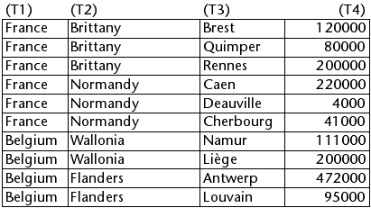
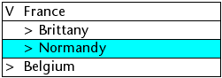

<!--REF #_command_.LISTBOX SELECT BREAK.Syntax-->**LISTBOX SELECT BREAK** ( {* ;} *objet* ; *ligne* ; *colonne* {; *action*} )<!-- END REF-->
<!--REF #_command_.LISTBOX SELECT BREAK.Params-->
| Paramètre | Type |  | Description |
| --- | --- | --- | --- |
| * | Opérateur | &#8594;  | Si spécifié, objet est un nom d'objet (chaîne) Si omis, objet est une variable |
| objet | any | &#8594;  | Nom d'objet (si * spécifié) ou Variable (si * omis) |
| ligne | Integer | &#8594;  | Numéro de ligne de la rupture |
| colonne | Integer | &#8594;  | Numéro de colonne de la rupture |
| action | Integer | &#8594;  | Action de sélection |

<!-- END REF-->

#### Description 

<!--REF #_command_.LISTBOX SELECT BREAK.Summary-->La commande **LISTBOX SELECT BREAK** permet de sélectionner des lignes de rupture dans l’objet list box désigné par les paramètres *objet* et *\**.<!-- END REF--> La list box doit être affichée en mode hiérarchique. 

Si vous passez le paramètre optionnel *\**, vous indiquez que le paramètre *objet* est un nom d'objet (une chaîne). Si vous ne passez pas ce paramètre, vous indiquez que le paramètre *objet* est une variable. Dans ce cas, vous ne passez pas une chaîne mais une référence de variable.

Les lignes de rupture sont ajoutées pour représenter la hiérarchie mais ne correspondent pas à des lignes de tableaux existantes. Pour désigner une ligne de rupture à sélectionner, vous devez passer dans les paramètres *ligne* et *colonne* des numéros de ligne et de colonne correspondant à la première occurrence dans le tableau correspondant. Ces valeurs sont retournées par la commande [LISTBOX GET CELL POSITION](listbox-get-cell-position.md) lorsque l’utilisateur a sélectionné une ligne de rupture. Ce principe est détaillé dans le paragraphe “Gestion des lignes de rupture” de la section *List box hiérarchiques*. 

Le paramètre *action*, s’il est passé, permet de définir l’action de sélection à effectuer lorsqu’une sélection de lignes de rupture existe déjà dans la list box. Vous pouvez passer une valeur ou l’une des constantes suivantes, placées dans le thème "*List box*" :

| Constante                | Type        | Valeur | Comment                                                                                                                                                                                                                                                                                                                      |
| ------------------------ | ----------- | ------ | ---------------------------------------------------------------------------------------------------------------------------------------------------------------------------------------------------------------------------------------------------------------------------------------------------------------------------- |
| lk add to selection      | Entier long | 1      | La ligne sélectionnée est ajoutée à la sélection existante. Si la ligne désignée appartient déjà à la sélection existante, la commande ne fait rien.                                                                                                                                                                         |
| lk remove from selection | Entier long | 2      | La ligne sélectionnée est supprimée de la sélection existante. Si la ligne désignée n’appartient pas à la sélection existante, la commande ne fait rien.                                                                                                                                                                     |
| lk replace selection     | Entier long | 0      | La ligne sélectionnée devient la nouvelle sélection et remplace la sélection existante. La commande produit le même effet qu’un clic de l’utilisateur sur une ligne de la list box (l'événement Sur clic n'est toutefois pas généré). Cette action est effectuée par défaut (lorsque le paramètre *action* n’est pas passé). |

**Note :** Si vous avez coché l'option **Cacher surlignage sélection** pour la list box : 

* vous devrez gérer la représentation visuelle des sélections dans la list box à l'aide des options d'interface disponibles. Pour plus d'informations sur ce point, veuillez vous reporter au paragraphe *Personnaliser la représentation des sélections*.
* vous ne pouvez pas surligner les lignes de rupture dans les list box hiérarchiques dans ce cas (cf. *Limitation pour les list box hiérarchiques*).

#### Exemple 

Soient les tableaux suivants représentés dans une list box :



Nous souhaitons sélectionner la ligne de rupture "Normandie" dans la représentation hiérarchique de ces tableaux :

```4d
 $ligne:=Find in array(T2;"Normandie")
 $colonne:=2
 LISTBOX COLLAPSE(*;"MaListbox") //contraction de tous les niveaux
 LISTBOX SELECT BREAK(*;"MaListbox";$ligne;$colonne)
```

Voici le résultat :



#### Voir aussi 

[LISTBOX GET CELL POSITION](listbox-get-cell-position.md)  
[LISTBOX SELECT ROW](listbox-select-row.md)  

#### Propriétés
|  |  |
| --- | --- |
| Numéro de commande | 1117 |
| Thread safe | &check; |
| Interdite sur le serveur ||


