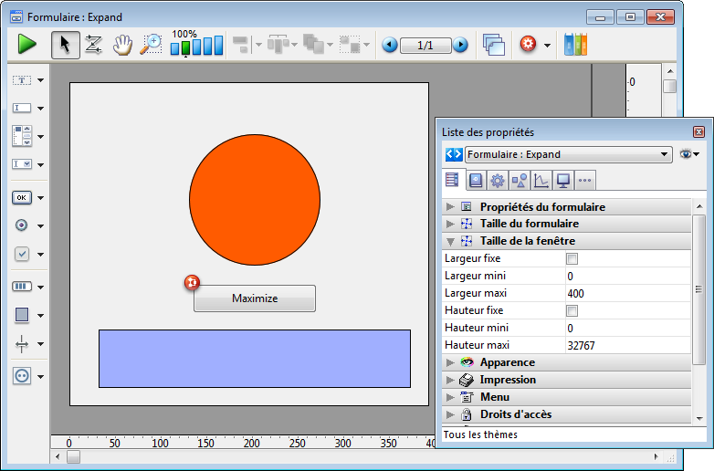
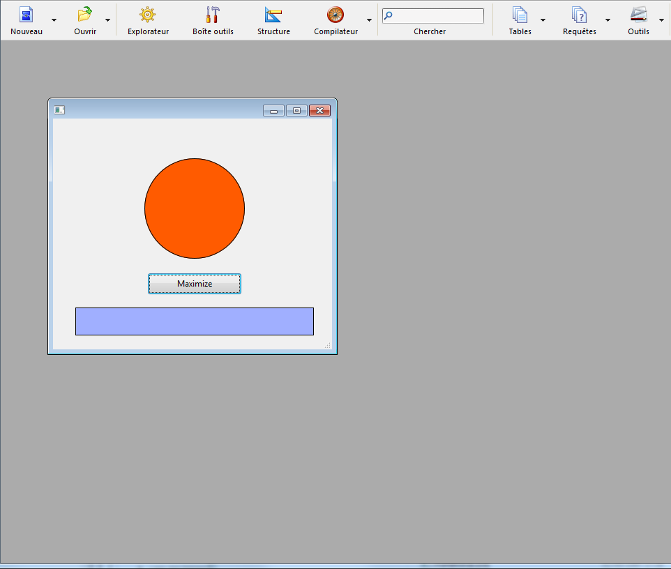
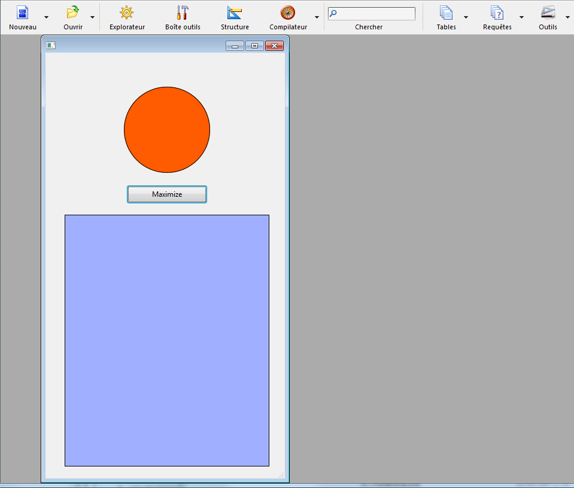

<!--REF #_command_.MAXIMIZE WINDOW.Syntax-->**MAXIMIZE WINDOW** {( *fenêtre* )}<!-- END REF-->
<!--REF #_command_.MAXIMIZE WINDOW.Params-->
| Paramètre | Type |  | Description |
| --- | --- | --- | --- |
| fenêtre | Integer | &#8594;  | Numéro de référence de la fenêtre Si omis = Toutes les fenêtres (Windows) ou Fenêtre de premier plan du process courant (Mac OS) |

<!-- END REF-->

*Cette commande n'est pas thread-safe, elle ne peut pas être utilisée dans du code préemptif.*


#### Description 

<!--REF #_command_.MAXIMIZE WINDOW.Summary-->La commande **MAXIMIZE WINDOW** provoque le zoom de la fenêtre dont vous avez passé le numéro de référence dans *fenêtre* ou, si ce paramètre est omis, de toutes les fenêtres de l'application (sous Windows) ou de la fenêtre de premier plan du process courant (sous Mac OS).<!-- END REF--> 

Cette commande produit le même effet qu'un clic sur la case de zoom d'une fenêtre de l'application 4D. Les fenêtres que vous souhaitez maximiser doivent comporter une case de zoom. Si le type de *fenêtre* n'en contient pas, la commande ne fait rien.

Un clic ultérieur sur la case de zoom ou l'appel de la commande [MINIMIZE WINDOW](minimize-window.md) provoque le retour de la fenêtre à sa taille initiale. Sous Windows, si la fenêtre a été maximisée, un clic sur la case de zoom ou l'appel de la commande [MINIMIZE WINDOW](minimize-window.md) (sans paramètre) entraîne le retour à leur taille initiale de toutes les fenêtres de l'application.

Si *fenêtre* est déjà maximisée, la commande ne fait rien.

##### Sous Windows 

La fenêtre est agrandie et s'adapte à la taille courante de la fenêtre de l'application (mode MDI) ou de l'écran (mode SDI). Si vous ne passez pas le paramètre *fenêtre*, toutes les fenêtres de l'application sont maximisées. La fenêtre maximisée est passée au premier plan. 

  
Case de zoom ("bouton d'agrandissement") sous Windows

Dans le cas où la commande est appliquée à une fenêtre dont la taille est soumise à des contraintes (par exemple, une fenêtre formulaire) :

* Si aucune des containtes de taille n'est en conflit avec la taille cible, la fenêtre est placée dans son état "maximisé" : elle est redimensionnée à la taille de la fenêtre de l'application parente (mode MDI) ou de l'écran (mode SDI) ; sa barre de titre et ses bordures sont cachées et ses boutons de contrôle - minimiser, restaurer et fermer - sont déplacés à droite de la barre de menus de l'application.
* Si au moins une des contraintes de taille est en conflit (par exemple, si la largeur de la fenêtre MDI est de 100 et que la largeur maximale de la fenêtre formulaire est 80), la fenêtre n'est pas placée dans son état "maximisé", mais uniquement redimensionnée à sa taille maximale autorisée. Cette taille est définie soit par la fenêtre MDI, soit par la contrainte. Avec ce fonctionnement, l'interface reste cohérente lorsque les fenêtres avec contraintes sont redimensionnées.

##### Sous Mac OS 

La fenêtre est agrandie de manière à afficher la totalité de son contenu. Si vous ne passez pas le paramètre *fenêtre*, la fenêtre du premier plan du process courant est maximisée. 

  
Case de zoom sous Mac OS

* Le zoom étant calculé par rapport au contenu de la fenêtre, cette commande doit être appelée dans un contexte où ce contenu est défini, par exemple une méthode formulaire. Sinon, la commande ne fait rien.
* La fenêtre est dimensionnée à sa taille "maximale". Si la fenêtre est un formulaire dont la taille maximale a été définie dans les Propriétés du formulaire, le zoom de la fenêtre se limitera à cette taille.

#### Exemple 1 

Vous souhaitez que votre formulaire s'ouvre sur une fenêtre "plein écran". Pour cela, vous placez la commande **MAXIMIZE WINDOW** dans la méthode du formulaire :

```4d
  // Méthode formulaire
 
 MAXIMIZE WINDOW
```

#### Exemple 2 

Cet exemple illustre la prise en charge des contraintes de taille sous Windows en mode MDI. Le formulaire suivant comporte une contrainte de taille (largeur maximale=400) :



La méthode du bouton contient uniquement :

```4d
 MAXIMIZE WINDOW(Current form window)
```

Dans le contexte suivant, si l'utilisateur clique sur le bouton :



... la fenêtre n'est pas placée dans son état "maximisé" ; seule sa hauteur est augmentée :



#### Voir aussi 

[Is window maximized](is-window-maximized.md)  
[MINIMIZE WINDOW](minimize-window.md)  
[REDUCE RESTORE WINDOW](reduce-restore-window.md)  