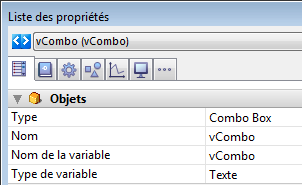

<!--REF #_command_.OBJECT Get data source.Syntax-->**OBJECT Get data source** ( {* ;} *objet* ) : Pointer<!-- END REF-->
<!--REF #_command_.OBJECT Get data source.Params-->
| Paramètre | Type |  | Description |
| --- | --- | --- | --- |
| * | Opérateur | &#8594;  | Si spécifié, objet est un nom d'objet (chaîne)<br/>Si omis, objet est un champ ou une variable |
| objet | any | &#8594;  | Nom d'objet (si * est spécifié) ou <br/>Champ ou variable (si * est omis) |
| Résultat | Pointer | &#8592; | Pointeur vers la source de données courante de l’objet |

<!-- END REF-->

*Cette commande n'est pas thread-safe, elle ne peut pas être utilisée dans du code préemptif.*


#### Description 

<!--REF #_command_.OBJECT Get data source.Summary-->La commande **OBJECT Get data source** retourne la source de données courante de l’objet ou des objets désigné(s) par les paramètres *objet* et *\**.<!-- END REF--> 

La source de données d’un objet peut avoir été définie en mode Développement via la Liste des propriétés ou à l’aide de la commande [OBJECT SET DATA SOURCE](object-set-data-source.md).

Si vous passez le paramètre optionnel *\**, vous indiquez que le paramètre *objet* est un nom d’objet (une chaîne). Si vous ne passez pas le paramètre, vous indiquez que le paramètre *objet* est un champ ou une variable. Dans ce cas, vous ne passez pas une chaîne mais une référence de champ ou de variable (champ ou variable objet uniquement).

#### Exemple 

Soit un objet combo box défini dans un formulaire :



Vous exécutez le code suivant :

```4d
 $vPtr :=OBJECT Get data source(*;"vCombo")
     //$vPtr contient ->vCombo
```

#### Voir aussi 

[OBJECT SET DATA SOURCE](object-set-data-source.md)  