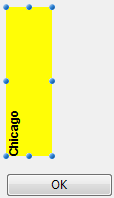

<!--REF #_command_.OBJECT Get text orientation.Syntax-->**OBJECT Get text orientation** ( {* ;} *objet* ) : Integer<!-- END REF-->
<!--REF #_command_.OBJECT Get text orientation.Params-->
| Paramètre | Type |  | Description |
| --- | --- | --- | --- |
| * | Opérateur | &#8594;  | Si spécifié, objet est un nom d'objet (chaîne)<br/>Si omis, objet est un champ ou une variable |
| objet | any | &#8594;  | Nom d'objet (si * est spécifié) ou <br/>Champ ou variable (si * est omis) |
| Résultat | Integer | &#8592; | Angle de rotation du texte |

<!-- END REF-->

*Cette commande n'est pas thread-safe, elle ne peut pas être utilisée dans du code préemptif.*


#### Description 

<!--REF #_command_.OBJECT Get text orientation.Summary-->La commande **OBJECT Get text orientation** retourne la valeur d’orientation courante appliquée au texte de l’objet ou des objets désigné(s) par les paramètres *objet* et *\**.<!-- END REF--> 

L’option "Orientation" d’un objet peut avoir été définie en mode Développement via la Liste des propriétés ou à l’aide de la commande [OBJECT SET TEXT ORIENTATION](object-set-text-orientation.md).

Si vous passez le paramètre optionnel *\**, vous indiquez que le paramètre *objet* est un nom d’objet (une chaîne). Si vous ne passez pas le paramètre, vous indiquez que le paramètre *objet* est un champ ou une variable. Dans ce cas, vous ne passez pas une chaîne mais une référence de champ ou de variable (champ ou variable objet uniquement).

La valeur retournée correspond à l’une des constantes suivantes du thème "*Objets de formulaire (Propriétés)*" :

| Constante             | Type        | Valeur | Comment                                              |
| --------------------- | ----------- | ------ | ---------------------------------------------------- |
| Orientation 0°        | Entier long | 0      | Pas de rotation (valeur par défaut)                  |
| Orientation 180°      | Entier long | 180    | Orientation du texte à 180° dans le sens horaire     |
| Orientation 90° left  | Entier long | 270    | Orientation du texte à 90° dans le sens anti-horaire |
| Orientation 90° right | Entier long | 90     | Orientation du texte à 90° dans le sens horaire      |

#### Exemple 

Soit l’objet suivant (une orientation "90° gauche" lui a été appliquée dans l’éditeur de formulaires) :



Si, à l’exécution du formulaire, vous appelez l’instruction suivante :

```4d
 OBJECT SET TEXT ORIENTATION(*;"monTexte";Orientation 180°)
```

... l’objet prend alors l’apparence suivante :


```4d
 $vOrt:=OBJECT Get text orientation(*;"monTexte") //$vOrt=180
```

#### Voir aussi 

[OBJECT SET TEXT ORIENTATION](object-set-text-orientation.md)  