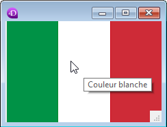
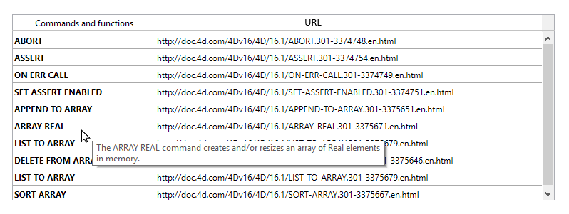

<!--REF #_command_.OBJECT SET HELP TIP.Syntax-->**OBJECT SET HELP TIP** ( {* ;} *objet* ; *messageAide* )<!-- END REF-->
<!--REF #_command_.OBJECT SET HELP TIP.Params-->
| Paramètre | Type |  | Description |
| --- | --- | --- | --- |
| * | Opérateur | &#8594;  | Si spécifié, objet est un nom d'objet (chaîne)<br/>Si omis, objet est une variable ou un champ |
| objet | any | &#8594;  | Nom d'objet (si * est spécifié) ou <br/>Variable (si * est omis) |
| messageAide | Text | &#8594;  | Contenu du message d’aide |

<!-- END REF-->

#### Description 

<!--REF #_command_.OBJECT SET HELP TIP.Summary-->La commande **OBJECT SET HELP TIP** permet de définir ou de modifier dynamiquement le message d’aide associé à l’objet ou aux objets désigné(s) par les paramètres *objet* et *\** pour le process courant.<!-- END REF--> 

Si vous passez le paramètre optionnel *\**, vous indiquez que le paramètre *objet* est un nom d’objet de formulaire (une chaîne). Si vous ne passez pas ce paramètre, vous indiquez que le paramètre *objet* est une variable. Dans ce cas, vous ne passez pas une chaîne mais une référence de variable. 

Passez dans le paramètre *messageAide* une chaîne de caractères contenant le message à afficher. Si vous passez une chaîne vide "", l'infobulle est supprimée.

Lorsque le formulaire est exécuté, les messages d'aide apparaissent sous forme d'infobulle à chaque fois que le curseur de la souris survole le champ ou l'objet. Le délai d'affichage et la durée maximum d'affichage des messages d'aide peuvent être contrôlés en utilisant les sélecteurs Tips delay et Tips duration de la commande [SET DATABASE PARAMETER](set-database-parameter.md).

Note : Vous pouvez utiliser cette commande avec une list box afin d'associer des infobulles aux lignes et cellules de la list box. Par exemple, un objet list box peut comporter une infobulle différente par ligne. Ce cas nécessite de déterminer au préalable la position du curseur à l'aide de la commande [LISTBOX GET CELL POSITION](listbox-get-cell-position.md). Ce principe est présenté dans un exemple ci-dessous.

Lorsqu'un message d'aide est déjà affiché, l'utilisation de la commande **OBJECT SET HELP TIP** le ferme, ouvre un nouveau message d'aide à l'endroit où se trouve la souris et redémarre le compteur Tips duration, permettant une gestion dynamique des messages d'aide.

**Notes :** 

* Les messages d'aide peuvent également être définis via l'éditeur de formulaires (voir *Contrôles et aides à la saisie*) et l'éditeur de structure (voir *Propriétés des champs*) en mode Développement.
* Les messages d'aide peuvent être globalement désactivés pour l'application en utilisant le sélecteur Tips enabled de la commande [SET DATABASE PARAMETER](set-database-parameter.md).

#### Exemple 1 

Dans ce formulaire, un message d'aide est affiché et change dynamiquement lorsque la souris survole des zones différentes du bouton-image :



```4d
  //Méthode objet du bouton-image nommé "myFlag"
 
 var $x;$y;oldX;oldY : Real
 var $left;$right;$top;$bottom : Real
 var $b : Integer
 var $tip : Text
 var oldTip : Text
 var $doRefresh : Boolean
 
 Case of
    :(FORM Event=On Load)
       oldTip:=""
       SET DATABASE PARAMETER(Message aide activation;1) //Pour être sûr que les messages d'aide sont activés
       SET DATABASE PARAMETER(Message aide délai;0) // Le message est affiché dès que la souris s'arrête
       SET DATABASE PARAMETER(Message aide durée;60*10) // Affichage de 10 secondes
    :(FORM Event=On Mouse Move)
       MOUSE POSITION($x;$y;$b)
       OBJECT GET COORDINATES(*;"myFlag";$left;$top;$right;$bottom)
       $x:=$x-$left
       $y:=$y-$top
       Case of //chaque zone du drapeau fait 76 pixels
          :($x<76)
             $tip:="Couleur verte"
          :($x<152)
             $tip:="Couleur blanche"
             sinon
             $tip:="Couleur rouge"
       End case
 
       $doRefresh:=($tip#oldtip) //Vrai si le message d'aide est différent
       If(Not($doRefresh)) //contenus identiques
          $doRefresh:=((Abs($x-oldX)>30)|(Abs($y-oldY)>30)) //Vrai si le curseur a bougé
       End if
 
       If($doRefresh) //Affiche un autre message
          OBJECT SET HELP TIP(*;"myFlag";$tip)
          oldX:=$x
          oldY:=$y
          oldTip:=$tip
       End if
 
 End case
```

#### Exemple 2 

Vous avez défini une list box "liste de commandes" et vous souhaitez proposer des infobulles affichant la description de chaque élément de la liste. La description se trouve dans la table \[Documentation\]. 

```4d
 var $mouseX;$mouseY;$mouseZ : Real
 var $col;$row : Integer
 
 Case of
 
    :(FORM Event=On Mouse Enter)
       SET DATABASE PARAMETER(Tips delay;1) // l'infobulle doit s'afficher rapidement
 
    :(FORM Event=On Mouse Move)
  //#1 : trouver quelle ligne est survolée
       MOUSE POSITION($mouseX;$mouseY;$mouseZ)
       LISTBOX GET CELL POSITION(*;"Commands List";$mouseX;$mouseY;$col;$row)
 
  //#2 : définir l'infobulle à afficher
       If($row#0)
          GOTO SELECTED RECORD([Documentation];$row)
          OBJECT SET HELP TIP(*;"Commands List";[Documentation]Description) // la description complète sera utilisée comme message d'aide lorsque (si) la souris est immobile
       End if
 
    :(FORM Event=On Mouse Leave)
       SET DATABASE PARAMETER(Tips delay;3) //Retour délai normal
 
 End case
```

Résultat :



#### Voir aussi 

[OBJECT Get help tip](object-get-help-tip.md)  
[SET DATABASE PARAMETER](set-database-parameter.md)  