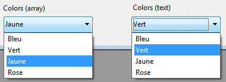
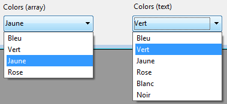

<!--REF #_command_.OBJECT SET LIST BY REFERENCE.Syntax-->**OBJECT SET LIST BY REFERENCE** ( {* ;} *objet* {; *typeListe*}; *liste* )<!-- END REF-->
<!--REF #_command_.OBJECT SET LIST BY REFERENCE.Params-->
| Paramètre | Type |  | Description |
| --- | --- | --- | --- |
| * | Opérateur | &#8594;  | Si spécifié, objet est un nom d'objet (chaîne)<br/>Si omis, objet est un champ ou une variable |
| objet | any | &#8594;  | Nom d'objet (si * est spécifié) ou <br/>Champ ou variable (si * est omis) |
| typeListe | Integer | &#8594;  | Type de liste : Liste énumération, Liste obligations ou Liste exclusions |
| liste | Integer | &#8594;  | Numéro de référence de liste |

<!-- END REF-->

#### Description 

<!--REF #_command_.OBJECT SET LIST BY REFERENCE.Summary-->La commande **OBJECT SET LIST BY REFERENCE** définit ou remplace l’énumération associée à l’objet ou aux objets désigné(s) par les paramètres *objet* et *\**, avec la liste hiérarchique référencée dans le paramètre *liste*.<!-- END REF-->

Si vous passez le paramètre optionnel *\**, vous indiquez que le paramètre *objet* est un nom d'objet (une chaîne). Si vous ne passez pas le paramètre, vous indiquez que le paramètre *objet* est un champ ou une variable. Dans ce cas, vous ne passez pas une chaîne mais une référence de champ ou de variable (champ ou variable objet uniquement).

Par défaut, si vous omettez le paramètre *typeListe*, la commande définit une énumération source (choix de valeurs) pour l’objet. Le paramètre *typeListe* vous permet de désigner tout type d’énumération. Pour cela, il vous suffit de passer dans ce paramètre une des constantes suivantes du thème "*Objets de formulaire (Propriétés)*" :

| Constante     | Type        | Valeur | Comment                                                                                               |
| ------------- | ----------- | ------ | ----------------------------------------------------------------------------------------------------- |
| Choice list   | Entier long | 0      | Liste simple de choix de valeurs (option "Enumération" dans la Liste des propriétés) (défaut)         |
| Excluded list | Entier long | 2      | Liste de valeurs non acceptées pour la saisie (option "Exclusions" dans la Liste des propriétés)      |
| Required list | Entier long | 1      | Liste des seules valeurs acceptées pour la saisie (option "Obligations" dans la Liste des propriétés) |

Passez dans *liste* le numéro de référence de la liste hiérarchique que vous souhaitez associer à l’objet. Cette liste doit avoir été générée à l’aide de la commande [Copy list](copy-list.md), [Load list](load-list.md) ou [New list](new-list.md). 

Pour mettre fin à l’association d’une *liste* à un *objet*, il suffit de passer 0 dans le paramètre *liste* pour le type de liste concerné. Supprimer une association de liste ne supprime pas la référence de liste en mémoire. N’oubliez pas d’appeler la commande [CLEAR LIST](clear-list.md) lorsque vous n’avez plus besoin d’une liste. 

La liste de valeurs existante est remplacée en fonction de la manière dont la liste est associée à l'objet de formulaire:

* à l'aide d'une énumération : la liste elle-même est remplacée.
* à l'aide d'un tableau : la liste est copiée dans les éléments du tableau.
* à l'aide d'un objet (non pris en charge dans les bases binaires) : la liste est copiée en tant qu'éléments de collection dans la propriété *values* de l'objet.

Cette commande est particulièrement intéressante dans le cas d'une liste déroulante ou d'une combo box associée à une variable ou à un champ. Dans ce cas, l'association est dynamique et toute modification apportée à la liste est copiée dans le formulaire. Lorsque l'objet est associé à un tableau ou à un objet, la liste est copiée dans le tableau ou l'objet et les modifications apportées à la liste ne sont pas disponibles automatiquement (voir exemple 5).

#### Exemple 1 

Association d’une énumération simple (type de liste par défaut) à un champ texte :

```4d
 vListCountries:=New list
 APPEND TO LIST(vListCountries;"Espagne";1)
 APPEND TO LIST(vListCountries;"Portugal";2)
 APPEND TO LIST(vListCountries;"Grèce";3)
 OBJECT SET LIST BY REFERENCE([Contact]Country;vListCountries)
```

#### Exemple 2 

Associer la liste "vColor" en tant qu’énumération simple au pop up/Liste déroulante "CoulPorte" :

```4d
 vColor:=New list
 APPEND TO LIST(vColor;"Bleu";1)
 APPEND TO LIST(vColor;"Vert";2)
 APPEND TO LIST(vColor;"Jaune";3)
 APPEND TO LIST(vColor;"Rose";4)
 OBJECT SET LIST BY REFERENCE(*;"CoulPorte";Choice list;vColor)
```

#### Exemple 3 

Vous souhaitez maintenant associer la liste "vColor" à une combo box "CoulMur". Comme la combo box est saisissable, vous souhaitez que certaines couleurs telles que "noir", "violet"... ne puissent pas être utilisées. Ces couleurs sont placées dans la liste "vRejet" :

```4d
 OBJECT SET LIST BY REFERENCE(*;"CoulMur";Choice list;vColor)
 vRejet:=New list
 APPEND TO LIST(vRejet;"Noir";1)
 APPEND TO LIST(vRejet;"Gris";2)
 APPEND TO LIST(vRejet;"Violet";3)
 OBJECT SET LIST BY REFERENCE(*;"CoulMur";Excluded list;vRejet)
```

#### Exemple 4 

Vous souhaitez supprimer des associations de listes :

```4d
 OBJECT SET LIST BY REFERENCE(*;"CoulMur";Choice list;0)
 OBJECT SET LIST BY REFERENCE(*;"CoulMur";Required list;0)
 OBJECT SET LIST BY REFERENCE(*;"CoulMur";Excluded list;0)
```

#### Exemple 5 

Cet exemple illustre la différence de fonctionnement de la commande selon qu’elle est appliquée à un pop up menu associé à un tableau texte ou à une variable texte. Dans un formulaire se trouvent deux pop up menus :


Le contenu des pop up menus est défini par la liste *<>vColor* (contenant des valeurs de couleurs). Le code suivant est exécuté au chargement du formulaire :

```4d
 ARRAY TEXT(tab1;0) //pop up tab1
 var text1 : Text //pop up text1
 OBJECT SET LIST BY REFERENCE(*;"tab1";<>vColor)
 OBJECT SET LIST BY REFERENCE(*;"text1";<>vColor)
```

A l’exécution, les deux menus proposent alors les mêmes valeurs :

  
(*Montage montrant simultanément le contenu des menus*)

Vous exécutez alors le code suivant, par exemple via un bouton :

```4d
 APPEND TO LIST(<>vColor;"Blanc";5)
 APPEND TO LIST(<>vColor;"Noir";6)
```

Seul le menu associé au champ texte est mis à jour (via la référence dynamique) :



Pour pouvoir mettre à jour la liste associée au pop up géré par tableau, il est nécessaire de rappeler la commande **OBJECT SET LIST BY REFERENCE** afin de recopier le contenu de la liste. 

#### Voir aussi 

[OBJECT Get list reference](object-get-list-reference.md)  
[OBJECT SET LIST BY NAME](object-set-list-by-name.md)  

#### Propriétés
|  |  |
| --- | --- |
| Numéro de commande | 1266 |
| Thread safe | &check; |
| Interdite sur le serveur ||


