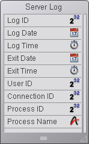
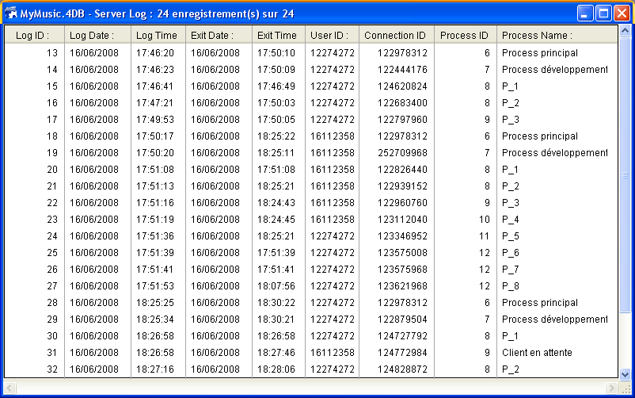

<!--REF #_command_.On Server Open Connection database method.Syntax-->$1, $2, $3 -> On Server Open Connection database method -> $0<!-- END REF-->
<!--REF #_command_.On Server Open Connection database method.Params-->
| Paramètre | Type |  | Description |
| --- | --- | --- | --- |
| $1 | Integer | &#8592; | Numéro d'utilisateur utilisé en interne par 4D Server pour identifier les utilisateurs |
| $2 | Integer | &#8592; | Numéro de connexion utilisé en interne par 4D Server pour identifier une connexion |
| $3 | Integer | &#8592; | Obsolète : Retourne toujours 0 (mais doit être déclaré) |
| $0 | Integer | &#8592; | 0 ou omis = connexion acceptée, autre valeur = connexion refusée |

<!-- END REF-->

*Cette commande n'est pas thread-safe, elle ne peut pas être utilisée dans du code préemptif.*


#### Quand la Méthode base Sur ouverture connexion serveur est-elle appelée ? 

<!--REF #_command_.On Server Open Connection database method.Summary-->La **On Server Open Connection database method** est appelée une fois sur la machine serveur chaque fois qu’un poste 4D distant démarre un process de connexion.<!-- END REF--> La **On Server Open Connection database method** n’est appelée que par 4D Server, à l’exclusion de tout autre environnement 4D. 

La **On Server Open Connection database method** est appelée à chaque fois que :

* un 4D distant se connecte (démarrage du process principal)
* un 4D distant ouvre l’environnement Développement (démarrage du process de développement)
* un 4D distant démarre un process global (dont le nom de ne commence pas par "$") qui nécessite la création d'un process coopératif sur le serveur **(\*)**. Ce process peut être créé avec la commande [New process](new-process.md), une commande de menu ou la boîte de dialogue “Exécuter une méthode” .

Dans chaque cas, plusieurs process démarrent. Un sur la machine client, et un ou deux autres sur la machine serveur (suivant les besoins). Sur la machine client, le process exécute le code et envoie les requêtes à 4D Server. Sur la machine serveur, le **process 4D Client** (process préemptif) gère l’environnement de base de données du process client (c.-à-d. les sélections courantes et le verrouillage des enregistrements pour le process utilisateur) et répond aux requêtes envoyées par le process exécuté sur la machine cliente. Le **process base 4D Client** (process coopératif) est chargé de contrôler le process 4D Client correspondant.

**(\*)** A compter de 4D v13, pour des raisons d'optimisation les process serveurs (process préemptif pour les accès au moteur de la base et process coopératif pour l’accès au langage) ne sont créés qu’en cas de nécessité lors de l’exécution du code côté client. Par exemple, voici le détail d’une séquence de code 4D s’exécutant dans un nouveau process client :  

```4d
  // le process global commence sans nouveau process sur le serveur, comme un process local.
 CREATE RECORD([Table_1])
 [Table_1])champ1_1:="Hello world"
 SAVE RECORD([Table_1]) // création ici du process préemptif sur le serveur
  //pas d'appel de Sur ouverture connexion serveur
 $serverTime:=Current time(*) // création ici du process coopératif sur le serveur
  // appel de Sur ouverture connexion serveur
```

**Important** **:** Les connexions Web et les connexions SQL ne provoquent **pas** l'exécution de la **On Server Open Connection database method**. Lorsqu’un navigateur Web se connecte à 4D Server, la [On Web Authentication database method](on-web-authentication-database-method.md) (si elle existe) et/ou la [On Web Connection database method](on-web-connection-database-method.md) sont appelées. Lorsque 4D Server reçoit une requête SQL, la [On SQL Authentication database method](on-sql-authentication-database-method.md) (si elle existe) est appelée. Pour plus d’informations, reportez-vous à la description de ces méthodes base dans le manuel Langage de 4D. 

**Important** **:** Lors du démarrage d’une procédure stockée, la **On Server Open Connection database method** n’est **pas** appelée. Les *Procédures stockées* sont des process serveur et non des process 4D Client. Elles exécutent du code sur la machine serveur mais ne répondent pas aux requêtes échangées par 4D Client (ou d’autres clients) et 4D Server.

#### Comment la méthode base est-elle appelée ? 

La **On Server Open Connection database method** est exécutée sur le poste serveur dans le process 4D Client qui a provoqué l’appel de la méthode. 

Si, par exemple, un 4D distant se connecte à une base 4D Server en mode interprété, il démarre le process utilisateur, le process de développement ainsi que (par défaut) le process d'inscription du client. La **On Server Open Connection database method** est donc exécutée trois fois de suite. La première fois dans le process principal, la deuxième fois dans le process d'inscription du client et la troisième fois dans le process de développement. Si les trois process sont respectivement les 6e, 7e et 8e process démarrés sur la machine serveur, et si vous appelez [Current process](current-process.md) dans la **On Server Open Connection database method**, le premier [Current process](current-process.md) retourne 6, le deuxième 7 et le troisième 8.

Notez que la **On Server Open Connection database method** s’exécute sur le poste serveur, à l'intérieur du process 4D Client sur le serveur. Elle ignore tout du process exécuté sur le client. En outre, au moment où la méthode est appelée, le process 4D Client n’est pas encore nommé ([Process info](../commands/process-info.md) ne retournera pas, à ce moment, le nom du process 4D Client).

La **On Server Open Connection database method** n’a pas accès à la table des variables process du process exécuté sur le client. Cette table réside sur le poste client, pas sur le serveur.

Lorsque la **On Server Open Connection database method** accède à une variable process, elle travaille avec une table de variables process particulière, créée dynamiquement pour le process 4D Client. 

4D Server passe trois paramètres de type Entier long à la **On Server Open Connection database method** et attend un résultat Entier long. La méthode doit donc être explicitement déclarée avec trois paramètres Entier long ainsi qu'un retour de fonction Entier long : 

```4d
 var $0;$1;$2;$3 : Integer
```

Si vous ne retournez pas de valeur dans *$0* et donc laissez la variable indéfinie ou initialisée à zéro, 4D Server estime que la méthode base accepte la connexion. Si vous n’acceptez pas la connexion, retournez une valeur non nulle dans *$0*.

Le tableau ci-dessous détaille les informations fournies par les trois paramètres passés à la méthode base : 

| **Paramètre** | **Description**                                                                        |
| ------------- | -------------------------------------------------------------------------------------- |
| $1            | Numéro d'utilisateur utilisé en interne par 4D Server pour identifier les utilisateurs |
| $2            | Numéro de connexion utilisé en interne par 4D Server pour identifier une connexion     |
| $3            | Obsolète : Retourne toujours 0 (mais doit être déclaré)                                |

Ces numéros de référence ne sont pas directement utilisables en tant que « sources d’information » à passer, par exemple, comme paramètres à une commande 4D. Ils vous fournissent un moyen d’identifier de manière unique un process 4D Client entre la **On Server Open Connection database method** et la [On Server Close Connection database method](on-server-close-connection-database-method.md). La combinaison de ces valeurs est unique à tout moment d’une session 4D Server. Si vous stockez cette information dans une table ou un tableau interprocess, les deux méthodes base peuvent échanger des informations. Dans l’exemple présenté à la fin de cette section, les deux méthodes base utilisent cette information pour stocker l’heure et la date du début et de la fin d’une connexion dans le même enregistrement d’une table.

#### Exemple 1 

L’exemple suivant montre comment maintenir un historique des connexions à la base de données en utilisant la **On Server Open Connection database method** et la [On Server Close Connection database method](on-server-close-connection-database-method.md). La table \[Server Log\] (ci-dessous) sert à garder la trace des process de connexion : 



L’information stockée dans cette table est gérée par la **On Server Open Connection database method** et la [On Server Close Connection database method](on-server-close-connection-database-method.md) listées ci-dessous :

```4d
  // Méthode base Sur ouverture connexion serveur
 var $0;$1;$2;$3 : Integer
  // Créer un enregistrement [Server Log]
 CREATE RECORD([Server Log])
 [Server Log]Log ID:=Sequence number([Server Log])
  // Enregistrer l’historique Date et Heure
 [Server Log]Log Date:=Current date
 [Server Log]Log Time:=Current time
  // Enregistrer l’information sur la connexion
 [Server Log]User ID:=$1
 [Server Log]Connection ID:=$2
 SAVE RECORD([Server Log])
    // Ne retourne pas d’erreur, pour continuer la connexion
 $0:=0
```

```4d
  // Méthode base Sur fermeture connexion serveur
 var $1;$2;$3 : Integer
  // Chercher l’enregistrement [Server Log]
 QUERY([Server Log];[Server Log]User ID=$1;*)
 QUERY([Server Log]; & ;[Server Log]Connection ID=$2;*)
 QUERY([Server Log]; & ;[Server Log]Process ID=0)
  // Enregistrer date et heure de déconnexion
 [Server Log]Exit Date:=Current date
 [Server Log]Exit Time:=Current time
  // Enregistrer informations process
 [Server Log]Process ID:=Current process
 PROCESS PROPERTIES([Server Log]Process ID;$vsProcName;$vlProcState;$vlProcTime)
 [Server Log]Process Name:=$vsProcName
 SAVE RECORD([Server Log])
```

Voici quelques entrées dans \[Server Log\] montrant plusieurs connexions distantes :

****

#### Exemple 2 

L’exemple suivant interdit toute nouvelle connexion entre 2 et 4 heures du matin.

```4d
  // Méthode base Sur ouverture connexion serveur
 var $0;$1;$2;$3 : Integer
 
 If((?02:00:00?<=Current time)&(Current time
```
