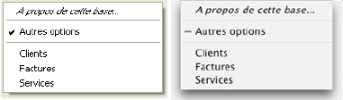

<!--REF #_command_.Pop up menu.Syntax-->**Pop up menu** ( *contenu* {; *parDéfaut* {; *coordX* ; *coordY*}} )  : Integer<!-- END REF-->
<!--REF #_command_.Pop up menu.Params-->
| Paramètre | Type |  | Description |
| --- | --- | --- | --- |
| contenu | Text | &#8594;  | Définition du texte du menu |
| parDéfaut | Integer | &#8594;  | Numéro de l'élément sélectionné par défaut |
| coordX | Integer | &#8594;  | Coordonnée X du coin supérieur gauche |
| coordY | Integer | &#8594;  | Coordonnée Y du coin supérieur gauche |
| Résultat | Integer | &#8592; | Numéro de l'élément de menu sélectionné |

<!-- END REF-->

*Cette commande n'est pas thread-safe, elle ne peut pas être utilisée dans du code préemptif.*


#### Description 

<!--REF #_command_.Pop up menu.Summary-->La commande **Pop up menu** fait apparaître un pop up à l'emplacement courant du curseur de la souris ou à l'emplacement défini par les paramètres facultatifs *coordX* et *coordY*.<!-- END REF-->

Selon les règles standard d'interface utilisateur, cette commande doit généralement être appelée en réponse à un clic souris, et lorsque le bouton reste enfoncé un certain laps de temps.

Vous définissez les éléments du pop up menu à l'aide du paramètre *contenu*, de la manière suivante :

* Chaque élément est séparé des autres par un point-virgule (;), *"Elément1;Elément2;Elément3"*.
* Pour inactiver un élément, placez une parenthèse ouvrante "*(*" dans son libellé.
* Pour définir une ligne de séparation, passez la valeur "-" ou "(-" en tant que libellé.
* Pour définir le style de caractères d'un élément, placez dans son libellé le symbole inférieur à "*<*" suivi d'une lettre. Voici les différents codes :  

| <B | Gras                        |  
| -- | --------------------------- |  
| <I | Italique                    |  
| <U | Souligné                    |  
| <O | Contours (Mac OS seulement) |  
| <S | Relief (Mac OS seulement)   |
* Pour associer une coche à un élément, insérez dans son libellé un point d'exclamation "*!*" suivi du caractère que vous voulez utiliser comme coche.  
   * Sous Mac OS, le caractère passé est directement affiché. Pour afficher la coche standard quelle que soit la version ou la langue du système, utilisez l'instruction [Char](char.md)(18).  
   * Sous Windows, une coche standard est affichée (quel que soit le caractère passé).
* Pour associer une icône à un élément, insérez dans son libellé un accent circonflexe "^" suivi d'un caractère dont le code moins 48 plus 256 (ou plus 208) représente un numéro de ressource d'icône Mac OS.
* Pour ajouter un raccourci clavier à un élément, insérez dans son libellé une barre oblique "*/*" suivie du caractère de raccourci. Notez que cette dernière option est uniquement informative (aucun raccourci clavier n'active le pop up menu), cependant vous pouvez indiquer un raccourci clavier si l'élément du pop up menu dispose d'une commande équivalente dans la barre de menus principale de votre application.

Astuce : Il est possible de désactiver le mécanisme d'interprétation des caractères spéciaux (!, /, etc.) dans un élément de pop up menu afin, par exemple, de faire figurer ces caractères dans les libellés. Pour cela, il suffit de faire débuter la définition de l'élément contenue dans le paramètre *contenu* par l'instruction [Char](char.md)(1) (ex : **Caractere*(1)+"1/4"* pour définir un élément "1/4").

Le paramètre optionnel *parDéfaut* vous permet de définir l'élément du pop up menu sélectionné par défaut lorsque celui-ci apparaît. Passez une valeur située entre 1 et le nombre d'éléments du menu. Si vous ne passez pas ce paramètre, le premier élément du menu sera sélectionné par défaut. Si vous passez également les paramètres *coordX* et *coordY* (cf. ci-dessous), ce paramètre est ignoré.

Les paramètres facultatifs *coordX* et *coordY* permettent de désigner l’emplacement du pop up menu à afficher. Passez respectivement dans *coordX* et *coordY* les coordonnées horizontale et verticale du coin supérieur gauche du menu. Ces coordonnées doivent être exprimées en pixels dans le système de coordonnées local au formulaire courant. Ces deux paramètres doivent être passés ensemble ; si un seul est passé, il est ignoré.   
Si vous utilisez les paramètres *coordX* et *coordY*, le paramètre *parDéfaut* est ignoré. Dans ce cas en effet, la souris ne se trouve pas nécessairement au niveau du pop up menu.   
Ces paramètres sont utiles notamment pour la gestion des boutons 3D avec pop up menu associé.

Lorsqu'un élément du pop up menu est sélectionné, la commande retourne son numéro, autrement elle retourne zéro.

**Note :** Utilisez les pop up menus avec un nombre "raisonnable" d'éléments. Si, par exemple, vous voulez afficher plus de 50 éléments, envisagez plutôt d'employer une zone de défilement dans un formulaire.

#### Exemple 

La méthode projet MON RACCOURCI fait apparaître un pop up menu de navigation :

```4d
  // Méthode projet MON RACCOURCI
 MOUSE POSITION($vlMouseX;$vlMouseY;$vlBouton)
 If(Macintosh control down | ($vlBouton=2))
    $vtItems:="A propos de cette base...<i;(-;!-autres options;(-"=""     for($vltable;1;get="" last="" table="" number)=""        if(is="" number="" valid($vltable))=""           $vtitems:="$vtItems+";"+Table" name($vltable)=""        end="" if=""     end="" for=""     $vlchoixutilisateur:="Pop" up="" menu($vtitems)=""     case="" of=""        :($vlchoixutilisateur="1)"   //="" afficher="" les="" informations="" options=""        else=""           if($vlchoixutilisateur="">0)
  // Aller à la table dont le numéro est $vlChoixUtilisateur-4
          End if
    End case
 End if</i;(-;!-autres>
```

Cette méthode projet peut être appelée d'une des manières suivantes :

* depuis la méthode d'un objet réagissant à un clic souris, et n'attendant pas que le bouton soit relâché (par exemple un bouton invisible),
* depuis un process qui “épie” les événements et communique avec les autres process,
* depuis une méthode de gestion d'événements installée par la commande [ON ERR CALL](on-err-call.md).

Dans les deux derniers cas, il n'est pas nécessaire que le clic se produise dans un objet de formulaire. C'est l'un des avantages de la commande **Pop up menu**. Généralement, les pop up menus sont affichés par l'intermédiaire d'objets de formulaire. Avec **Pop up menu**, vous pouvez faire apparaître un pop up menu n'importe où. 

Le pop up menu s'affiche sous Windows lorsque l'utilisateur appuie sur le **bouton droit** de la souris, et sous Mac OS lorsqu'il utilise la combinaison **Control+clic**. Notez cependant que la méthode ci-dessus ne teste pas le clic souris, c'est la méthode appelante qui en est chargée. 

Voici le pop up menu tel qu'il s'affiche sous Windows (à gauche) et sous Mac OS (à droite). Notez la coche standard de la version Windows :



#### Voir aussi 

[Dynamic pop up menu](dynamic-pop-up-menu.md)  
[MOUSE POSITION](mouse-position.md)  