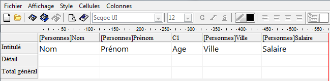
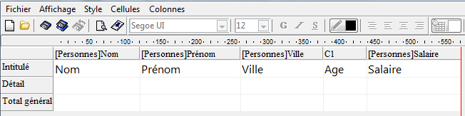

<!--REF #_command_.QR MOVE COLUMN.Syntax-->**QR MOVE COLUMN** ( *zone* ; *numColonne* ; *nouvPosition* )<!-- END REF-->
<!--REF #_command_.QR MOVE COLUMN.Params-->
| Paramètre | Type |  | Description |
| --- | --- | --- | --- |
| zone | Integer | &#8594;  | Référence de la zone |
| numColonne | Integer | &#8594;  | Numéro de la colonne |
| nouvPosition | Integer | &#8594;  | Nouvelle position de la colonne |

<!-- END REF-->

#### Description 

<!--REF #_command_.QR MOVE COLUMN.Summary-->La commande **QR MOVE COLUMN** déplace la colonne *numColonne* de sa position courante à la position *nouvPosition*.<!-- END REF-->

Les deux paramètres *numColonne* et *nouvPosition* doivent être des numéros de colonne valides (entre 1 et le nombre total de colonnes de l'état) ; dans le cas contraire, l'erreur -9852 est retournée. 

**Note :** Cette commande peut être utilisée avec des états en liste uniquement. 

#### Exemple 

Vous avez conçu l'état suivant :



Si vous exécutez :

```4d
 QR MOVE COLUMN(area;3;4)
```

Vous obtenez :




#### Propriétés
|  |  |
| --- | --- |
| Numéro de commande | 1325 |
| Thread safe | &check; |
| Interdite sur le serveur ||


