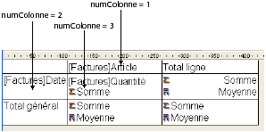

<!--REF #_command_.QR SET INFO COLUMN.Syntax-->**QR SET INFO COLUMN** ( *zone* ; *numColonne* ; *titre* ; *objet* ; *cachée* ; *taille* ; *valeursRépétées* ; *formatAffich* )<!-- END REF-->
<!--REF #_command_.QR SET INFO COLUMN.Params-->
| Paramètre | Type |  | Description |
| --- | --- | --- | --- |
| zone | Integer | &srarr; | Référence de la zone |
| numColonne | Integer | &srarr; | Numéro de colonne |
| titre | Text | &srarr; | Titre de la colonne |
| objet | Field, Variable | &srarr; | Objet affecté à la colonne |
| cachée | Integer | &srarr; | 0 = visible, 1 = invisible |
| taille | Integer | &srarr; | Largeur de la colonne |
| valeursRépétées | Integer | &srarr; | 0 = Non répétées, 1 = Répétées |
| formatAffich | Text | &srarr; | Format d'affichage |

<!-- END REF-->

#### Description 

<!--REF #_command_.QR SET INFO COLUMN.Summary-->##### Etats en liste 

La commande **QR SET INFO COLUMN** vous permet de définir les paramètres d'une colonne existante de l'état présent dans la *zone*.<!-- END REF--> 

Passez dans *zone* la référence de la zone d'état rapide.

Passez dans *numColonne* le numéro de la colonne à définir.

Passez dans *titre* l'intitulé devant apparaître dans l'en-tête de la colonne. 

Passez dans *objet* la référence de l'objet devant être affecté à la colonne (variable, champ ou formule).

Le paramètre *cachée* indique si la colonne doit être affichée ou masquée :

* si *cachée* vaut 1, la colonne est masquée ;
* si *cachée* vaut 0, la colonne est affichée.

Passez dans *taille* la taille en pixels à assigner à la colonne. Si *taille* vaut -1, la taille de la colonne est automatique. 

*valeursRépétées* indique le statut de la propriété de répétition des données. Par exemple, si la valeur d'un champ ou d'une variable ne change pas d'un enregistrement à l'autre, il est possible de la répéter ou non dans chaque ligne de la colonne.

* si *valeursRépétées* vaut 0, les valeurs ne sont pas répétées.
* si *valeursRépétées* vaut 1, les valeurs sont répétées.

Le paramètre *formatAffich* indique le format d'affichage de la colonne. Vous pouvez utiliser tout format d'affichage standard de 4D compatible avec les données affichées dans la colonne. 

Exemple :  
La ligne suivante associe à la colonne 1 l'intitulé “Titre” et le champ Champ2, rend la colonne visible avec une largeur de 150 pixels et définit le format d'affichage ###,##.

```4d
 QR SET INFO COLUMN(zone;1;"Titre";"[Table 1]Champ2";0;150;0;"###,##")
```

##### Etats tableaux croisés 

Avec ce type d'état, la commande **QR SET INFO COLUMN** permet de définir globalement les mêmes paramètres que ceux décrits dans le paragraphe ci-dessus, toutefois les zones auxquelles ils s'appliquent sont différentes et varient en fonction du paramètre à fixer.   
En outre, les paramètres *titre*, *cachée* et *valeursRépétées* ne sont pas utilisés lorsque vous travaillez avec des états tableaux croisés. La valeur à passer dans le paramètre *numColonne* dépend de l'opération que vous souhaitez effectuer : définir la taille de la colonne ou définir la source de données et le format d'affichage. 

* Taille de la colonne  
Il s'agit d'un attribut “visuel”, par conséquent les colonnes sont simplement numérotées de gauche à droite, comme illustré ci-dessous :  

La méthode suivante affecte une taille automatique à toutes les colonnes d'un état en tableau croisé et laisse les autres éléments inchangés :  

```4d
 For($i;1;3)
    QR GET INFO COLUMN(qr_zone;$i;$titre;$obj;$caché;$taille;$rep;$format)
    QR SET INFO COLUMN(qr_zone;$i;$titre;$obj;$caché;0;$rep;$format)
 End for
```

  
A noter que, comme vous voulez modifier uniquement la taille de la colonne, vous devez utiliser la commande [QR GET INFO COLUMN](qr-get-info-column.md) pour récupérer les propriétés courantes de la colonne puis les passer à **QR SET INFO COLUMN** afin de les conserver inchangées, excepté pour la taille.

* Source de données (objet) et format d'affichage  
Dans ce cas, la numérotation des colonnes s'effectue de la manière suivante :  


A noter qu'il n'est pas possible d'adresser toutes les cellules avec la commande **QR SET INFO COLUMN**, les cellules non numérotées dans le schéma ci-dessus doivent être gérées à l'aide de la commande [QR SET TOTALS DATA](qr-set-totals-data.md).

Le code suivant associe des sources de données aux trois cellules nécessaires à la construction d'un état en tableau croisé simple :

```4d
 QR SET REPORT TABLE(qr_zone;Table(->[Factures]))
 ALL RECORDS([Factures])
 QR SET REPORT KIND(qr_zone;2)
 QR SET INFO COLUMN(qr_zone;1;"";->[Factures]Article;1;-1;1;"")
 QR SET INFO COLUMN(qr_zone;2;"";->[Factures]Date;1;-1;1;"")
 QR SET INFO COLUMN(qr_zone;3;"";->[Factures]Quantité;1;-1;1;"")
```

La zone d'état suivante est générée :


Si un numéro de *zone* invalide est passé, l’erreur -9850 est générée.  
Si le paramètre *numColonne* est incorrect, l’erreur -9852 est générée.

#### Voir aussi 

[QR GET INFO COLUMN](qr-get-info-column.md)  
[QR Get info row](qr-get-info-row.md)  
[QR SET INFO ROW](qr-set-info-row.md)  