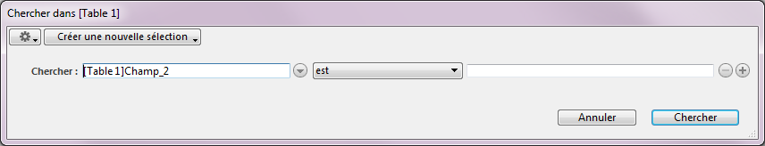

<!--REF #_command_.QUERY.Syntax-->**QUERY** ( {*laTable* }{;}{ *critère* {; *}} )<!-- END REF-->
<!--REF #_command_.QUERY.Params-->
| Paramètre | Type |  | Description |
| --- | --- | --- | --- |
| laTable | Table | &#8594;  | Table dans laquelle la sélection est créée ou Table par défaut si ce paramètre est omis |
| critère | Expression | &#8594;  | Critère de recherche |
| * | Opérateur | &#8594;  | Attente d'exécution de la recherche |

<!-- END REF-->

#### Description 

<!--REF #_command_.QUERY.Summary-->La commande **QUERY** recherche les enregistrements répondant au(x) critère(s) de recherche spécifié(s) dans *critère* et retourne une sélection d'enregistrements de *laTable*.<!-- END REF-->modifie la sélection courante de *laTable* pour le process courant. Le premier enregistrement de la nouvelle sélection devient l'enregistrement courant.

Si vous omettez le paramètre *laTable*, la commande s'applique à la table par défaut. Si aucune table par défaut n'a été définie, une erreur est générée. 

Si vous ne passez ni le paramètre *critère* ni le paramètre *\**, **QUERY** affiche la boîte de dialogue de l'Editeur de recherches de 4D pour *table* (sauf lorsqu'il s'agit de la dernière ligne d'une recherche complexe, cf. ci-dessous) :



Pour plus d'informations sur l'utilisation de cet éditeur, reportez-vous au manuel *Mode Développement*.  
L'utilisateur construit la recherche puis clique sur le bouton **Chercher** ou **Chercher dans sélection**. Si la recherche est correctement effectuée et n'est pas interrompue, la variable système OK prend la valeur *1*. Si l'utilisateur clique sur **Annuler**, la commande **QUERY** est interrompue sans effectuer de recherche et la variable OK prend la valeur *0* (zéro).

#### Exemple 1 

L'exemple suivant affiche l'Editeur de recherches pour la table \[Produits\] :

```4d
 QUERY([Produits])
```

#### Exemple 2 

L'exemple suivant affiche l'Editeur de recherches pour la table par défaut (si elle a été définie) : 

```4d
 QUERY
```

Si vous spécifiez le paramètre *critère*, l'Editeur de recherches ne s'affiche pas et la recherche est entièrement définie par programmation. Pour des recherches simples (recherches sur un seul champ), vous appelez **QUERY** une seule fois avec le paramètre *critère* construit de la manière décrite plus bas. Pour des recherches complexes (recherches sur de multiples champs ou avec de multiples conditions), vous appelez **QUERY** autant de fois que nécessaire avec le paramètre *critère* et le paramètre optionnel \* sauf pour la dernière ligne **QUERY** (qui déclenche la recherche).

#### Exemple 3 

L'exemple suivant recherche les \[Personnes\] dont le nom commence par "a" :

```4d
 QUERY([Personnes];[Personnes]Nom="a@")
```

#### Exemple 4 

L'exemple suivant recherche les \[Personnes\] dont le nom commence par "a" ou "b" :

```4d
 QUERY([Personnes];[Personnes]Nom="a@";*) // * indique qu'il y a un autre critère de recherche
 QUERY([Personnes];|;[Personnes]Nom="b@")
  // Pas de * : indique la fin de la définition des critères et lance l'exécution de la recherche
```

**Note :** Le mode d'interprétation du caractère @ dans les recherches peut être modifié via une option des préférences. Pour plus d'informations, reportez-vous à la section *Opérateurs de comparaison*.

#### Construction d'une ligne de recherche 

Le paramètre *critère* utilise la syntaxe suivante :

*{opérateur ; } champ comparateur valeur*

* L'opérateur est utilisé pour lier deux appels à **QUERY** lors d'une définition de recherche complexe. Les opérateurs disponibles sont les mêmes que ceux proposés dans l'Editeur de recherches :  

| **Opérateur** | **Symbole** |  
| ------------- | ----------- |  
| ET            | &           |  
| OU            | \|          |  
| Sauf          | #           |  
    
L'opérateur est optionnel et n'est pas nécessaire pour le premier appel à **QUERY** lors d'une recherche complexe. Il est également inutile si votre recherche s'écrit sur une seule ligne. Si vous l'omettez à l'intérieur d'une recherche complexe, le **ET** (&) est utilisé par défaut.
* Le *champ* est le champ sur lequel va porter la recherche. Il peut provenir d'une autre table si celle-ci est la table 1 d'une table liée à *table* par un lien automatique ou manuel.
* Le *comparateur* est l'élément qui va permettre de confronter *champ* et *critèreRecherche*. Voici la liste des comparateurs possibles :  

| **Comparateur**     | **Symbole à utiliser avec** **QUERY** |  
| ------------------- | ------------------------------------- |  
| Egal à              | \=                                    |  
| Différent de        | #                                     |  
| Inférieur à         | <                                     |  
| Supérieur à         | \>                                    |  
| Inférieur ou égal à | <=                                    |  
| Supérieur ou égal à | \>=                                   |  
| Contient mot-clé    | %                                     |

**Note :** Il est possible de définir le comparateur sous la forme d'une expression alphanumérique au lieu d'un symbole. Dans ce cas, il est obligatoire d'utiliser des points-virgules pour dissocier les éléments de la chaîne de recherche. Ce principe permet par exemple de créer des séquences de recherches paramétrables en faisant varier le comparateur, ou de construire des interfaces de recherche utilisateur personnalisées. Reportez-vous à l'exemple 21\. 

* La *valeur* représente ce qui va être comparé au contenu de *champ*. La valeur peut être toute expression du même type que *champ*. Le type de la valeur n'est évalué qu'une seule fois, au démarrage de la recherche, et ne l'est donc pas pour chaque enregistrement. Si la recherche porte sur le contenu d'une chaîne de caractères, utilisez dans 'valeur' le symbole "@" pour isoler le contenu à rechercher, par exemple "@Dupon@". Il est à noter, dans ce cas, que la recherche ne tire que partiellement parti de l'index (compacité du stockage des données).  
La recherche par mots-clés n'est disponible qu'avec des champs de type alpha ou texte. Pour plus d'informations sur ce type de recherche, reportez-vous à la section *Opérateurs de comparaison*.

Voici les règles à observer pour la construction de séquences de recherche :

* La première ligne ne doit pas contenir d'opérateur.
* Les suivantes peuvent débuter par un opérateur de liaison. Si vous l'omettez, l'opérateur ET (&) est utilisé par défaut.
* Toutes les lignes, à l'exception de la dernière, doivent s'achever par le symbole \*.
* Pour lancer la recherche, ne passez pas le paramètre \* lors de la construction de votre dernière ligne. Autre solution : vous pouvez exécuter la commande **QUERY** sans autre paramètre que la table (l'Editeur de recherches ne s'affiche pas ; au lieu de cela, les lignes de recherche complexes définies auparavant sont exécutées).

**Note :** Chaque table maintient sa propre construction de recherche courante. Cela signifie que vous pouvez créer de multiples recherches simultanément, une pour chaque table. Dans ce cas, vous devez passer le paramètre *table* ou spécifier une table par défaut. 

Quelle que soit la manière dont la recherche a été définie :

* Si l'exécution d'une commande **QUERY** nécessite un certain temps, 4D affiche automatiquement un message contenant un thermomètre de progression. Ces thermomètres peuvent être cachés à l'aide des commandes [MESSAGES ON](messages-on.md) et [MESSAGES OFF](messages-off.md). Si le thermomètre de progression est affiché, l'utilisateur peut cliquer sur le bouton **Stop** pour interrompre l'opération. Si la recherche s'est correctement déroulée, la variable système OK prend la valeur 1\. Sinon, si la recherche est interrompue, OK prend la valeur 0 (zéro).
* Si des champs indexés sont spécifiés, la recherche est optimisée à chaque fois que c'est possible (la recherche commence par les champs indexés), réduisant au maximum la durée de l'opération. La commande tire parti des index composites pour les recherches utilisant le **ET** (&).

#### Exemple 5 

Nous recherchons tous les enregistrements dont le nom correspond à "Dupont" :

```4d
 QUERY([Personnes];[Personnes]Nom="Dupont")
```

**Note :** Si le champ Nom est indexé, nous bénéficions donc d'une recherche accélérée tirant parti de l'index.

**Rappel :** Cette recherche trouvera les enregistrements tels que "Dupont", "dupont", "DUPONT", etc. Si vous voulez que la recherche tienne compte des majuscules/minuscules, définissez des critères supplémentaires utilisant les codes de caractères.

#### Exemple 6 

 Nous recherchons les personnes se nommant "Dupont" et se prénommant "Jean". Le champ Nom est indexé. En revanche, le champ Prénom ne l'est pas :

```4d
 QUERY([Personnes];[Personnes]Nom="Dupont";*) // Chercher toute personne qui s'appelle Dupont
 QUERY([Personnes];&;[Personnes]Prénom="Jean") // dont le prénom est Jean
```

Cet exemple effectue dans un premier temps une recherche rapide sur le champ indexé Nom, ce qui réduit la sélection d'enregistrements à ceux des personnes s'appelant Dupont. La recherche s'effectue ensuite séquentiellement sur le champ Prénom, mais nous serons peu pénalisés puisqu'elle s'exécute parmi une présélection d'enregistrements.

#### Exemple 7 

Cet exemple tirera automatiquement parti de l'index composite incluant les champs *\[Personnes\]Prénom+\[Personnes\]Nom* (s'il existe) pour trouver les enregistrements de toutes les personnes nommées Jean Dupont :

```4d
 QUERY([Personnes];[Personnes]Prénom="john";*) // Trouver tous les Jean
 QUERY([Personnes];&;[Personnes]Nom="Dupont") // dont le nom est Dupont
```

Pour plus d'informations, veuillez vous référer au paragraphe *Index composites*.

#### Exemple 8 

L'exemple suivant recherche les personnes se nommant Dupont ou Blanc. Le champ Nom est indexé :

```4d
  // Chercher toute personne qui s'appelle Dupont…
 QUERY([Personnes];[Personnes]Nom="Dupont";*)
 QUERY([Personnes];|;[Personnes]Nom="Blanc") // ou Blanc
```

La commande utilise l'index du champ Nom pour les deux recherches. Les deux recherches sont effectuées, et leurs résultats sont placés dans des ensembles internes qui sont finalement combinés par l'intermédiaire d'une opération Union. 

#### Exemple 9 

L'exemple suivant recherche des personnes qui ne travaillent pas pour une société. La recherche est effectuée en testant si le nom de la société est une chaîne vide.

```4d
 QUERY([Personnes];[Personnes]Société="") // Chercher les personnes sans société
```

#### Exemple 10 

L'exemple suivant recherche chaque personne se nommant "Dupont" et travaillant dans une société basée à Paris. La deuxième recherche utilise un champ venant d'une autre table. Cette recherche peut être effectuée parce que la table \[Personnes\] est liée à la table \[Société\] par un lien de N vers 1 :

```4d
 QUERY([Personnes];[Personnes]Nom="Dupont";*) // Chercher toute personne qui s'appelle Dupont…
 QUERY([Personnes];&;[Société]Ville ="Paris") // ...qui travaille pour une société à Paris
```

#### Exemple 11 

L'exemple suivant recherche l'enregistrement de chaque personne dont l'initiale du nom est située entre les lettre A (incluse) et M (incluse) :

```4d
 QUERY([Personnes];[Personnes]Nom<"n") // Trouver toute personne entre A et M
```

#### Exemple 12 

L'exemple suivant recherche les enregistrements des personnes habitant soit Paris soit Lyon :

```4d
 QUERY([Personnes];[Personnes]CodePostal="75@";*) // Trouver ceux qui habitent Paris…
 QUERY([Personnes];|;[Personnes]CodePostal="6900@") // ou Lyon
```

#### Exemple 13 

Recherche par mot-clé : l’exemple suivant recherche dans toute la table \[Produits\] les enregistrements dont le champ Description contient le mot “facile” : 

```4d
 QUERY([Produits];[Produits]Description%"facile")
  // Trouver les produits dont la description contient le mot-clé facile
```

#### Exemple 14 

Nous recherchons les enregistrements correspondant à la réponse fournie dans une boîte de dialogue :

```4d
 vTrouvé:=Request("Saisissez un code de facture :") //Demander un code de facture à l'utilisateur
 If(OK=1) // Si l'utilisateur clique sur OK…
    QUERY([Factures];[Factures]Code =vTrouvé) //Trouver le code qui correspond à vTrouvé
 End if
```

#### Exemple 15 

Cet exemple recherche tous les enregistrements des factures saisies en 1996\. Nous recherchons les dates entre le 31/12/95 et le 1/1/97 :

```4d
 QUERY([Factures];[Factures]DateFacture >!31/12/95!;*) // Trouver des factures après le 31/12/95…
 QUERY([Factures];&;[Factures]DateFacture 
```

#### Exemple 16 

L'exemple suivant trouve les employés qui ont un salaire entre 20 000 et 40 000 Euros. La recherche inclut les employés qui gagnent 20 000 Euros et exclut ceux qui gagnent 40 000 Euros :

```4d
 QUERY([Employés];[Employés]Salaire >=20000;*) // Trouver les employés qui ont un salaire entre…
 QUERY([Employés];&;[Employés]Salaire <40000) // 20 000 et 40 000 Euros
```

#### Exemple 17 

L'exemple suivant cherche les employés du service Marketing qui ont un salaire supérieur à 30 000 Euros. Le champ Salaire est utilisé dans un premier temps car il est indexé. Notez que la seconde recherche utilise un champ venant d'une autre table. Le champ \[Service\]Nom est lié à la table \[Employés\] par un lien automatique de N vers 1.

```4d
 QUERY([Employés];[Employés]Salaire >30000;*)
  // Trouver les employés qui ont un salaire supérieur à 30 000 Euros
 QUERY([Employés];&;[Service]Nom="marketing") // et qui travaillent dans le service marketing
```

#### Exemple 18 

Soient trois tables reliées par des liens de N vers 1 : \[Ville\] -> \[Département\] -> \[Région\] . La recherche suivante trouve toutes les régions comportant des villes dont le nom débute par "Saint" :

```4d
 QUERY([Région];[Ville]Nom="Saint@") // Trouver toutes les régions contenant des villes commençant par Saint
```

#### Exemple 19 

La recherche suivante recherche les informations égales à la valeur de la variable *mavar*.

```4d
 QUERY([Lois];[Lois]Texte =mavar) // Trouver toutes les lois qui sont égales à la valeur de mavar
```

La recherche peut avoir des résultats différents selon la valeur de *mavar*. Elle sera également exécutée différement. Par exemple :

* Si *mavar* est égale à "Copyright@", la sélection contient toutes les lois qui commencent par Copyright.
* Si *mavar* est égale à "@Copyright@", la sélection contient toutes les lois qui contiennent au moins une occurrence de Copyright.

#### Exemple 20 

L'exemple suivant ajoute ou non les lignes d'une recherche complexe en fonction de la valeur de variables. Ainsi, seuls les critères valides sont pris en compte pour la recherche : 

```4d
 QUERY([Facture];[Facture]Payee=False;*)
 If($ville#"") // Si un nom de ville a été spécifié
    QUERY([Facture];[Facture]Ville_Livraison=$ville;*)
 End if
 If($code_postal#"") // Si un code postal a été spécifié
    QUERY([Facture];[Facture]Code_Postal=$code_postal;*)
 End if
 QUERY([Facture]) // Exécution de la recherche sur les critères
```

#### Exemple 21 

Cet exemple illustre l'utilisation d'un comparateur sous forme d'expression alphanumérique. La valeur du comparateur est définie via un pop up menu placé dans une boîte dialogue de recherche personnalisée :

```4d
 var $ope : Text
 $ope:=_pup_operateur{_pup_operateur} //$ope vaut par exemple "#", ou "="
 If(OK=1)
    QUERY([Facture];[Facture]Montant;$ope;$montant)
 End if
```

#### Exemple 22 

L’utilisation des index de mots-clés d’image peut accélérer de façon importante vos applications.

```4d
 QUERY([IMAGES];[IMAGES]Photos %"cats") // cherche les photos contenant le mot-clé cats
```

#### Variables et ensembles système 

Si la recherche est correctement effectuée, la variable système OK prend la valeur 1.  
La variable OK prend la valeur 0 si :

* l'utilisateur clique sur le bouton **Annuler** / **Stop**,
* en mode 'recherche et verrouillage' (cf. commande [SET QUERY AND LOCK](set-query-and-lock.md)), la recherche a trouvé au moins un enregistrement verrouillé. Dans ce cas également, l'ensemble système LockedSet est mis à jour.

#### Voir aussi 

[QUERY SELECTION](query-selection.md)  

#### Propriétés
|  |  |
| --- | --- |
| Numéro de commande | 277 |
| Thread safe | &check; |
| Modifie les variables | OK |
| Change l'enregistrement courant ||
| Change la sélection courante ||
| Interdite sur le serveur ||


