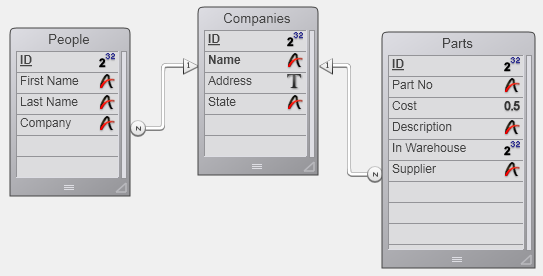

<!--REF #_command_.RELATE MANY.Syntax-->**RELATE MANY** ( table1 | champ1 )<!-- END REF-->
<!--REF #_command_.RELATE MANY.Params-->
| Paramètre | Type |  | Description |
| --- | --- | --- | --- |
| table1 &#124; champ1 | Table, Champ | &#8594;  | Table pour laquelle établir tous les liens de 1 vers N ou champ 1 |

<!-- END REF-->

#### Description 

<!--REF #_command_.RELATE MANY.Summary-->**RELATE MANY** a deux syntaxes.<!-- END REF-->

La première syntaxe, **RELATE MANY**(table1), active tous les liens 1 vers N pour *table1*. Elle modifie la sélection courante pour chaque table qui a un lien 1 vers N vers *table1*. Les sélections courantes dans les tables N dépendent de la valeur courante de chaque champ lié dans la table 1\. Chaque fois que cette commande est exécutée, les sélections courantes des tables N sont modifiées et le premier enregistrement de la sélection est chargé en tant qu'enregistrement courant.

La seconde syntaxe, **RELATE MANY**(champ1), active le lien 1 vers N pour *champ1*. Elle modifie la sélection courante et l'enregistrement courant pour chaque table qui a un lien avec *champ1*. En conséquence, les enregistrements liés deviennent la sélection courante de la table N.

**Notes :** 

* Si la sélection courante de la table 1 est vide au moment de l'exécution de **RELATE MANY**, la commande ne fait rien.
* Pour que la commande fonctionne, les champs clé d'appel (champs N) doivent être indexés.

##### 

**Note :** Cette commande ne prend pas en charge les champs de type Objet.

#### Exemple 

Dans l'exemple suivant, trois tables sont liées avec des liens automatiques. Les deux tables \[People\] et \[Parts\] ont un lien N vers 1 vers la table \[Companies\].



Voici le formulaire pour la table \[Companies\] qui affiche les enregistrements liés venant des tables \[People\] et \[Parts\].


Lorsque les formulaires pour People et Parts s'affichent, les enregistrements liés pour les tables \[People\] et \[Parts\] sont chargés et deviennent les sélections courantes de ces tables. 

En revanche, les enregistrements liés ne sont pas chargés si un enregistrement de la table \[Companies\] est sélectionné par programmation. Dans ce cas, il faut utiliser la commande **RELATE MANY**.

Par exemple, la méthode suivante effectue une boucle sur chaque enregistrement de la table \[Companies\]. Pour chaque société, une alerte apparaît. Cette alerte affiche le nombre de personnes dans la société (le nombre d'enregistrements liés dans la table \[People\]) ainsi que le nombre de Parts que la société distribue (le nombre d'enregistrements dans la table \[Parts\] qui sont liés). Notez que nous avons besoin d'appeler la commande **RELATE MANY** bien que les liens soient automatiques :

```4d
 ALL RECORDS([Companies]) //Sélectionner tous les enregistrements dans la table
 ORDER BY([Companies];[Companies]Name) //Trier les enregistrements dans l'ordre alphabétique
 For($i;1;Records in table([Companies])) //Boucler une fois par enregistrement
    RELATE MANY([Companies]Name) //Sélectionner les enregistrements liés
    ALERT("Société : "+[Companies]Name+Char(13)+"personnes dans la société : "+String(Enregistrements trouves([People]))+Caractere(13)+"Nombre de Produits qu'ils distribuent : "+Chaine(Enregistrements trouves([Parts])))
    NEXT RECORD([Companies]) //Aller à l'enregistrement suivant
 End for
```

#### Voir aussi 

[OLD RELATED MANY](old-related-many.md)  
[RELATE ONE](relate-one.md)  

#### Propriétés
|  |  |
| --- | --- |
| Numéro de commande | 262 |
| Thread safe | &check; |
| Change la sélection courante ||
| Interdite sur le serveur ||


