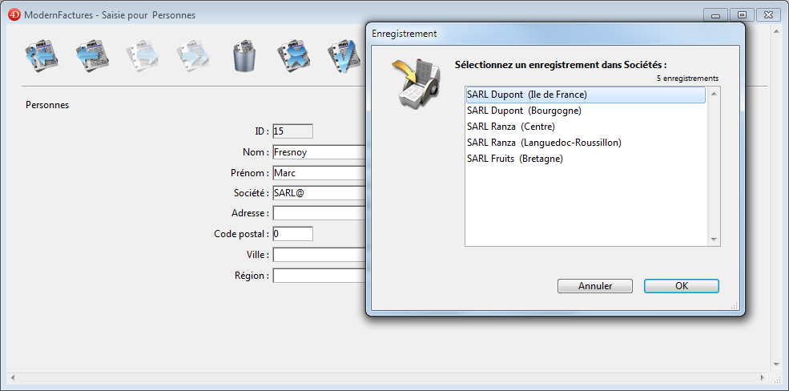
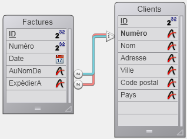
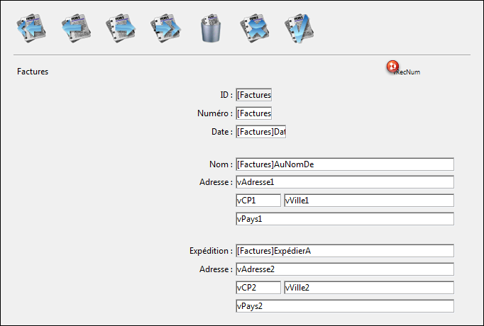

<!--REF #_command_.RELATE ONE.Syntax-->**RELATE ONE** ( tableN | champN {; *discriminant*} )<!-- END REF-->
<!--REF #_command_.RELATE ONE.Params-->
| Paramètre | Type |  | Description |
| --- | --- | --- | --- |
| tableN &#124; champN | Table, Champ | &#8594;  | Table pour laquelle définir tous les liens automatiques ou Champ avec lien manuel partant vers la table 1 |
| discriminant | Field | &#8594;  | Champ discriminant de la table 1 |

<!-- END REF-->

#### Description 

<!--REF #_command_.RELATE ONE.Summary-->**RELATE ONE** accepte deux syntaxes.<!-- END REF-->

La première syntaxe de la commande, **RELATE ONE**(tableN), active tous les liens aller automatiques (de N vers 1) pour la table *tableN* dans le process courant. Cela signifie que pour chaque champ de la *tableN* d'où part un lien aller automatique, la commande sélectionnera l'enregistrement lié dans chaque table liée. Cela peut donc modifier l'enregistrement courant dans la (les) table(s) liée(s) du process courant.

La seconde syntaxe, **RELATE ONE**(champN{;discriminant}), recherche l'enregistrement lié au champ *champN*. Il n'est pas nécessaire que le lien soit automatique. S'il existe, **RELATE ONE** charge en mémoire l'enregistrement lié, et en fait l'enregistrement et la sélection courants de la table à laquelle il appartient.

Le paramètre optionnel *discriminant* doit être un champ de la table liée. Il peut être uniquement de type Alpha, Texte, numérique, Date, Heure ou Booléen. En particulier, il ne peut pas être de type Image ou Blob. Si *champN* est spécifié, et si plus d'un enregistrement est trouvé dans la table liée, **RELATE ONE** affiche une liste des enregistrements qui correspondent à la valeur de *champN*, permettant à l'utilisateur de sélectionner un enregistrement. Dans cette liste, la colonne de gauche affiche les valeurs des champs liés, la colonne de droite affiche les valeurs de *discriminant*.

Généralement, plusieurs enregistrements sont trouvés lorsque *champN* se termine par le caractère Joker (@). S'il n'y en a qu'un seul, la liste de sélection n'apparaît pas. 

Dans l'écran ci-dessous, un enregistrement est en train d'être saisi et une liste de sélection s'affiche au premier plan.



La commande suivante a fait apparaître la liste de sélection : 

```4d
 RELATE ONE([Personnes]Société;[Sociétés]Région)
```

L'utilisateur a saisi SARL@ pour visualiser la liste de toutes les sociétés dont le nom commence par SARL, ainsi que leur région.

Spécifier un champ dans *discriminant* est la même opération que celle qui consiste à définir un champ discriminant dans la boîte de dialogue de définition des propriétés d'un lien en mode Développement. Pour plus d'informations sur la définition d'un champ discriminant, reportez-vous au manuel *Mode Développement* de 4D.

##### 

**Note :** Cette commande ne prend pas en charge les champs de type Objet.

#### Exemple 

Dans l'exemple suivant, la table \[Factures\] est reliée à la table \[Clients\] par deux liens manuels. Un lien part du champ \[Factures\]AuNomDe et va vers le champ \[Clients\]Numéro, l'autre lien va de \[Factures\]ExpédierA à \[Clients\]Numéro.



Voici le formulaire de la table \[Factures\] affichant les informations "AuNomDe" et "ExpédierA".



Comme les deux liens pointent vers la même table, \[Clients\], l'information qu'ils récupèrent doit être affichée dans des variables. Si le formulaire contenait les champs de \[Clients\], seules les valeurs issues du second lien seraient affichées. 

Les deux méthodes suivantes sont les méthodes objet des champs \[Factures\]ExpédierA et \[Factures\]AuNomDe. Voici la méthode objet du champ \[Factures\]AuNomDe :

```4d
 RELATE ONE([Factures]AuNomDe;[Clients]Adresse)
 vAdresse1:=[Clients]Adresse
 vVille1:=[Clients]Ville
 vPays1:=[Clients]Pays
 vCP1:=[Clients]Code postal
```

Voici la méthode objet du champ \[Factures\]ExpédierA :

```4d
 RELATE ONE([Factures]ExpédierA;[Clients]Adresse)
 vAdresse2:=[Clients]Adresse
 vVille2:=[Clients]Ville
 vPays2:=[Clients]Pays
 vCP2:=[Clients]Code postal
```

#### Variables et ensembles système 

Si la commande a été correctement exécutée et si les enregistrements liés ont bien été chargés, la variable système OK prend la valeur 1\. Si l'utilisateur a cliqué sur le bouton **Annuler** dans la boîte de dialogue de choix d'enregistrement (qui apparaît si l'enregistrement lié avait été modifié), la variable OK prend la valeur 0\. 

#### Voir aussi 

[OLD RELATED ONE](old-related-one.md)  
[RELATE MANY](relate-many.md)  

#### Propriétés
|  |  |
| --- | --- |
| Numéro de commande | 42 |
| Thread safe | &check; |
| Modifie les variables | OK |
| Change l'enregistrement courant ||
| Change la sélection courante ||
| Interdite sur le serveur ||


