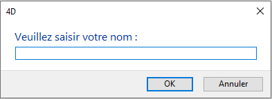
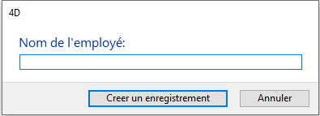
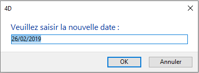

<!--REF #_command_.Request.Syntax-->**Request** ( *message* {; *réponseDéfaut* {; *titreBoutonOK* {; *titreBoutonAnn*}}} )  : Text<!-- END REF-->
<!--REF #_command_.Request.Params-->
| Paramètre | Type |  | Description |
| --- | --- | --- | --- |
| message | Text | &#8594;  | Message à afficher dans la boîte de dialogue |
| réponseDéfaut | Text | &#8594;  | Valeur par défaut dans la zone de saisie de texte |
| titreBoutonOK | Text | &#8594;  | Libellé du bouton OK |
| titreBoutonAnn | Text | &#8594;  | Libellé du bouton Annuler |
| Résultat | Text | &#8592; | Valeur saisie par l'utilisateur |

<!-- END REF-->

#### Description 

<!--REF #_command_.Request.Summary-->La fonction **Request** affiche une boîte de dialogue de demande d'informations composée d'un message, d'une zone de saisie de texte, d'un bouton **OK** et d'un bouton **Annuler**.<!-- END REF--> 

Vous passez le message à afficher dans le paramètre *message*. Si la taille du message excède les capacités de la zone d'affichage (aux alentours de 50 caractères, variant en fonction du Système et de la police utilisée), il peut apparaître tronqué.

Par défaut, le libellé du bouton OK est “OK” et celui du bouton Annuler est “Annuler”. Si vous voulez modifier ces libellés, passez d'autres valeurs dans les paramètres optionnels *titreBoutonOK* et *titreBoutonAnn*. Si nécessaire, les boutons sont agrandis vers la gauche, en fonction de la taille des libellés que vous avez saisis.

Le bouton OK est le bouton par défaut. L'utilisateur peut cliquer sur le bouton OK ou appuyer sur la touche Entrée pour valider la boîte de dialogue, mettant ainsi la variable système OK à 1\. Il peut également cliquer sur le bouton Annuler pour annuler la boîte de dialogue, mettant ainsi la variable système OK à 0\. 

L'utilisateur peut taper des caractères dans la zone de saisie de texte. Pour définir une valeur par défaut, passez le texte par défaut dans le paramètre *réponseDéfaut*. Si l'utilisateur clique sur le bouton OK, **Request** retourne le texte. Si l'utilisateur clique sur le bouton Annuler, **Request** retourne une chaîne vide (""). Si la réponse doit être une valeur numérique ou une date, convertissez la chaîne retournée par **Request** dans le type souhaité à l'aide des fonctions [Num](num.md) et [Date](date.md).

**Note :** N'appelez pas la fonction **Request** dans une méthode formulaire ou objet qui gère l'événement On Activate ou On Deactivate car cela provoquerait une boucle sans fin.

**Conseil :** Si vous voulez récupérer plusieurs informations de l'utilisateur, construisez un formulaire approprié et appelez-le avec la commande [DIALOG](../commands/dialog.md), plutôt que d'afficher une succession de boîtes de dialogue du type **Request**.

#### Exemple 1 

La ligne de code :

```4d
 $vsPrompt:=Request("Veuillez saisir votre nom :")
```

... provoquera l'affichage de la boîte de dialogue suivante :



#### Exemple 2 

Le code suivant :

```4d
 vsPrompt:=Request("Nom de l'employé:";"";"Creer un enregistrement";"Annuler")
 If(OK=1)
    ADD RECORD([Employes])
  //Note: vsPrompt est alors copiée dans le champ [Employés]Nom 
  //lors de l'événement formulaire Sur chargement de la méthode formulaire
 End if
```

... provoquera l'affichage de la boîte de dialogue suivante :



#### Exemple 3 

La ligne de code :

```4d
 $vdPrompt:=Date(Demander("Veuillez saisir la nouvelle date :";Chaine(Date du jour)))
```

... provoquera l'affichage de la boîte de dialogue suivante :



#### Voir aussi 

[ALERT](alert.md)  
[CONFIRM](confirm.md)  