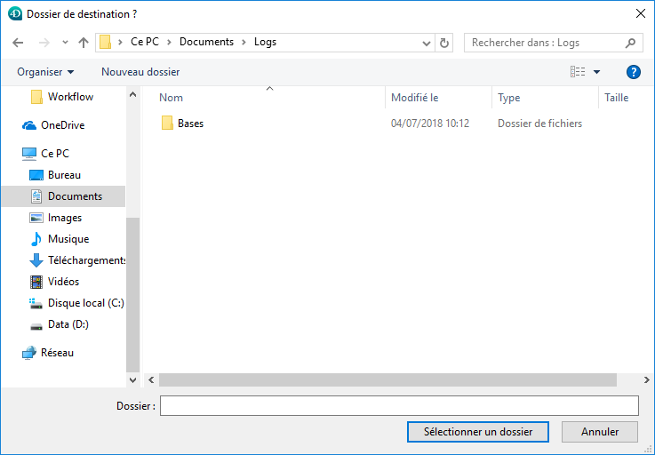
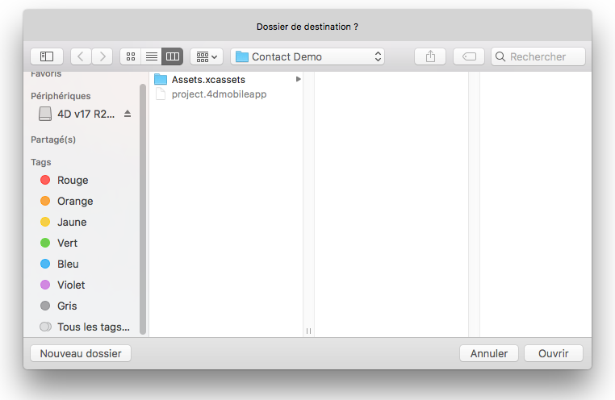
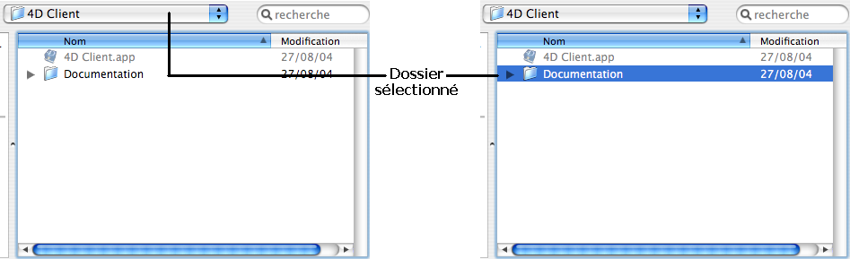

<!--REF #_command_.Select folder.Syntax-->**Select folder** ( {*message* }{;}{ *répertoire* {; *options*}} ) : Text<!-- END REF-->
<!--REF #_command_.Select folder.Params-->
| Paramètre | Type |  | Description |
| --- | --- | --- | --- |
| message | Text | &#8594;  | Titre de la fenêtre de sélection |
| répertoire | Text, Integer | &#8594;  | Chemin d’accès du répertoire par défautou Chaîne vide pour afficher le dossier d’utilisateur par défaut (“Mes documents” sous Windows, “Documents” sous Mac OS),ou Numéro de chemin d’accès mémorisé |
| options | Integer | &#8594;  | Option(s) de sélection sous Mac OS |
| Résultat | Text | &#8592; | Chemin d’accès au dossier sélectionné |

<!-- END REF-->

#### Description 

<!--REF #_command_.Select folder.Summary-->La commande **Select folder** affiche une boîte de dialogue permettant de désigner manuellement un dossier, et de récupérer en retour de fonction le chemin d’accès complet au dossier sélectionné.<!-- END REF--> Le paramètre facultatif *répertoire* vous permet de désigner un emplacement de dossier qui sera affiché initialement dans la boîte de dialogue de sélection de dossier.

**Note :** Cette commande ne modifie pas le dossier courant de l’application 4D.

La commande **Select folder** affiche une boîte de dialogue standard de navigation à travers les volumes et les dossiers du poste.   
Le paramètre optionnel *message* permet d’afficher une ligne d’information dans la boîte de dialogue (dans notre exemple, *message* a pour valeur "Dossier de destination ?").

**Windows :**  



**macOS :**  



Vous pouvez utiliser le paramètre *répertoire* pour proposer un emplacement de dossier par défaut dans la boîte de dialogue de sélection de dossier. Vous pouvez passer dans ce paramètre trois types de valeurs :

* un chemin d’accès de dossier valide utilisant la syntaxe de la plate-forme courante.
* une chaîne vide (“”) pour afficher le dossier d’utilisateur par défaut du système (“Mes documents” sous Windows, “Documents” sous macOS).
* un numéro de chemin d’accès mémorisé (de 1 à 32000) pour afficher le dossier associé. Avec ce principe, vous pouvez conserver en mémoire le chemin d’accès du dossier ouvert au moment où l’utilisateur a cliqué sur le bouton de sélection, c’est-à-dire le dossier choisi par l’utilisateur. Lors du premier appel d’un numéro arbitraire (par exemple 5), la commande affiche le dossier d’utilisateur par défaut du système (équivaut à passer une chaîne vide). L’utilisateur peut alors éventuellement naviguer parmi les dossiers de son disque dur. Au moment où il clique sur le bouton de sélection, le chemin d’accès est mémorisé et associé au numéro 5\. Lors des appels suivants du numéro 5, le chemin d’accès mémorisé sera utilisé par défaut. En cas de sélection d’un nouvel emplacement, le chemin numéro 5 sera mis à jour, et ainsi de suite.  
Ce mécanisme vous permet de mémoriser jusqu’à 32000 chemins d’accès. Sous Windows, chaque chemin est conservé durant la session uniquement. Sous macOS, les chemins restent mémorisés d’une session à l’autre. Si le chemin d’accès est incorrect, le paramètre *cheminDéfaut* est ignoré.

**Note :** Ce mécanisme est identique à celui utilisé par la commande [Select document](select-document.md). Les numéros de chemins d’accès mémorisés sont partagés entre les deux commandes.

Le paramètre *options* vous permet de bénéficier de fonctions supplémentaires sous macOS. Vous pouvez passer dans ce paramètre les constantes suivantes, placées dans le thème *Documents système* : 

| Constante        | Type        | Valeur | Comment                                                                                                                                                                                                                                                                                                                                                                                                                                                                                 |
| ---------------- | ----------- | ------ | --------------------------------------------------------------------------------------------------------------------------------------------------------------------------------------------------------------------------------------------------------------------------------------------------------------------------------------------------------------------------------------------------------------------------------------------------------------------------------------- |
| Package open     | Entier long | 2      | (Mac OS uniquement) Autorise l’ouverture des progiciels (packages) en tant que dossiers et donc la visualisation/sélection de leur contenu. Par défaut, si cette constante n’est pas utilisée, la commande n’autorise pas l’ouverture des progiciels.                                                                                                                                                                                                                                   |
| Use sheet window | Entier long | 16     | (Mac OS uniquement) Affiche la boîte de dialogue de sélection sous forme de fenêtre feuille (cette option est ignorée sous Windows). <br/>Les fenêtres feuilles sont des fenêtres spécifiques de l’interface Mac OS X, bénéficiant notamment d’une animation graphique (pour plus d’informations, reportez-vous à la section [DISPLAY SELECTION](display-selection.md)). Par défaut, si cette constante n’est pas utilisée, la commande affiche une boîte de dialogue standard. |

Vous pouvez passer une constante ou la combinaison des deux. Ces options sont prises en compte sous macOS uniquement. Sous Windows, le paramètre *options* est ignoré s’il est passé. 

 L'utilisateur sélectionne un dossier en cliquant sur le bouton **OK** (Windows) ou **Sélectionner** (macOS). Le chemin d’accès au dossier choisi est alors retourné par la fonction. 
* Sous Windows, la chaîne retournée est du type “C:\\Dossier1\\Dossier2\\DossierSélectionné\\”
* Sous macOS, la chaîne retournée est du type “Disque:Dossier1:Dossier2:DossierSélectionné:”

**Note :** Sous macOS, selon que le nom du dossier est sélectionné ou non dans la boîte de dialogue, le chemin retourné est différent.



**4D Server :** Cette fonction permet de visualiser les volumes connectés aux postes clients. Il n’est pas possible de l’appeler depuis une procédure stockée.

Si l’utilisateur clique sur le bouton de sélection, la variable système OK prend la valeur 1\. Si l’utilisateur clique sur le bouton d’annulation, OK prend la valeur 0 et la fonction retourne une chaîne vide.

**Note :** Sous Windows, si l’utilisateur a sélectionné certains éléments incorrects tels que “Poste de travail”, “Corbeille”, etc., la variable système OK prend la valeur 0, même si la boîte de dialogue est validée.

#### Exemple 

L’exemple suivant permet de sélectionner le dossier dans lequel toutes les images de la bibliothèque d’images seront enregistrées :

```4d
 $DossierImages:=Select folder("Sélectionnez un dossier pour vos images.")
 PICTURE LIBRARY LIST(pictRefs;pictNoms)
 For($n;1;Size of array(pictNoms))
    GET PICTURE FROM LIBRARY(pictRefs{$n};$vPictSauvegarde)
    WRITE PICTURE FILE($DossierImages+pictNoms{$n};$vPictSauvegarde)
 End for
```

#### Voir aussi 

[CREATE FOLDER](create-folder.md)  
[FOLDER LIST](folder-list.md)  
[Select document](select-document.md)  