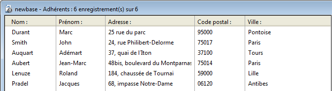

<!--REF #_command_.Selection to JSON.Syntax-->**Selection to JSON** ( *laTable* {; *leChamp*}{; *leChamp2* ; ... ; *leChampN*}{; *template*})  : Text<!-- END REF-->
<!--REF #_command_.Selection to JSON.Params-->
| Paramètre | Type |  | Description |
| --- | --- | --- | --- |
| laTable | Table | &#8594;  | Table à sérialiser |
| leField | Field | &#8594;  | Champ(s) dont le contenu doit être sérialisé |
| template | Object | &#8594;  | Objet pour la sélection de libellés et de champs |
| Résultat | Text | &#8592; | Chaîne contenant le tableau JSON sérialisé |

<!-- END REF-->

#### Description 

<!--REF #_command_.Selection to JSON.Summary-->La commande **Selection to JSON** retourne une chaîne qui contient un tableau JSON avec autant d'éléments qu'il y a d'enregistrements dans la sélection courante de *laTable*.<!-- END REF--> Chaque élément du tableau est un objet JSON contenant les libellés et les valeurs des champs de la sélection.

Si vous passez uniquement le paramètre *laTable*, la commande inclut dans le tableau JSON les valeurs de tous les champs de la table exprimables en JSON. Les champs de type BLOB et image sont ignorés.

Si vous ne souhaitez pas inclure tous les champs de *laTable*, vous pouvez utiliser soit le paramètre *leChamp* soit le paramètre *template* : 

* *leChamp* : passez un ou plusieurs champ(s) dans ce paramètre. Seules les valeurs des champs définis seront incluses dans le tableau JSON.
* *template* : passez un objet 4D contenant une ou plusieurs paire(s) *nom/valeur* où *nom* peut être tout nom d'attribut valide et *valeur* est un pointeur vers un champ à inclure. Cette syntaxe permet de personnaliser les libellés des champs dans le tableau JSON.

Cette commande prend en charge les champs de type objet : les données des champs sont automatiquement converties au format JSON (les valeurs des attributs image sont converties en chaînes "\[object Picture\]"). A noter que l'instruction 4D suivante sera interprétée comme "produire du JSON à partir de toutes les valeurs de *champObjet* dans la sélection courante de la table" :  

```4d
 Selection to JSON([uneTable];champObjet)
```

**Note :** Après un appel à **Selection to JSON**, la sélection courante n'est pas modifiée mais l'enregistrement courant n'est plus chargé et il peut avoir changé (le dernier enregistrement de la sélection devient l'enregistrement courant). Après un **Selection to JSON**, utilisez les commandes [LOAD RECORD](load-record.md) ainsi que [GOTO SELECTED RECORD](goto-selected-record.md) (si nécessaire) si vous souhaitez utiliser les valeurs des champs de l'enregistrement courant d'origine. 

#### Exemple 1 

Vous voulez créer une chaîne JSON représentant cette sélection :



1) Vous souhaitez inclure les valeurs de tous les champs de la table \[Adhérents\] :  

```4d
 $jsonString :=Selection to JSON([Adhérents])
     // $jsonString = [{"Nom":"Durant","Prénom":"Marc","Adresse":"25 rue du
     //parc","Code postal":"95000","Ville":"Pontoise"},{"Nom":"Smith",
     //"Prénom":"John","Adresse":"24, rue Philibert-Delorme ","Code postal":
     //"75017","Ville":"Paris"},{"Nom":"Auquart","Prénom":"Adémart",
     //"Adresse":"37, quai de l´Iton","Code postal":"37100","Ville":"Tours"},...]
```

2) Vous souhaitez réduire la sélection et n’inclure que deux champs dans la chaîne JSON en utilisant la syntaxe basée sur les champs :  

```4d
 QUERY([Adhérents];[Adhérents]Nom="A@")
 $jsonString :=Selection to JSON([Adhérents];[Adhérents]Nom;[Adhérents]Ville)
     // $jsonString = [{"Nom":"Auquart","Ville":"Tours"},{"Nom":"Aubert","Ville":"Paris"}]
```

3) Vous souhaitez n’inclure qu’un champ dans la chaîne JSON et utiliser un autre libellé. Vous utilisez la syntaxe *template* :  

```4d
 var $template : Object
 OB SET($template;"Membre";->[Adhérents]Nom) //libellé personnalisé et un seul champ
 ALL RECORDS([Adhérents])
 $jsonString :=Selection to JSON([Adhérents];$template)
     // $jsonString = [{"Membre":"Durant"},{"Membre":"Smith"},{"Membre":"Auquart"},{"Membre":"Aubert"},{"Membre":"Lenuze"},{"Membre":"Pradel"}]
```

#### Exemple 2 

Vous utilisez la syntaxe avec *template* afin d'exporter des champs de différentes tables :

```4d
 var $template : Object
 var $chaineJSON : Text
 OB SET($template;"Nom";->[Emp]Nom)
 OB SET($template;"Prénom";->[Emp]Prénom)
 OB SET($template;"Société";->[Société]Nom) //libellé personnalisé sinon conflit avec le champ [Emp]Nom
 ALL RECORDS([Emp])
 SET FIELD RELATION([Emp]UUID_Societe;Automatic;Do not modify)
 $chaineJSON:=Selection to JSON([Emp];$template)
 SET FIELD RELATION([Emp]UUID_Societe;Structure configuration;Do not modify)
```

#### Voir aussi 

[JSON TO SELECTION](json-to-selection.md)  