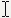
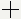
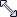
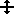
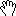
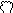
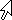

<!--REF #_command_.SET CURSOR.Syntax-->**SET CURSOR** {( *curseur* )}<!-- END REF-->
<!--REF #_command_.SET CURSOR.Params-->
| Paramètre | Type |  | Description |
| --- | --- | --- | --- |
| curseur | Integer | &#8594;  | Numéro de curseur système |

<!-- END REF-->

*Cette commande n'est pas thread-safe, elle ne peut pas être utilisée dans du code préemptif.*


#### Description 

<!--REF #_command_.SET CURSOR.Summary-->La commande **SET CURSOR** remplace le pointeur (graphique) de la souris par le pointeur système dont vous avez passé le numéro d'ID dans le paramètre *curseur*.<!-- END REF-->

Cette commande doit être appelée dans le contexte de l'[Form event code](../commands/form-event-code.md) On Mouse Move.

Pour restaurer le pointeur de souris standard, appelez la commande sans paramètre. 

Voici les curseurs disponibles :

| **Numéro** | **Curseur**                                   |
| ---------- | --------------------------------------------- |
| 1          |    |
| 2          |    |
| 4          |  |
| 9000       |  |
| 9001       |  |
| 9003       |  |
| 9004       |  |
| 9005       |  |
| 9006       |  |
| 9021       |  |
| 351        |  |
| 9010       |  |
| 9011       |  |
| 9013       |  |
| 9014       |  |
| 9015       |  |
| 9016       |  |
| 9017       |  |
| 9019       |  |
| 9020       |  |
| 559        |  |
| 560        |  |

**Note :** La disponibilité et l'apparence des curseurs varie en fonction du système d'exploitation. 

#### Exemple 

Vous souhaitez que le curseur se transforme en  lorsque la souris survole une variable du formulaire. Dans la méthode de la variable, vous pouvez écrire :

```4d
 If(Form event code=On Mouse Move)
    SET CURSOR(9019)
 End if
```
