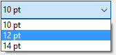

<!--REF #_command_.SET LIST ITEM PARAMETER.Syntax-->**SET LIST ITEM PARAMETER** ( {* ;} *liste* ; refElément | * ; *sélecteur* ; *valeur* )<!-- END REF-->
<!--REF #_command_.SET LIST ITEM PARAMETER.Params-->
| Paramètre | Type |  | Description |
| --- | --- | --- | --- |
| * | Opérateur | &#8594;  | Si spécifié, liste est un nom d’objet (chaîne) Si omis, liste est un numéro de référence de liste |
| liste | Integer, Text | &#8594;  | Numéro de référence de liste (si * omis) ou Nom d'objet de type liste (si * passé) |
| refElément &#124; * | Opérateur, Entier long | &#8594;  | Numéro de référence d’élément ou 0 pour le dernier élément ajouté à la liste ou * pour l’élément courant de la liste |
| sélecteur | Text | &#8594;  | Constante de paramètre |
| valeur | Text, Boolean, Real | &#8594;  | Valeur de paramètre |

<!-- END REF-->

*Cette commande n'est pas thread-safe, elle ne peut pas être utilisée dans du code préemptif.*


#### Description 

<!--REF #_command_.SET LIST ITEM PARAMETER.Summary-->La commande **SET LIST ITEM PARAMETER** permet de modifier le paramètre *sélecteur* pour l’élément *réfElément* de la liste hiérarchique dont vous avez passé la référence ou le nom d’objet dans le paramètre *liste*.<!-- END REF-->

Si vous passez le premier paramètre optionnel *\**, vous indiquez que le paramètre *liste* est un nom d’objet (chaîne) correspondant à une représentation de liste dans le formulaire. Si vous ne passez pas ce paramètre, vous indiquez que le paramètre *liste* est une référence de liste hiérarchique ([RéfListe](# "Expression de type Entier long identifiant de façon unique une liste hiérarchique")). Si vous utilisez une seule représentation de liste ou travaillez avec les éléments structurels (le second *\** est omis), vous pouvez utiliser indifféremment l’une ou l’autre syntaxe. En revanche, si vous utilisez plusieurs représentations d’une même liste et travaillez avec l’élément courant (le second *\** est passé), la syntaxe basée sur le nom d’objet est requise car chaque représentation peut disposer de son propre élément courant.

Vous pouvez passer un numéro de référence dans *réfElément*. Si ce numéro ne correspond à aucun élément de la liste, la commande ne fait rien. Vous pouvez également passer 0 dans *réfElément* afin de demander la modification du dernier élément ajouté à la liste (à l’aide de *Listes hiérarchiques*).   
Vous pouvez enfin passer *\** dans *réfElément* : dans ce cas, la commande s’appliquera à l’élément courant de la liste. Si plusieurs éléments sont sélectionnés manuellement, l’élément courant est celui qui a été sélectionné en dernier. Si aucun élément n’est sélectionné, la commande ne fait rien.

Dans le paramètre *sélecteur*, vous pouvez passer :

* une des constantes suivantes du thème "*Listes hiérarchiques*" :  

| Constante                  | Type   | Valeur                     | Comment                                                                                                                                                                                                                                                                                                               |  
| -------------------------- | ------ | -------------------------- | --------------------------------------------------------------------------------------------------------------------------------------------------------------------------------------------------------------------------------------------------------------------------------------------------------------------- |  
| Additional text            | Chaîne | 4D\_additional\_text       | Cette constante permet d’ajouter un texte à droite de l’élément *réfElément*. Ce libellé supplémentaire reste toujours affiché dans la partie droite de la liste, même si l’utilisateur déplace le curseur de défilement horizontal. Lorsque vous utilisez cette constante, passez dans *valeur* le texte à afficher. |  
| Associated standard action | Chaîne | 4D\_standard\_action\_name | Associe une action standard à l'élément *refElément*. Dans ce cas, vous devez passer dans le paramètre *valeur* un nom d'action standard avec un paramètre, par exemple "fontSize?value=10pt". Pour plus d'informations, veuillez vous reporter à la section *Actions standard* dans le manuel *Mode Développement*.  |
* ou une **valeur personnalisée** : vous pouvez passer dans *sélecteur* tout texte personnalisé et lui associer une valeur de type texte, numérique ou booléen. Cette valeur sera stockée avec l’élément et pourra être récupérée via la commande [GET LIST ITEM PARAMETER](get-list-item-parameter.md). Ce principe permet de mettre en place tout type d’interface associée aux listes hiérarchiques. Par exemple, dans une liste stockant des noms de personnes, vous pouvez stocker l’âge de chaque personne et ne l’afficher que lorsque l’élément correspondant est sélectionné.

#### Exemple 

Vous souhaitez définir comme énumération d'un pop up menu hiérarchique une liste personnalisée de valeurs de tailles de police, à l'aide de la fonctionnalité des actions standard :

```4d
 $myList:=New list
 APPEND TO LIST($myList;ak standard action title;1)
 APPEND TO LIST($myList;ak standard action title;2)
 APPEND TO LIST($myList;ak standard action title;3)
 SET LIST ITEM PARAMETER($myList;1;Associated standard action;"fontSize?value=10pt")
 SET LIST ITEM PARAMETER($myList;2;Associated standard action;"fontSize?value=12pt")
 SET LIST ITEM PARAMETER($myList;3;Associated standard action;"fontSize?value=14pt")
 OBJECT SET LIST BY REFERENCE(*;"popup";Choice list;$myList)
```



#### Voir aussi 

[APPEND TO LIST](append-to-list.md)  
[Action info](action-info.md)  
[GET LIST ITEM PARAMETER](get-list-item-parameter.md)  
[GET LIST ITEM PARAMETER ARRAYS](get-list-item-parameter-arrays.md)  
[INSERT IN LIST](insert-in-list.md)  