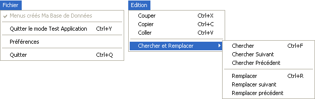

<!--REF #_command_.SET MENU BAR.Syntax-->**SET MENU BAR** ( *barre* {; *process*}{; *} )<!-- END REF-->
<!--REF #_command_.SET MENU BAR.Params-->
| Paramètre | Type |  | Description |
| --- | --- | --- | --- |
| barre | Integer, Text, Text | &#8594;  | Numéro ou nom de la barre de menus ou Référence de menu |
| process | Integer | &#8594;  | Numéro de référence du process |
| * | Opérateur | &#8594;  | Conserver l'état de la barre de menus |

<!-- END REF-->

#### Description 

<!--REF #_command_.SET MENU BAR.Summary-->La commande **SET MENU BAR** remplace la barre de menus courante par la barre de menus *barre*, pour le process en cours uniquement.<!-- END REF--> Vous pouvez passer dans le paramètre *barre* soit le numéro soit le nom de la nouvelle barre. Vous pouvez également passer une référence unique de menu (type [RefMenu](# "Référence unique de menu (16 caractères alphanumériques)"), chaîne de 16 caractères). Lorsque vous travaillez avec des références, les menus peuvent être utilisés comme barres de menus et inversement (cf. section *Gestion des menus*). 

**Note :** Le nom d’une barre de menus peut contenir jusqu’à 31 caractères et doit être unique. 

Si vous passez le paramètre optionnel *process*, c'est la barre de menus du process spécifié qui sera remplacée par la *barre*. 

**Note :** Si vous passez un paramètre [RefMenu](# "Référence unique de menu (16 caractères alphanumériques)") dans *barre*, le paramètre *process* est inutile et sera ignoré.

Le paramètre optionnel \* vous permet de conserver l'état de la barre de menus. Si ce paramètre est omis, **SET MENU BAR** réinitialise la barre de menus lors de l'exécution de la commande.  
Imaginez, par exemple, que l'instruction **SET MENU BAR**(1) soit exécutée. Ensuite, plusieurs commandes de menu sont désactivées à l'aide de la commande [DISABLE MENU ITEM](disable-menu-item.md).  
Si **SET MENU BAR**(1) est exécutée une seconde fois, soit à partir du même process, soit à partir d'un autre process, toutes les commandes de menu retournent à leur état d'activation initial.   
Si **SET MENU BAR**(1;\*) est exécutée, la barre de menus conservera son état précédent, les commandes de menu qui étaient inactivées le resteront.

**Note :** Si vous passez un paramètre [RefMenu](# "Référence unique de menu (16 caractères alphanumériques)") dans *barre*, le paramètre *\** est inutile et sera ignoré.

Lorsqu'un utilisateur arrive en mode Application, la première barre de menus s'affiche (Barre n° 1). Vous pouvez changer cette barre de menus par défaut en spécifiant la barre que vous voulez dans la , ou dans la méthode de démarrage associée à un utilisateur. 

#### Exemple 1 

L'exemple suivant remplace la barre de menus courante par la barre de menus n° 3 et initialise l'état des commandes des menus : 

```4d
 SET MENU BAR(3)
```

#### Exemple 2 

L'exemple suivant remplace la barre de menus courante par la barre de menus nommée “BarreForm1” et conserve l'état des commandes des menus : celles qui étaient précédemment inactivées apparaîtront inactivées :

```4d
 SET MENU BAR("BarreForm1";*)
```

#### Exemple 3 

L'exemple suivant remplace la barre de menus courante par la barre de menus n° 3 pendant que des enregistrements sont en cours de modification. Une fois les enregistrements modifiés, la barre de menus n° 2 est réaffichée. L'état des commandes de ce menu est conservé :

```4d
 SET MENU BAR(3) // Définir la barre de menus n° 3 pour le formulaire suivant
 ALL RECORDS([Clients])
 MODIFY SELECTION([Clients]) // Afficher la sélection
 SET MENU BAR(2;*) // Après modification, retour à la barre de menus n° 2
```

#### Exemple 4 

Dans cet exemple complet, nous allons créer par programmation une barre comportant les menus Fichier et Edition suivants : 



```4d
  //Méthode de création menu Fichier
 var FileMenu : Text // FileMenu contiendra la référence du menu Fichier
 FileMenu:=Create menu
 INSERT MENU ITEM(FileMenu;-1;Get indexed string(131;29)+" Ma Base de Données(")
 SET MENU ITEM MARK(FileMenu;1;Char(18))
 INSERT MENU ITEM(FileMenu;-1;"(-")
 INSERT MENU ITEM(FileMenu;-1;"Quitter le mode Test Application/Y")
 SET MENU ITEM PROPERTY(FileMenu;3;Associated standard action;ak return to design mode)
 INSERT MENU ITEM(FileMenu;-1;"(-")
 INSERT MENU ITEM(FileMenu;-1;"Préférences")
 SET MENU ITEM PROPERTY(FileMenu;5;Associated standard action;ak database settings) //Paramètres
 INSERT MENU ITEM(FileMenu;-1;"(-")
 INSERT MENU ITEM(FileMenu;-1;Get indexed string(131;30))
 SET MENU ITEM PROPERTY(FileMenu;7;Associated standard action;ak quit) //Quitter
 SET MENU ITEM SHORTCUT(FileMenu;7;Character code("Q"))
 
  //Méthode de création menu Chercher et Remplacer
 var FindAndReplaceMenu : Text //FindAndReplaceMenu contiendra la référence du menu Chercher remplacer
 FindAndReplaceMenu:=Create menu
 APPEND MENU ITEM(FindAndReplaceMenu;"Chercher;Chercher Suivant;Chercher Précédent;(-;Remplacer;Remplacer suivant;Remplacer précédent")
 SET MENU ITEM SHORTCUT(FindAndReplaceMenu;1;Character code("F"))
 SET MENU ITEM SHORTCUT(FindAndReplaceMenu;5;Character code("R"))
 SET MENU ITEM METHOD(FindAndReplaceMenu;1;"MaMethodechercher")
 
  //Méthode de création menu Edition
 var EditMenu : Text //EditMenu contiendra la référence du menu Edition
 EditMenu:=Create menu
 APPEND MENU ITEM(EditMenu;"Couper;Copier;Coller")
 SET MENU ITEM SHORTCUT(EditMenu;1;Character code("X"))
 SET MENU ITEM PROPERTY(EditMenu;1;Associated standard action;ak cut)
 SET MENU ITEM SHORTCUT(EditMenu;2;Character code("C"))
 SET MENU ITEM PROPERTY(EditMenu;2;Associated standard action;ak copy)
 SET MENU ITEM SHORTCUT(EditMenu;3;Character code("V"))
 SET MENU ITEM PROPERTY(EditMenu;3;Associated standard action;ak paste)
 INSERT MENU ITEM(EditMenu;-1;"(-")
 INSERT MENU ITEM(EditMenu;-1;"Chercher et Remplacer";FindAndReplaceMenu) // ligne qui aura le sous menu
 
 main_Bar:=Create menu // Cree la barre constituée des autres menus
 INSERT MENU ITEM(main_Bar;-1;Get indexed string(79;1);FileMenu)
 APPEND MENU ITEM(main_Bar;"Edition";EditMenu)
 
 SET MENU BAR(main_Bar)
```

#### Voir aussi 

*Gestion des menus*  

#### Propriétés
|  |  |
| --- | --- |
| Numéro de commande | 67 |
| Thread safe | &check; |
| Interdite sur le serveur ||


