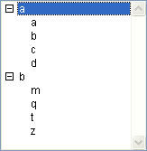
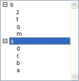

<!--REF #_command_.SORT LIST.Syntax-->**SORT LIST** ( *liste* {; > ou <} )<!-- END REF-->
<!--REF #_command_.SORT LIST.Params-->
| Paramètre | Type |  | Description |
| --- | --- | --- | --- |
| liste | Integer | &#8594;  | Numéro de référence de liste |
| > ou < | Opérateur | &#8594;  | Ordre de tri : > pour trier la liste dans l'ordre croissant ou < pour trier la liste dans l'ordre décroissant |

<!-- END REF-->

#### Description 

<!--REF #_command_.SORT LIST.Summary-->La commande **SORT LIST** effectue un tri sur la liste dont vous avez passé le numéro de référence dans le paramètre *liste*.<!-- END REF-->

Pour effectuer un tri dans l'ordre croissant, passez *\>* comme deuxième paramètre. Pour effectuer un tri dans l'ordre décroissant, passez *<* comme deuxième paramètre. Si vous omettez ce paramètre, **SORT LIST** effectue par défaut un tri croissant. 

**SORT LIST** trie tous les niveaux de la liste : les éléments de la liste, puis les sous-éléments de chaque sous-liste, puis des sous-listes suivantes, etc., sont triés. C'est pourquoi généralement vous utiliserez la commande **SORT LIST** avec une liste affichée dans un formulaire. Le tri d'une sous-liste a moins d'intérêt car son ordre sera modifié dès qu'un appel à une liste se produira à un niveau supérieur. 

**SORT LIST** ne modifie pas l'état courant déployé/contracté de la liste et de ses éventuelles sous-listes, ni l'élément courant. Cependant, comme l'élément courant peut être déplacé à la suite du tri, [Selected list items](selected-list-items.md) peut retourner une position différente avant et après le tri. 

#### Exemple 

Voici la liste nommée *hList*, affichée ici en mode Application :


Après l'exécution du code suivant :

```4d
  // Trier la liste et ses sous-listes dans l'ordre croissant
 SORT LIST(hList;>)
```

... la liste apparaît ainsi :



Après l'exécution du code suivant :

```4d
  // Trier la liste et ses sous-listes dans l'ordre décroissant
 SORT LIST(hList;<)
```

... la liste apparaît ainsi :



#### Voir aussi 

[Selected list items](selected-list-items.md)  

#### Propriétés
|  |  |
| --- | --- |
| Numéro de commande | 391 |
| Thread safe | &check; |
| Interdite sur le serveur ||


