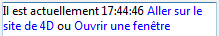

<!--REF #_command_.ST Get plain text.Syntax-->**ST Get plain text** ( {* ;} *objet* {; *modeRéf*} ) : Text<!-- END REF-->
<!--REF #_command_.ST Get plain text.Params-->
| Paramètre | Type |  | Description |
| --- | --- | --- | --- |
| * | Opérateur | &#8594;  | Si spécifié, objet est un nom d'objet (chaîne) <br/>Si omis, objet est une variable ou un champ |
| objet | any | &#8594;  | Nom d'objet (si * est spécifié) ou <br/>Variable ou champ (si * est omis) |
| modeRéf | Integer | &#8594;  | Mode de prise en charge des références présentes dans le texte |
| Résultat | Text | &#8592; | Texte sans balises |

<!-- END REF-->

#### Description 

<!--REF #_command_.ST Get plain text.Summary-->La commande **ST Get plain text** supprime toute balise de style du champ ou de la variable texte désigné(e) par les paramètres *\** et *objet*, et retourne le texte brut.<!-- END REF--> 

##### 

Si vous passez le paramètre optionnel *\**, vous indiquez que le paramètre *objet* est un nom d’objet (une chaîne). A l'exécution, si l'objet a le focus, la commande retourne les informations de l'objet en cours d'édition ; si l'objet n'a pas le focus, la commande retourne les informations de la source de données de l'objet (variable ou champ).  
Si vous omettez le paramètre *\**, vous indiquez que le paramètre *objet* est un champ ou une variable. Dans ce cas, vous ne passez pas une chaîne mais une référence de champ ou de variable. A l'exécution, la commande retourne les informations de la variable ou du champ.

##### 

Le paramètre optionnel *modeRéf* permet d’indiquer la manière dont les références présentes dans *objet* doivent être retournées. Passez dans *modeRéf* une des constantes suivantes, placées dans le thème "*Texte multistyle*" (vous pouvez passer une constante ou une combinaison de constantes) :

| Constante                                    | Type        | Valeur | Comment                                                                                                                                                                                                          |
| -------------------------------------------- | ----------- | ------ | ---------------------------------------------------------------------------------------------------------------------------------------------------------------------------------------------------------------- |
| ST 4D Expressions as sources                 | Entier long | 2      | La chaîne d’origine des références d’expressions 4D est retournée                                                                                                                                                |
| ST 4D Expressions as values                  | Entier long | 1      | Les références d’expressions 4D sont retournées sous leur forme évaluée (fonctionnement par défaut dans les formulaires)                                                                                         |
| ST References as spaces                      | Entier long | 0      | Chaque référence est retournée sous forme d’un caractère espace insécable (fonctionnement par défaut, utilisé par les autres commandes)                                                                          |
| ST Tags as plain text                        | Entier long | 64     | Le libellé de la balise est retourné en texte brut. Par exemple pour la balise 'mon image</img>', le texte brut est "mon image" (fonctionnement par défaut dans les formulaires) |
| ST Tags as XML code                          | Entier long | 128    | Le code XML de la balise est retourné en texte brut. Par exemple pour la balise 'mon image</img>', le texte brut est 'mon image</img>'           |
| ST Text displayed with 4D Expression sources | Entier long | 86     | Retourne le texte tel qu’il est visible dans les formulaires avec la chaîne d’origine des expressions 4D.<br/>Correspond à la combinaison prédéfinie des constantes 2+4+16+64.                           |
| ST Text displayed with 4D Expression values  | Entier long | 85     | Retourne le texte tel qu’il est visible dans les formulaires avec les expressions 4D sous leur forme évaluée.<br/>Correspond à la combinaison prédéfinie de constantes 1+4+16+64.                        |
| ST URL as labels                             | Entier long | 4      | Le libellé visible des URLs est retourné, par exemple "Visitez notre site Web" (fonctionnement par défaut dans les formulaires)                                                                                  |
| ST URL as links                              | Entier long | 8      | Le lien est retourné, par exemple "http://www.4d.com"                                                                                                                                                            |
| ST User links as labels                      | Entier long | 16     | Le libellé visible du lien utilisateur est retourné (fonctionnement par défaut dans les formulaires)                                                                                                             |
| ST User links as links                       | Entier long | 32     | Le contenu du lien utilisateur est retourné                                                                                                                                                                      |

**Notes :**

* Le paramètre optionnel *modeRéf* n’est donc utile que si le texte contient des références, sinon le texte brut est identique quelle que soit la valeur du paramètre *modeRéf*.
* Si un document 4D Write Pro contient des tableaux, le contenu de chaque cellule est traité en tant que paragraphe individuel et retourné sous forme de texte, séparé par des tabulations. Les lignes sont séparées par des retours chariot.

#### Exemple 1 

Vous cherchez le texte "très beau" parmi les valeurs d’un champ texte multistyle. La valeur a été stockée sous la forme "Il fait très beau **aujourd’hui**". 

```4d
 QUERY BY FORMULA([Commentaires];ST Get plain text([Commentaires]Meteo)="@très beau@")
```

**Note :** Dans ce contexte, l’instruction suivante ne donnera pas le résultat escompté car le texte est enregistré avec des balises de style :   

```4d
 QUERY([Commentaires];[Commentaires]Meteo="@très beau@")
```

#### Exemple 2 

Soit le texte suivant placé dans la zone multistyle "mazone" :

```RAW
Il est actuellement   Aller sur le site de 4D ou Ouvrir une fenêtre
```

Ce texte est affiché :



Si vous exécutez le code suivant :

```4d
 $txt :=ST Get plain text(*;"mazone";ST References as spaces)
     //$txt = "Il est actuellement    ou " (espaces)
 $txt :=ST Get plain text(*;"mazone";ST 4D Expressions as values)
     //$txt = "Il est actuellement 18:29:55  ou  "
 $txt :=ST Get plain text(*;"mazone";ST 4D Expressions as sources)
     //$txt = "Il est actuellement Heure courante  ou  "
 $txt :=ST Get plain text(*;"mazone";ST URL as links)
     //$txt = "Il est actuellement  http://www.4d.com ou  "
 $txt :=ST Get plain text(*;"mazone";ST Text displayed with 4D Expression values)
     //$txt = "Il est actuellement 17:54:30 Aller sur le site de 4D ou Ouvrir une fenêtre"
 $txt :=ST Get plain text(*;"mazone";ST Text displayed with 4D Expression sources)
     //$txt = "Il est actuellement Heure courante Aller sur le site de 4D ou Ouvrir une fenêtre"
 $txt :=ST Get plain text(*;"mazone";ST User links as labels)
     //$txt = "Il est actuellement    ou Ouvrir une fenêtre"
 $txt :=ST Get plain text(*;"mazone";ST User links as links)
     //$txt = "Il est actuellement    ou openW"
```

#### Variables et ensembles système 

A l’issue de l’exécution de cette commande, la variable OK prend la valeur 1 si aucune erreur n’a été rencontrée et 0 dans le cas contraire. C’est le cas notamment lorsque l’évaluation des balises de style échoue (balise incorrecte ou manquante). 

A noter qu’en cas d’erreur, la variable n’est pas modifiée. Lorsqu’une erreur se produit sur une variable lors de l’évaluation du texte, 4D transforme le texte en texte brut ; par conséquent, les caractères <, > et & seront convertis en entités HTML.

#### Voir aussi 

[ST Get text](st-get-text.md)  
[ST SET PLAIN TEXT](st-set-plain-text.md)  
[ST SET TEXT](st-set-text.md)  
[TEXT TO ARRAY](text-to-array.md)  

#### Propriétés
|  |  |
| --- | --- |
| Numéro de commande | 1092 |
| Thread safe | &check; |
| Modifie les variables | OK |
| Interdite sur le serveur ||


