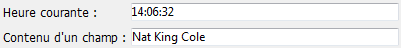
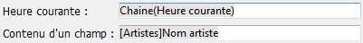

<!--REF #_command_.ST SET OPTIONS.Syntax-->**ST SET OPTIONS** ( {* ;} *objet* ; *option* ; *valeur* {; *option2* ; *valeur2* ; ... ; *optionN* ; *valeurN*} )<!-- END REF-->
<!--REF #_command_.ST SET OPTIONS.Params-->
| Paramètre | Type |  | Description |
| --- | --- | --- | --- |
| * | Opérateur | &#8594;  | Si spécifié, objet est un nom d'objet (chaîne)<br/>Si omis, objet est un champ ou une variable |
| objet | any | &#8594;  | Nom d'objet (si * est spécifié) ou <br/>Champ ou variable (si * est omis) |
| option | Integer | &#8594;  | Option à définir |
| valeur | Integer | &#8594;  | Nouvelle valeur de l’option |

<!-- END REF-->

#### Description 

<!--REF #_command_.ST SET OPTIONS.Summary-->La commande **ST SET OPTIONS** vous permet de modifier une ou plusieurs options de fonctionnement du champ ou de la variable de texte stylé désigné(e) par le paramètre *objet*.<!-- END REF--> 

Si vous passez le paramètre optionnel *\**, vous indiquez que le paramètre *objet* est un nom d’objet (une chaîne). Si vous ne passez pas le paramètre, vous indiquez que le paramètre *objet* est un champ ou une variable. Dans ce cas, vous ne passez pas une chaîne mais une référence de champ ou de variable (champ ou variable objet uniquement).

Passez dans *option* le code de l’option à modifier et dans *valeur*, sa nouvelle valeur. 

Le paramètre *option* prend en charge la constante suivante du thème "*Texte multistyle*" : 

| Constante                   | Type        | Valeur | Comment                                                        |
| --------------------------- | ----------- | ------ | -------------------------------------------------------------- |
| ST Expressions display mode | Entier long | 1      | Le paramètre *valeur* peut contenir ST Values or ST References |

Vous pouvez passer dans le paramètre *valeur* l'une des constantes suivantes :

| Constante     | Type        | Valeur | Comment                                         |
| ------------- | ----------- | ------ | ----------------------------------------------- |
| ST References | Entier long | 1      | Affichage des chaînes source des expressions    |
| ST Values     | Entier long | 0      | Affichage des valeurs calculées des expressions |

Affichage des valeurs :



Affichage des expressions :



#### Exemple 

Le code suivant vous permet de basculer le mode d’affichage de la zone : 

```4d
 ST GET OPTIONS(*;"StyledText_t";ST Expressions display mode;$valueExpr)
 If($valueExpr=1)
       ST SET OPTIONS(*;"StyledText_t";ST Expressions display mode;ST Values)
 Else
       ST SET OPTIONS(*;"StyledText_t";ST Expressions display mode;ST References)
 End if
```

#### Voir aussi 

[ST GET OPTIONS](st-get-options.md)  

#### Propriétés
|  |  |
| --- | --- |
| Numéro de commande | 1289 |
| Thread safe | &check; |
| Interdite sur le serveur ||


