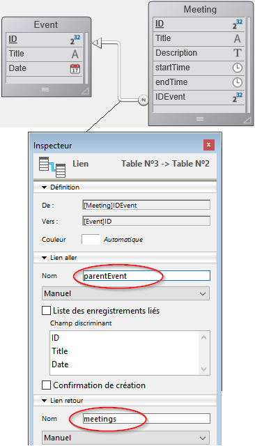

<!--REF #_command_.This.Syntax-->**This** -> Résultat<!-- END REF-->
<!--REF #_command_.This.Params-->
| Paramètre | Type |  | Description |
| --- | --- | --- | --- |
| Résultat | Object | &larr; | Elément ou objet courant |

<!-- END REF-->

#### Description 

<!--REF #_command_.This.Summary-->La commande **This** retourne une référence vers l'objet en cours de traitement.<!-- END REF-->

Cette commande est destinée à une utilisation dans les contextes suivants :

* une list box associée à une collection ou à une sélection d'entités (*entity selection*), pendant les événements formulaires On Display Detail ou On Data Change. Dans ce contexte, la commande retourne une référence vers l'élément de collection ou l'entité auquel/à laquelle la list box accède afin d'afficher la ligne courante.  
**Note :** Si vous utilisez une collection de valeurs scalaires dans une list box, 4D crée un un objet pour chaque élément avec une seule propriété **value**. La valeur scalaire est alors retournée par l'expression **This.value**, qui est non-associable.
* l'exécution d'un objet formule créé par les commandes [Formula](formula.md) ou [Formula from string](formula-from-string.md). Dans ce contexte, la commande retourne une référence vers l'objet en cours de traitement par la formule.

Dans tout autre contexte, la commande retourne **Null**.

Dans les deux contextes où la commande est utilisée, vous accéderez à toutes les propriétés des éléments objet/collection ou tous les attributs d'entités via **This.*<cheminPropriété>***. Par exemple, *This.prénom* ou *This.employeur.nom* sont des chemins de propriétés d'objets, d'éléments ou d'entités (attributs) valides.

#### Exemple 1 

```undefined
{  
"ID": 1234
"name": "Xavier",  
"revenues": 47300,  
"employees": [  
             "Allan",  
             "Bob", 
             "Charlie"  
            ] 
},{  
"ID": 2563
"name": "Carla",  
"revenues": 55000,  
"isFemale": true
"employees": [  
             "Igor",  
             "Jane"  
            ] 
},...
 
```

#### Exemple 2 

Vous souhaitez utiliser des entités de la structure suivante dans une list box :



Vous créez une list box du type "Collection ou entity selection" avec la définition suivante :


A noter que :

* *This.ID*, *This.Title* et *This.Date* se réfèrent directement aux attributs correspondants dans la dataclass ds.Event.
* *This.meetings* est un attribut relationnel (basé sur le nom du lien retour) qui retourne une sélection d'entités de la dataclass ds.Meeting.
* **Form.eventList** est la sélection d'entités qui est associée à la list box. Le code d'initialisation peut être placé dans l'événement fomulaire Sur chargement :  
```4d  
 Case of  
    :(Form event code=On Load)  
       Form.eventList:=ds.Event.all() //retourne une sélection d'entités avec toutes les entités  
 End case  
```

Lorsque le formulaire est exécuté, la list box est automatiquement remplie avec la sélection d'entités :


#### Exemple 3 

Vous souhaitez utiliser une méthode projet comme formule encapsulée dans un objet :

```4d
 var $personnes : Object
 $personnes:=New object
 $personnes.prénom:="John"
 $personnes.nom:="Smith"
 $personnes.salutation:=Formula(Salutation)
 $s:=$personnes.salutation("bonjour") // retourne "bonjour John Smith"
 $s:=$personnes.salutation("salut") // retourne "salut John Smith"
```

Avec la méthode projet Salutation :

```4d
 var $0;$1 : Text
 $0:=$1+" "+This.prénom+" "+This.nom
```

#### Voir aussi 

[Self](self.md)  
[Super](super.md)  