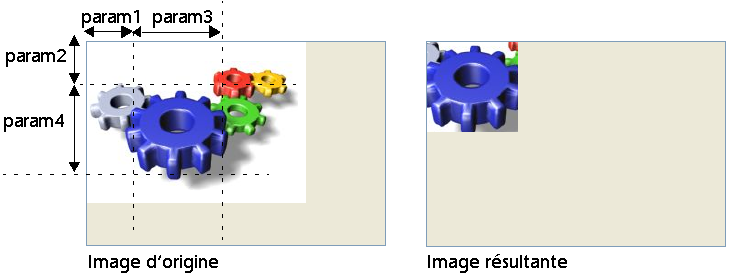

<!--REF #_command_.TRANSFORM PICTURE.Syntax-->**TRANSFORM PICTURE** ( *image* ; *opérateur* {; *param1* {; *param2* {; *param3* {; *param4*}}}} )<!-- END REF-->
<!--REF #_command_.TRANSFORM PICTURE.Params-->
| Paramètre | Type |  | Description |
| --- | --- | --- | --- |
| image | Picture | &#8594;  | Image source à transformer |
| &#8592; | Image résultant de la transformation |
| opérateur | Integer | &#8594;  | Type de transformation à effectuer |
| param1 | Real | &#8594;  | Paramètre de la transformation |
| param2 | Real | &#8594;  | Paramètre de la transformation |
| param3 | Real | &#8594;  | Paramètre de la transformation |
| param4 | Real | &#8594;  | Paramètre de la transformation |

<!-- END REF-->

#### Description 

<!--REF #_command_.TRANSFORM PICTURE.Summary-->La commande **TRANSFORM PICTURE** permet d’appliquer une transformation de type *opérateur* à l’image passée dans le paramètre *image*.<!-- END REF-->

**Note :** Cette commande reprend et étend les fonctionnalités proposées par les opérateurs “classiques” de transformation d’images (+/, etc., cf. section [C\_BOOLEAN](c-boolean.md)). Ces opérateurs restent parfaitement utilisables dans 4D.

L’*image* source est modifiée directement à l’issue de l’exécution de la commande. A noter cependant que certaines opérations ne sont pas destructives et peuvent être annulées via l’opération inverse ou l’opération “Réinitialisation”. Par exemple, une image réduite à 1 % retrouvera sa taille originale sans altération si elle est agrandie 100 fois par la suite. Les transformations ne modifient pas le type d’origine de l’image : par exemple, une image vectorielle restera vectorielle à l’issue de la transformation. 

Passez dans *opérateur* le numéro de l’opération à effectuer et dans *param1* à *param4* le ou les paramètre(s) nécessaire(s) à cette opération (le nombre de paramètres dépend de l’opération). Vous pouvez utiliser dans *opérateur* l’une des constantes du thème “*Transformation des images*”. Ces opérateurs et leurs paramètres sont décrits dans le tableau suivant :

| **opérateur (valeur)**   | **param1**  | **param2** | **param3** | **param4** | **Valeurs** | **Annulable** |
| ------------------------ | ----------- | ---------- | ---------- | ---------- | ----------- | ------------- |
| Reset (0)                | \-          | \-         | \-         | \-         | \-          | \-            |
| Scale (1)                | Largeur     | Hauteur    | \-         | \-         | Facteurs    | oui           |
| Translate (2)            | Axe X       | Axe Y      | \-         | \-         | Pixels      | oui           |
| Flip horizontally (3)    | \-          | \-         | \-         | \-         | oui         |               |
| Flip vertically (4)      | \-          | \-         | \-         | \-         | oui         |               |
| Crop (100)               | Orig. X     | Orig. Y    | Largeur    | Hauteur    | Pixels      | non           |
| Fade to grey scale (101) | \-          | \-         | \-         | \-         | non         |               |
| Transparency (102)       | Couleur RVB | \-         | \-         | \-         | Hexadécimal | non           |

* Reset : toutes les opérations matricielles effectuées sur l’image (redimensionnement, miroir...) sont annulées.
* Scale : l’image est redimensionnée horizontalement et verticalement en fonction des valeurs passées respectivement dans *param1* et *param2*. Ces valeurs sont des facteurs : par exemple, pour agrandir la largeur de 50 %, passez 1,5 dans *param1* et pour réduire la hauteur de 50 %, passez 0,5 dans *param2*.
* Translate : l’image est déplacée de *param1* pixels horizontalement et de *param2* pixels verticalement. Passez une valeur positive pour un déplacement vers la droite ou vers le bas et une valeur négative pour un déplacement vers la gauche ou vers le haut.
* Flip horizontally et Flip vertically : l’effet miroir est appliqué à l’image d’origine. Tout déplacement éventuel effectué auparavant ne sera pas pris en compte.
* Crop : l’image est recadrée à partir du point de coordonnées *param1* et *param2* (exprimé en pixels). La largeur et la hauteur de la nouvelle image sont déterminées par les paramètres *param3* et *param4*. Cette transformation ne peut pas être annulée.
* Fade to grey scale : l’image est passée en niveaux de gris (aucun paramètre n’est requis). Cette transformation ne peut pas être annulée.
* Transparency : Un masque de transparence est appliqué à l'image sur la base de la couleur passée dans *param1*. Par exemple, si vous passez 0x00FFFFFF (blanc) dans *param1*, tous les pixels blancs de l'image originale seront transparents dans l'image transformée. Cette opération peut être appliquée aux images bitmap ou vectorielles. Par défaut, si le paramètre *param1* est omis, le blanc (0x00FFFFFF) sera utilisé comme couleur cible. Cette fonction est plus particulièrement destinée à gérer la transparence dans les images converties depuis le format obsolète PICT, mais peut être utilisée avec des images de tout type. Cette transformation ne peut pas être annulée.

#### Exemple 1 

Vous souhaitez transformer les parties blanches d'une image en parties transparentes. Pour cela, vous pouvez utiliser le code suivant :

```4d
 TRANSFORM PICTURE(Pict1;Transparency;0x00FFFFFF) //0x00FFFFFF est le blanc
```

Vous obtenez le résultat suivant :


#### Exemple 2 

Voici un exemple de recadrage (l’image est affichée dans le formulaire avec le format “Image tronquée (non centrée)”) : 

```4d
 TRANSFORM PICTURE($vpRouages;Crop;50;50;100;100)
```



#### Voir aussi 

[COMBINE PICTURES](combine-pictures.md)  