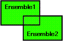

<!--REF #_command_.UNION.Syntax-->**UNION** ( *ensemble1* ; *ensemble2* ; *résultat* )<!-- END REF-->
<!--REF #_command_.UNION.Params-->
| Paramètre | Type |  | Description |
| --- | --- | --- | --- |
| ensemble1 | Text | &#8594;  | Premier ensemble |
| ensemble2 | Text | &#8594;  | Second ensemble |
| résultat | Text | &#8594;  | Ensemble résultant |

<!-- END REF-->

#### Description 

<!--REF #_command_.UNION.Summary-->**UNION** crée un nouvel ensemble contenant tous les enregistrements de *ensemble1* et *ensemble2*.<!-- END REF--> Le tableau suivant liste les résultats possibles d'une opération de réunion d'ensembles.

| **Ensemble1** | **Ensemble2** | **Ensemble résultant** |
| ------------- | ------------- | ---------------------- |
| Oui           | Non           | Oui                    |
| Oui           | Oui           | Oui                    |
| Non           | Oui           | Oui                    |
| Non           | Non           | Non                    |

Le schéma ci-dessous est la représentation graphique de la réunion de deux ensembles. La zone colorée est l'ensemble résultant.



L'ensemble *résultat* est créé par **UNION**. Il remplace tout ensemble du même nom existant déjà, y compris *ensemble1* et *ensemble2*. Les ensembles de départ *ensemble1* et *ensemble2* doivent appartenir à la même table. L'ensemble *résultat* appartient à la même table que *ensemble1* et *ensemble2*. L'enregistrement courant de *résultat* est celui de *ensemble1*.

**4D Server :** En mode client/serveur, les ensembles sont "visibles" en fonction de leur type (interprocess, process et local) et de leur lieu de création (serveur ou client). **UNION** requiert que les trois ensembles soient visibles sur la même machine. Pour plus d'informations sur ce point, reportez-vous au paragraphe *4D Server, ensembles et sélections* dans le manuel de référence de 4D Server.

#### Exemple 

L'exemple suivant ajoute des enregistrements à l'ensemble des meilleurs clients. Les enregistrements sont affichés à l'écran. Ensuite, l'ensemble des meilleurs clients est chargé du disque, et tous les enregistrements sélectionnés par l'utilisateur (l'ensemble système UserSet) sont ajoutés. Enfin, le nouvel ensemble est sauvegardé sur le disque :

```4d
 ALL RECORDS([Clients]) // Sélection de tous les enregistrements
 DISPLAY SELECTION([Clients]) // Afficher tous les clients en mode liste
 LOAD SET("$Meilleurs";"$Meilleurs.sav") // Chargement de l'ensemble des meilleurs clients
 UNION("$Meilleurs";"UserSet";"$Meilleurs") // Ajout de toute sélection à l'ensemble
 SAVE SET("$Meilleurs";"$Meilleurs.sav") // Sauvegarde de l'ensemble des meilleurs clients
```

#### Voir aussi 

[DIFFERENCE](difference.md)  
[INTERSECTION](intersection.md)  

#### Propriétés
|  |  |
| --- | --- |
| Numéro de commande | 120 |
| Thread safe | &check; |
| Interdite sur le serveur ||


